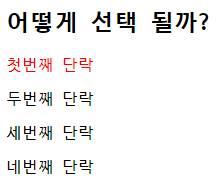
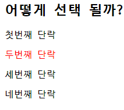

# Workshop

## 1. img tag

``

`` tag 내에 `src`에 이미지가 저장된 경로를 넣고, `alt`에 이미지의 대체 텍스트를 추가한다.


## 2. 파일 경로

(a) : 절대경로
(b) : 상대경로

``


## 3. Hyper Link

```
<a href="https://www.ssafy.com">
    
</a>
```

`<a>` tag로 hyperlink를 만든다.


## 4. 선택자

### 1)



만약 2번째 자식이 `<p>` tag가 아니었다면 style이 바뀌지 않는다.

### 2)



### 3)

`nth-child()`는 부모 element의 모든 자식 중 n번째를 나타내고
`nth-of type()`은 부모 element의 특정 자식 중 n번째를 나타낸다.


# Homework

## 1. HTML 정의

(3)


## 2. HTML 개념

1) F : W3C

2) F : 선택적인 부분이다.

3) T : 검색엔진에서 중요한 부분으로 받아들이기 때문

4) F : `<ol>, <dl>` tag도 가능하다.

5) F : 닫는 tag가 필요하지 않은 경우도 있다.


## 3. CSS 정의

(2)


## 4. CSS 개념

1) T

2) T

3) F : text 관련한 속성만 상속받고, 상속받지 않는 속성도 있다.

4) F : Viewport에 관한 이야기이다.

5) T : class는 중복되어도 되나 id는 중복되어서는 안된다.


## 5. CSS 우선순위

!important > Inline style > id 선택자 > class 선택자 > 요소 선택자 > 소스 순서

