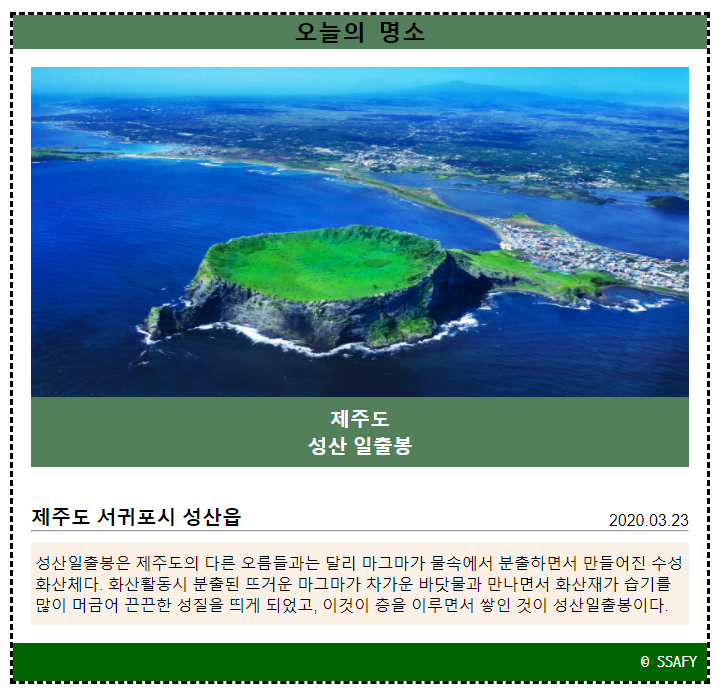

# Practice

## 1. Box Model

```
/* 큰 사각형 내부의 우측 하단 모서리에 빨간 사각형 위치시키기 */
position: absolute;
bottom: 0px;
right: 0px;
```

`position: absolute`로 부모 element를 기준으로 좌표를 설정하도록 하였다.
`bottom: 0px`로 하단에, `right: 0px`로 우측에 붙을 수 있도록 하였다.

* `absolute`는 부모 element중 `static`이 아닌 부모 기준이다.

```
/* 브라우저의 하단에서 50px, 우측에서 50px 위치에 고정하기 */
position: fixed;
bottom: 50px;
right: 50px;
```

`position: fixed`로 브라우저의 viewport를 기준으로 좌표를 설정하도록 하였다.
`bottom: 50px`로 하단에서 50px만큼, `right: 50px`로 우측에서 50px만큼 떨어지도록 하였다.

```
/* 큰 사각형의 가운데 위치시키기 */
position: absolute;
margin: 200px;
```

큰 사각형의 가운데 위치시키므로 `position: absolute`로 부모 element를 기준으로 좌표를 설정하도록 하였다.
사각형이 큰 사각형의 정가운데에 있을 때 간격이 200px이므로 `margin: 200px`을 사용하였다.

```
/* 큰 사각형 좌측 상단 모서리에서 100px, 100px 띄우기 */
position: absolute;
top: 100px;
left: 100px;
```

`position: absolute`로 부모 element를 기준으로 좌표를 설정하도록 하였다.
`top: 100px`로 상단에서 100px만큼, `left: 100px`로 좌측에서 100px만큼 떨어지도록 하였다.

```
/* 큰 사각형 내부의 좌측 상단 모서리로 옮기기*/
```

나머지 사각형들이 움직이면 자동으로 좌측 상단 모서리로 붙게 된다.


## 2. CSS Styling



- `card-img`와 `card-img-description`의 간격 해결 방법
  1. `card-img` 에 `display: block` 속성을 부여하면 된다.
     - `inline` 속성은 4.5 px 정도의 개행 공백이 발생한다.
  2. `card-img-description`에 `margin: -4px`을 부여한다.


```
.card {
  width: 700px;
  /* 테두리 점선 */
  border: dashed;
  margin-left: 20px;
}

.card-nav {
  /* content 위 아래로 간격을 띄우기 위해 padding 설정 */
  padding: 3px;
  background-color: rgb(83, 128, 90);
  /* text 중앙 정렬 */
  text-align: center;
}

.card-header {
  /* card-header 사방으로 margin 18px 적용 */
  margin: 18px;
}

.card-img {
  /* card-img와 card-img-description 간 간격을 없애기 위해 */
  display: block;
  /* 사진의 width를 부모 element width에 꽉 채우기 위해 width: 100% */
  width: 100%;
  height: 330px;
}

.card-img-description {
  height: 70px;
  /* header들을 vertically align하기 위해 padding 사용
  더 좋은 방법을 찾고 싶다. */
  padding: 7.5px 0px;
  background-color: rgb(83, 128, 90);
  color: white;
  text-align: center;
}

h4 {
  font-size: 20px;
  font: bold;
  font-family: Arial, Helvetica, sans-serif;
}

.card-body {
  /* padding을 이용하면 card-header의 bottom margin 18px + card-body의 padding 18px = 36px의 간격 만들기 가능 */
  padding: 18px;
  /* 위의 방법이 더 효율적
  margin: 36px 18px 18px; */
}

.card-body-title {
  /* 자식 p 태그를 우측 정렬 시키기 위해 position: relative; */
  position: relative;
}
.card-body-title > p {
  /* 부모 element를 기준으로 좌표를 설정하기 위해 */
  position: absolute;
  right: 0;
  bottom: 0;
}

p {
  font-family: Arial, Helvetica, sans-serif;
}

.card-body-content {
  margin-top: 10px;
  padding: 10px 4px;
  background-color: linen;
}

.card-footer {
  padding: 10px;
  background-color: darkgreen;
  color: white;
  text-align: right;
}
```