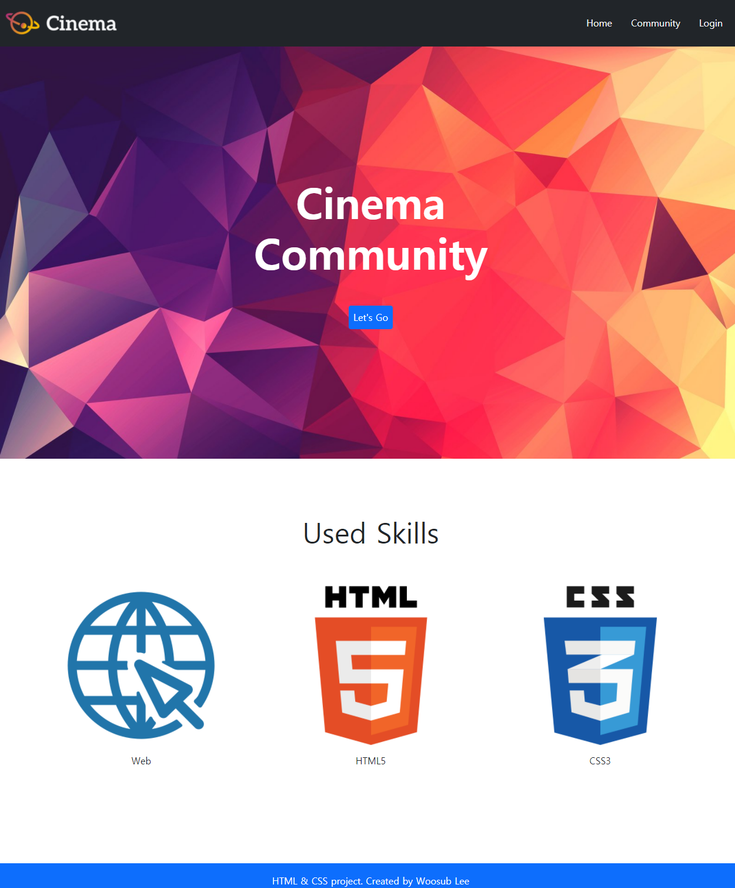
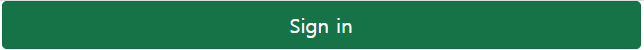
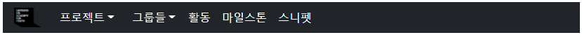
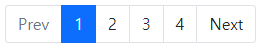
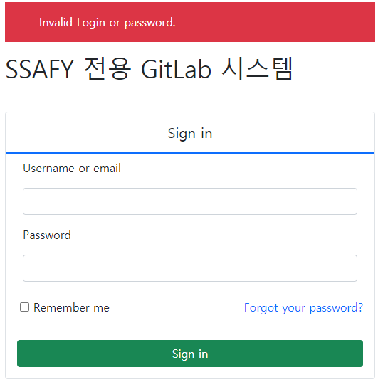

# Workshop



\* 캡쳐라 하단은 잘린 부분이 있습니다.

## Nav

```
<nav class="sticky-top bg-dark d-flex justify-content-between">
  <a href="#">
    
  </a>
  <ul class="d-flex align-items-center m-0 list-unstyled">
    <li><a class="text-decoration-none text-white me-3 pe-3" href="https://bit.ly/2MmBlYV">Home</a></li>
    <li><a class="text-decoration-none text-white me-3 pe-3" href="https://bit.ly/2NXYVvf">Community</a></li>
    <li><a class="text-decoration-none text-white me-3 pe-3" href="https://bit.ly/3asnuYQ">Login</a></li>
  </ul>
</nav>
```

- `nav`
  - `fixed-top` : 항상 화면 상단에서 보여짐.
  - `bg-dark` : 배경색 검은색 설정
  - `d-flex` : 메뉴 부분 오른쪽으로 보내기 위해 `flex` 설정
  - `justify-content-between` : 메뉴 부분 오른쪽으로 보내기
- `ul`
  - `d-flex` : 자식 요소 정렬을 위해 `flex` 설정
  - `align-items-center` : 교차축인 세로로축 가운데 정렬
  - `m-0` : 하단 margin을 없애기 위해
  - `list-unstyled` : 목차 표시를 없애기 위해
- `li`
  - `text-decoration-none` : text underline을 없애기 위해
  - `text-white` : 글씨색 흰색 설정
  - `me-3`, `pe-3` : margin과 padding을 줘 text 간 간격 설정

## Header

```
<header class="d-flex flex-column justify-content-center align-items-center">
    <div class="text-white fw-bold display-2">Cinema</div>
    <div class="text-white fw-bold display-2">Community</div>
    <a class="btn btn-primary btn-lg mt-5" href="#">Let's Go</a>
</header>
```

- `header`
  - `d-flex` : 자식 요소 정렬을 위해 `flex` 설정
  - `flex-column` : 자식 요소들이 세로로 정렬하도록 `column` 방향으로 설정
  - `justify-content-center` : 메인 축인 세로로 가운데 정렬
  - `align-items-center` : 교차 축인 가로로 가운데 정렬
- `div`
  - `text-white` : 글씨색 흰색 설정
  - `fw-bold` : 볼드체 설정
  - `display-2` : 헤더 크기 설정
- `a`
  - `btn` : button 속성 부여
  - `btn-primary` : 색 설정
  - `btn-lg` : button 크기 키우기
  - `mt-5` : margin을 줘 위의 `div`와 간격 설정

## Section

```
<section class="m-5 pt-5">
  <h2 class="text-center">Used Skills</h2>
  <article class="d-flex justify-content-evenly m-5">
    <div class="text-center">
      
      <p>Web</p>
    </div>
    <div class="text-center">
      
      <p>HTML5</p>
    </div>
    <div class="text-center">
      
      <p>CSS3</p>
    </div>
  </article>
</section>
```

- `section`
  - `m-5`, `pt-5` : header와 간격을 줌
- `h2`
  - `text-center` : text 중앙 정렬
- `article`
  - `d-flex` : 자식 요소 정렬을 위해 `flex` 설정
  - `justify-content-evenly` : 자식 요소 간 좌우 간격을 일정하게
  - `m-5` : `h2`와 간격 설정
- `div`
  - `text-center` : text 중앙 정렬

## Footer

```
<footer class="fixed-bottom bg-primary d-flex align-items-center justify-content-center">
  <p class="m-0 text-white">HTML & CSS project. Created by Woosub Lee</p>
</footer>
```

- `footer`
  - `fixed-bottom` : 하단에 항상 보여지도록 설정
  - `bg-primary` : 배경색 설정
  - `d-flex` : 자식 요소 정렬을 위해 `flex` 설정
  - `align-items-center` : 교차 축인 가로로 가운데 정렬
  - `justify-content-center` : 메인 축인 세로로 가운데 정렬
- `p`
  - `m-0` : 하단의 margin을 제거하기 위해
  - `text-white` : 글씨색 흰색 설정


# Homework

### 1. Button



```
<div class="d-grid col-6 mx-auto">
  <button class="btn btn-success btn-lg">Sign in</button>
</div>
```

- `div`
  - `d-grid` :
  - `col-6` : 가로 중앙 정렬
  - `mx-auto ` :
- `button`
  - `btn` :
  - `btn-success` :
  - `btn-lg` :

### 2. Navbar



```
<nav class="navbar navbar-expand bg-dark">
  <a href="https://lab.ssafy.com" class="px-3">
    
  </a>
  <div class="dropdown">
    <button class="dropdown-toggle bg-transparent text-white border-0 mx-1">프로젝트</button>
    <button class="dropdown-toggle bg-transparent text-white border-0 mx-1">그룹들</button>
</div>
  <a href="#" class="text-white text-decoration-none mx-2">활동</a>
  <a href="#" class="text-white text-decoration-none mx-2">마일스톤</a>
  <a href="#" class="text-white text-decoration-none mx-2">스니펫</a>
</nav>
```

- `nav`
  - `navbar` : `navbar` 속성을 줌.
  - `navbar-expand` : 브라우저 가로 전체를 차지하도록 함.
  - `bg-dark` : 배경색 설정
- `a`
  - `px-3` : 좌우 간격 설정
- `div`
  - `dropdown` : 메뉴를 dropdown 형식으로 만들기 위해 부모 요소를 만들어 선언
- `button`
  - `dropdown-toggle` : dropdown 적용
  - `bg-transparent` : 배경 투명으로 설정
  - `text-white` : 글씨색 흰색 설정
  - `border-0` : 테두리 삭제
  - `mx-1` : 요소 간 간격 설정
- `a`
  - `text-white` : 글씨색 흰색 설정
  - `text-decoration-none` : text underline 삭제
  - `mx-2` : 요소 간 간격 설정


### 3. Pagination



```
<div class="d-flex justify-content-center">
  <ul class="pagination">
    <li class="page-item disabled"><a href="#" class="page-link">Prev</a></li>
    <li class="page-item active"><a href="#" class="page-link">1</a></li>
    <li class="page-item"><a href="#" class="page-link text-dark">2</a></li>
    <li class="page-item"><a href="#" class="page-link text-dark">3</a></li>
    <li class="page-item"><a href="#" class="page-link text-dark">4</a></li>
    <li class="page-item"><a href="#" class="page-link text-dark">Next</a></li>
  </ul>
</div>
```

- `div`
  - `d-flex` : 중앙 정렬을 하기 위해 `flex` 속성 부여
  - `justify-content-center` : 가로 중앙 정렬
- `ul`
  - `pagination` : 페이지 바 속성을 줌.
- `li`
  - `page-item` : `pagination`의 한 페이지로 선언
  - `disabled` : 이전 페이지가 없으므로 비활성화
  - `active` : 현재 조회중인 페이지
- `a`
  - `page-link`
  - `text-dark` : 글씨색 설정


### 4. Forms



```
<div class="d-flex justify-content-center">
  <div style="width: 520px;">
    <p class="bg-danger text-white ps-5 py-3">Invalid Login or password.</p>
    <h1 class="mb-4">SSAFY 전용 GitLab 시스템</h1>
    <hr>
    <form action="" class="border rounded">
      <div class="d-flex justify-content-center border-bottom border-2 border-primary w-100">
        <h2 class="my-3 fs-5">Sign in</h2>
      </div>
      <div class="mx-3">
        <label for="" class="form-label m-2">Username or email</label>
        <div class="d-flex justify-content-center">
          <input type="email" class="form-control m-2">
        </div>
        <label for="" class="form-label m-2">Password</label>
        <div class="d-flex justify-content-center">
          <input type="password" class="form-control m-2">
        </div>
        <div class="d-flex justify-content-between my-3">
          <div class="form-check ps-1">
            <input type="checkbox" name="" id="">
            <label for="" class="form-check-label">Remember me</label>
          </div>
          <a href="#" class="text-decoration-none">Forgot your password?</a>
        </div>
        <button type="submit" class="btn btn-success w-100 my-3">Sign in</button>
      </div>
    </form>
  </div>
</div>
```

