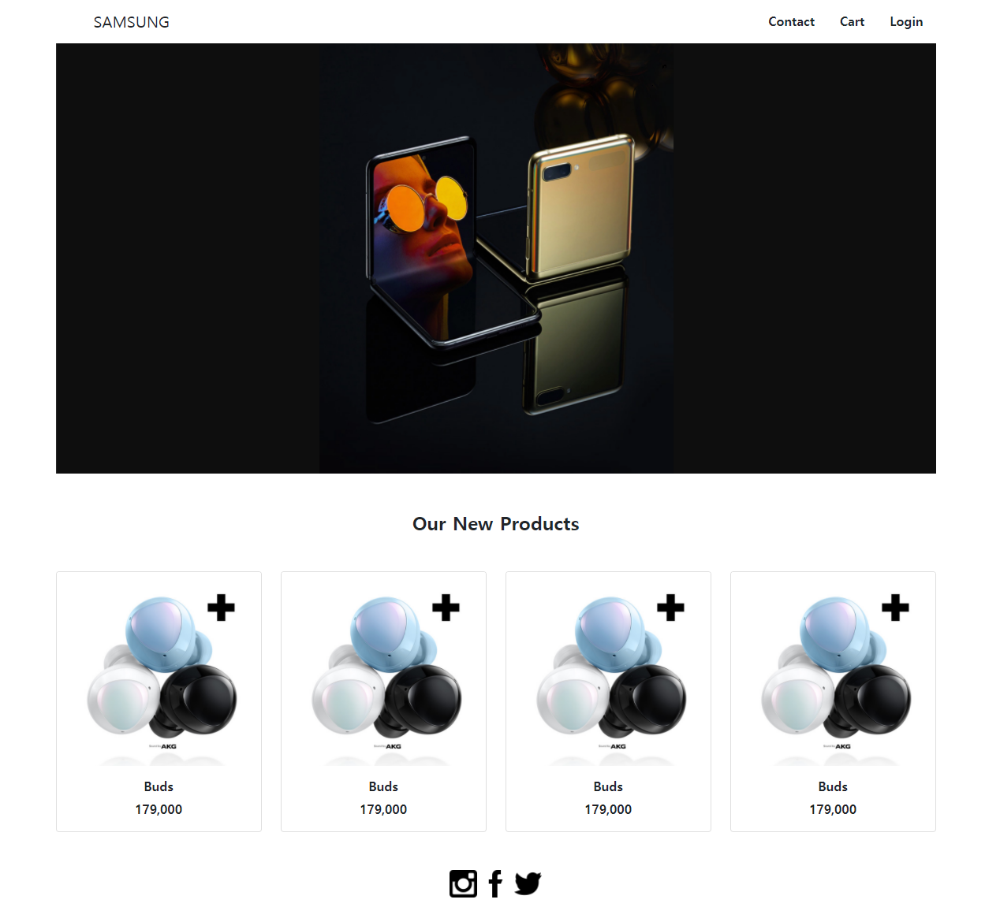
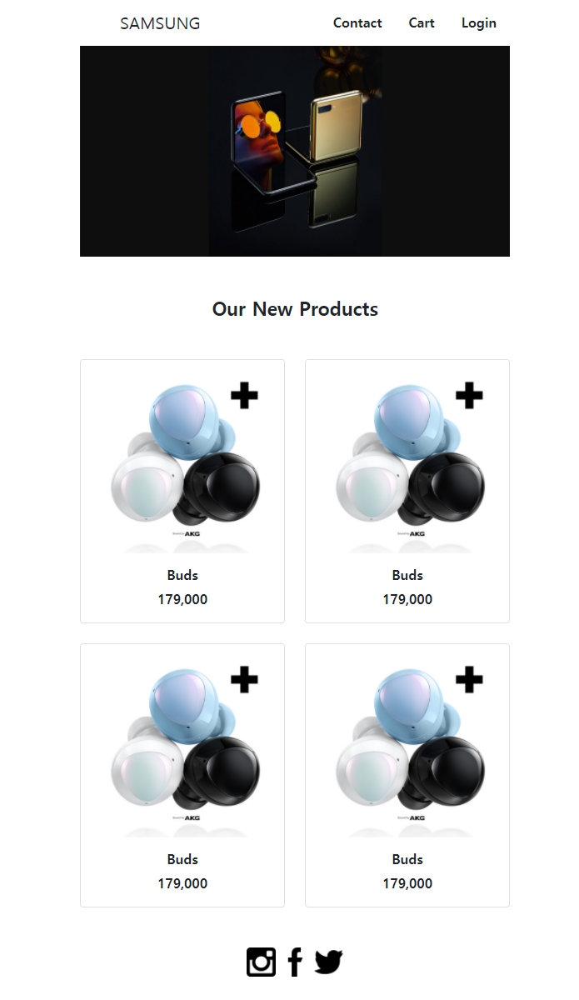
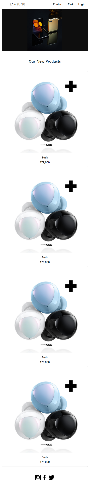

# Practice

## 2. Responsive Web







### nav

```
<!-- 상단 메뉴바이므로 navbar 속성 부여 -->
<nav class="navbar">
  <!-- 무한정 늘어나지 않는 container가 필요하므로 container-fluid가 아닌 container 속성 부여 -->
  <div class="container">
    <!-- 브랜드 로고이므로 navbar-brand 선언
      좌측 간격 주기 위해 ms-5 -->
    <span class="navbar-brand ms-5">SAMSUNG</span>
    <!-- nav 탭이므로 nav 선언 -->
    <ul class="nav">
      <!-- nav 탭의 한 item이므로 nav-item 선언
      element 간 간격 주기 위해 mx-3 -->
      <li class="nav-item mx-3">
        <!-- nav 메뉴의 link 역할을 하므로 nav_link 선언
        underline 제거를 위해 text-decoration-none -->
        <a href="#" class="nav_link text-decoration-none text-dark fw-bold">Contact</a>
      </li>
      <li class="nav-item mx-3">
        <a href="#" class="nav_link text-decoration-none text-dark fw-bold">Cart</a>
      </li>
      <li class="nav-item mx-3">
        <a href="#" class="nav_link text-decoration-none text-dark fw-bold">Login</a>
      </li>
    </ul>
  </div>
</nav>
```

### section

```
<section class="row">
  
</section>
```

### article

```
<!-- section과의 간격을 벌리기 위해 my-5 -->
<article class="my-5">
  <!-- text center align을 위한 text-center -->
  <h4 class="text-center fw-bold mb-5">Our New Products</h4>
  <!-- grid system 활용을 위해 row 선언 -->
  <div class="row g-4">
    <!-- 768px 이상일 경우 6 column, 992px 이상일 경우 3 column, 해당 없을 경우(768px 미만일 경우) 12 column 차지 -->
    <div class="col-12 col-sm-6 col-md-3">
      <!-- text underline 제거를 위한 text-decoration-none -->
      <a href="#" class="text-decoration-none text-dark fw-bold">
        <!-- card component가 적합하므로 card 선언 -->
        <div class="card">
          <!-- card 상단에 들어가는 image이므로 card-img-top 선언 -->
          
          <!-- card의 main 설명이 들어가는 부분이므로 card-body 선언 -->
          <div class="card-body text-center">
            <h6 class="fw-bold">Buds</h6>
            <!-- text의 세로 중앙 정렬을 방해하는 bottom margin 제거 -->
            <p class="m-0">179,000</p>
          </div>
        </div>
      </a>
    </div>
```

### footer

```
<!-- 세 images의 center align을 위해 flex 선언 후 justify-content-center -->
<footer class="d-flex justify-content-center mb-5">
  <div>
    <!-- image에 보이는 underline 제거 -->
    <a href="https://www.instagram.com/" class="text-decoration-none">
      
    </a>
    <a href="https://www.facebook.com/" class="text-decoration-none">
      
    </a>
    <a href="https://www.twitter.com/" class="text-decoration-none">
      
    </a>
  </div>
</footer>
```


## * Point 

- 만들고자 하는 element들의 목적이 무엇인지 파악하고, 그에 가장 적합한 component와 속성을 사용하기
- bootstrap docs를 꼼꼼히 읽으며 component와 content의 사용법 정확히 파악하기

