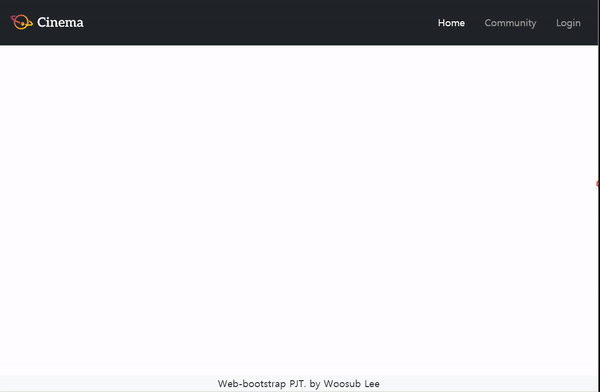
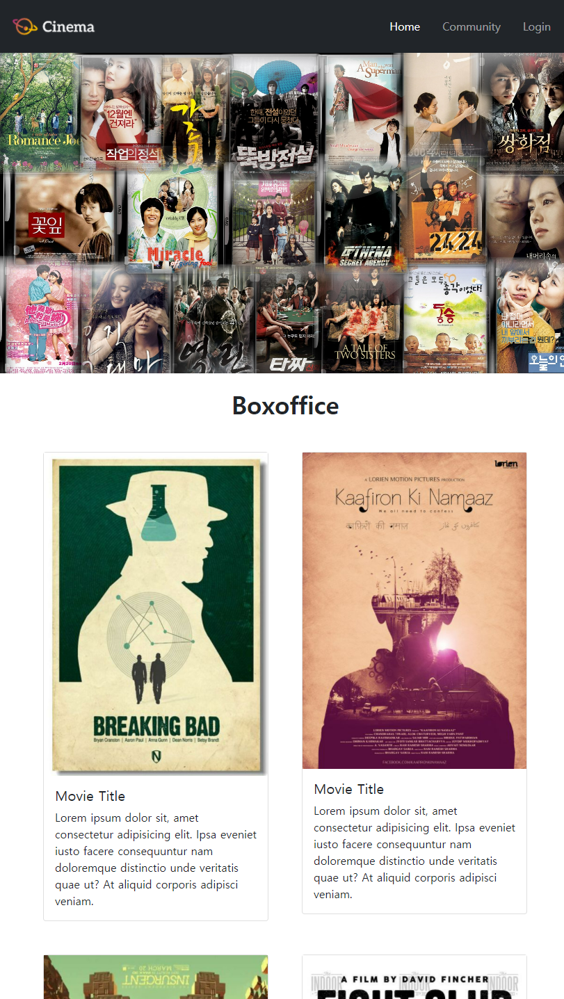
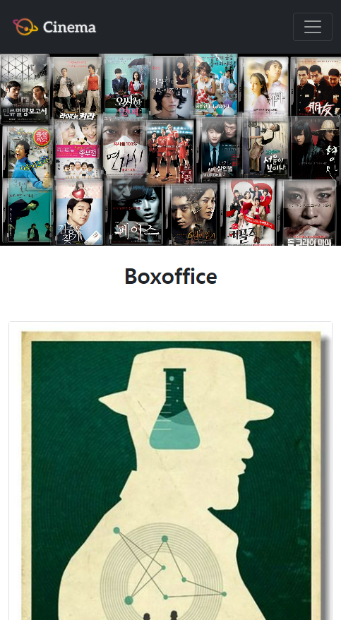
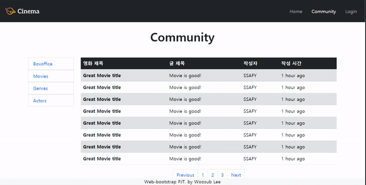

# Project 03

> 20210205에 진행한 프로젝트입니다.


## 1. nav_footer.html



### Main component

```
<nav class="navbar navbar-expand-md sticky-top navbar-dark bg-dark">
```

화면 상단 메뉴바이므로 `navbar` component를 활용하였다.

toggler로 `nav`가 collapse되는 구조이므로 `navbar-expand-md`로 md 이상이 될 때 `navbar-nav`의 `nav-item`들이 펼쳐지도록 하였다.

화면 상단에서 항상 보여지도록 하는 것은 `sticky-top`을 활용하였는데,
`fixed-top`은 다른 elements와 overlap되는 문제가 있으므로 사용하지 않았다.


### navbar-toggler

```
<button class="navbar-toggler" type="button" data-bs-toggle="collapse" data-bs-target="#navbarSupportedContent">
  <span class="navbar-toggler-icon"></span>
</button>
```

toggler component(햄버거)를 사용하기 위해 bootstrap에서 제공하는 `navbar-toggler` 속성을 활용하였다. 세부 code를 살펴보면

- `data-bs-toggle="collapse"` : docs가 말하길 toggler로 collapse를 하려면 꼭 써야한다고 한다.

- `data-bs-target="#navbarSupportedContent"` : collapse할 list의 id를 설정
- `navbar-toggler-icon` : 햄버거 아이콘을 bootstrap에서 자동 제공해준다.

```
<div class="collapse navbar-collapse" id="navbarSupportedContent">
  <ul class="navbar-nav ms-md-auto">
```

- `div`
  - `collapse` : 화면이 줄어서 toggler가 작동할 경우 처음에 메뉴가 접힌 상태로 보여지게 한다.
  - `navbar-collapse` : toggler collapse를 사용하게 해주는 navbar의 content인 것으로 보인다.

- `ul`

  - md 이상일 때는 메뉴들이 우측 정렬하고,
    md 미만에서 메뉴가 아래로 펼쳐질 때는 좌측 정렬하도록 하기 위해서

    `ms-md-auto`로 md 이상일 때만 좌측에 margin을 줘 우측 정렬하도록 하였다.
    md 미만일 경우에는 default 상태인 좌측 정렬이 된다.


### modal

```
<a class="nav-link text-decoration-none" data-bs-toggle="modal" href="#login-modal">Login</a>
```

Login 버튼을 누르면 modal이 나타나게 하는 code이다.

- `data-bs-toggle` : toggle하면(누르면) modal이 나타난다.

- `href="#login-modal"` : login-modal의 id를 가진 element로 연결한다.

##### 1) modal header

```
<div class="modal-header">
  <h5 class="modal-title">Login</h5>
  <button type="button" class="btn-close" data-bs-dismiss="modal"></button>
</div>
```

`button`내의

- `btn-close` : 버튼이 modal을 닫는 역할을 하도록 설정
- `data-bs-dismiss="modal"` : 대상을 modal로 설정

##### 2) modal body

```
<form class="modal-body">
  <div>
    <label for="username" class="form-label">Username</label>
    <input type="text" class="form-control" id="username">
  </div>
  <div class="mt-2">
    <label for="password" class="form-label">Password</label>
    <input type="password" class="form-control" id="password">
  </div>
  <div class="form-check mt-2">
    <!-- type="checkbox" : input의 type을 checkbox 형태로 만듦
    <input type="checkbox" class="form-check-input" id="checkbox">
    <label class="form-check-label" for="checkbox">Check me out</label>
  </div>
</form>
```

- `for="username"` : label의 대상을 username이란 id를 가진 element로 설정
- `type="password"` : password type으로 설정하여 내용이 보이지 않도록 함

##### 3) modal footer

```
<div class="modal-footer">
  <button type="button" class="btn btn-secondary" data-bs-dismiss="modal">Close</button>
  <button type="button" class="btn btn-primary">Submit</button>
</div>
```


### footer

```
<footer class="fixed-bottom bg-light">
```

하단에 고정되어 항상 보여지도록 `fixed-bottom`을 사용하였다.


## 2. home.html

- sm 이상일 때



- sm 미만일 때



### Header

```
<header class="carousel slide" data-bs-ride="carousel">
  <div class="carousel-inner">
    <div class="carousel-item active">
      
    </div>
```

- `header`
  - `carousel` : bootstrap의 carousel component를 활용하기 위해
  - `slide` : slide 형식으로 넘어가도록함
  - `data-bs-ride="carousel"` : page를 load할 때 자동으로 animation이 시작하도록 함
- `div`
  - `active` : page가 load될 때 carousel에 나올 element로 설정
- `img`
  - `w-100` : image가 한 슬라이드에 꽉 차도록 설정해준다.


### Section

```
<section class="container my-5">
  <div class="row row-cols-1 row-cols-sm-2 g-5">
    <div class="col">
      <article class="card">
        
        <div class="card-body">
          <h5 class="card-title">Movie Title</h5>
          <p class="card-text">Lorem ipsum dolor sit, amet consectetur adipisicing elit. Ipsa eveniet iusto facere consequuntur nam doloremque distinctio unde veritatis quae ut? At aliquid corporis adipisci veniam.</p>
        </div>
      </article>
    </div>
```

- `section`
  - `container` : grid system 활용을 위해 설정

- `div`
  - `row-cols-1` : default 값. 한 row에 한 column만 나오도록 해준다.
  - `row-cols-sm-2` : sm 이상이 될 경우, 한 row에 두 columns씩 나오도록 해준다.
  - `g-5` : column 간 gutter를 준다.


## 3. community.html




### 게시판 목록

```
<div class="row mx-3">
  <aside class="col-12 col-lg-2">
    <ul class="list-group list-unstyled">
      <li>
        <a class="list-group-item" href="#">Boxoffice</a>
      </li>
```

viewport가 lg 이상일 때는 div.main 영역 전체만큼의 너비를 가지도록 하고
lg 미만일 때는 div.main 영역의 1/6 만큼만 너비를 가지도록 하기 위해서
grid system을 활용하였다.

`col-12 col-lg-2` : default(lg 미만) 상태는 12 columns을 모두 차지하는, 즉 container를 모두 차지하고, lg이상이 되면 2 columns만 차지한다.


### 게시판

```
<section class="col-12 col-lg-10">
```

viewport가 lg 이상일 때는 게시판 목록 아래쪽으로 내려가 div.main 영역 전체만큼의 너비를 가지고
lg 미만일 때는 div.main 영역의 5/6 만큼만 차지하도록 해야하므로
일단 section tag에 col 속성을 주었다.

`col-12 col-lg-10` : default(lg 미만) 상태는 12 columns을 모두 차지하고, lg 이상이 되면 10 columns만 차지해 게시판 목록의 오른쪽에 자리하게 된다.


##### table

```
<table class="table d-none d-lg-table">
  <thead class="table-dark">
    <tr>
      <th>영화 제목</th>
      <th>글 제목</th>
      <th>작성자</th>
      <th>작성 시간</th>
    </tr>
  </thead>
  <tbody>
    <tr class="table-secondary">
      <th>Great Movie title</th>
      <td>Movie is good!</td>
      <td>SSAFY</td>
      <td>1 hour ago</td>
    </tr>
```

table은 viewport가 lg 이상일 때는 보여지고, lg 미만일 경우 사라지게 된다.

이를 `d-none d-lg-table` 코드로 구현하였다.


##### article

```
<article class="d-lg-none my-5">
  <hr>
  <section class="px-4">
    <p class="d-flex justify-content-between mb-1">
      <span class="fs-4">Best Movie Ever</span>
      <span>user</span>
    </p>
    <p class="mb-1">Great Movie Title</p>
    <p>1 minutes ago</p>
  </section>
  <hr>
```

aritcle은 table과는 반대로 viewport가 lg 이상일 때는 사라지고, lg 미만일 경우 보여지게 된다.

이를 `d-lg-none` 코드로 구현하였다.


### 게시판 탐색기

```
<nav class="d-flex justify-content-center">
  <ul class="pagination">
    <li class="page-item"><a class="page-link" href="#">Previous</a></li>
    <li class="page-item"><a class="page-link" href="#">1</a></li>
    <li class="page-item"><a class="page-link" href="#">2</a></li>
    <li class="page-item"><a class="page-link" href="#">3</a></li>
    <li class="page-item"><a class="page-link" href="#">Next</a></li>
  </ul>
</nav>
```

bootstrap의 pagination component를 활용하여 구현하였다.