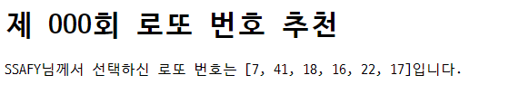

# Workshop



1. `intro/urls.py`

   ```
   from pages import views
   ```

   `pages`앱에서 `views.py`를 import하고

   ```
   urlpatterns = [
       path('lotto/', views.lotto),
   ]
   ```

   `urlpatterns`에 `path('lotto/', views.lotto)` 코드를 추가하여 사용자가 /lotto/ 주소로 요청을 보내면 `pages/views.py`의 `lotto` 메소드로 전달하도록 한다.

   

2. `pages/views.py`

   ```
   import random
   
   def lotto(request):
       numbers = random.sample(range(1, 46), 6)
       context = {
           'numbers': numbers
       }
       return render(request, 'lotto.html', context)
   ```

   `context` 딕셔너리에 `random` 모듈을 활용해 생성한 번호를 저장하고
   이를 `templates`의 `lotto.html`로 전달한다.

   

3. `templates/lotto.html`

   ```
   <body>
     <h1>제 OOO회 로또 번호 추천</h1>
     <p>SSAFY님께서 선택하신 로또 번호는 {{ numbers }}입니다.</p>
   </body>
   ```

   `views.py`에서 `context`내 로또 번호가 저장된 딕셔너리의 key 값이 `numbers`였으므로 `{{ numbers }}`로 변수가 보여지게 한다.


# Homework

### 1. 한국어로 번역하기

#### 1-1.

```
LANGUAGE_CODE = 'ko-kr'
```


#### 1-2.

```
USE_I18N = True
```

공식문서에 `LANGUAGE_CODE`와 관련하여 다음과 같이 나와있다.

'`USE_I18N` must be active for this setting to have any effect.'


### 2. 경로 설정하기

```
'ssafy/', views.ssafy
```


### Django Template Language

#### 1)

```
menu
```


#### 2)

```
forloop.counter0
```


#### 3)

```
empty
```


#### 4)

```
(a) if
(b) else
```


#### 5)

```
(a) length
(b) title
```


#### 6)

```
Y년 m월 d일 (D) A h:i
```


### Form tag with Django

#### 1)

action은 데이터를 보내는 목적지 URL을 지정한다.

#### 2)

POST, GET

#### 3)

```
/create/?title=안녕하세요&content=반갑습니다&my-site=파이팅
```