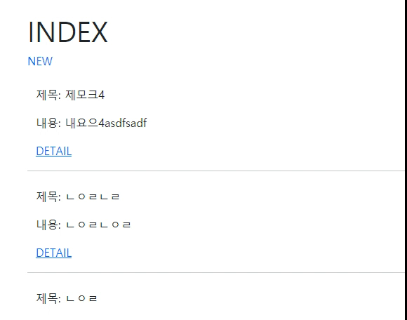

# Workshop



### 1. 프로젝트 & app 생성

터미널에서 다음 명령어를 실행하여 프로젝트를 생성한다.

```
django-admin startproject crud
```

프로젝트 내 터미널에서 다음 명령어를 실행하여 app을 생성한다.

```
python manage.py startapp articles
```

```
# 디렉토리 : crud/crud/settings.py
INSTALLED_APPS = [
    'articles',
    'django_extensions',
]
```

`INSTALLED_APPS`에 `'articles'`를 추가하여 프로젝트에서 app을 인식할 수 있도록 하고,
shell_plus 기능을 사용할 수 있도록`'django_extensions'`를 추가한다.

### 2. base.html 생성

모든 템플릿에서 상속받아 사용할 base.html을 작성한다.

'base.html이 담긴 templates 디렉토리는 프로젝트 및 앱 디렉토리와 동일한 위치에 생성한다.'
명세서에 위와 같이 나와있으므로  templates 폴더는 crud, articles와 동일한 위치에 만들도록 한다.

```
# 디렉토리 : templates/base.html
<!DOCTYPE html>
<html lang="en">
<head>
  ......
  <link href="https://cdn.jsdelivr.net/npm/bootstrap@5.0.0-beta2/dist/css/bootstrap.min.css" rel="stylesheet" integrity="sha384-BmbxuPwQa2lc/FVzBcNJ7UAyJxM6wuqIj61tLrc4wSX0szH/Ev+nYRRuWlolflfl" crossorigin="anonymous">
  <title>Document</title>
</head>
<body>
  
  
  <script src="https://cdn.jsdelivr.net/npm/bootstrap@5.0.0-beta2/dist/js/bootstrap.bundle.min.js" integrity="sha384-b5kHyXgcpbZJO/tY9Ul7kGkf1S0CWuKcCD38l8YkeH8z8QjE0GmW1gYU5S9FOnJ0" crossorigin="anonymous">
  ......
```

기본 html 형식에 bootstrap의 CDN을 추가하고,
block built-in template을 추가하여 자식 템플릿에서 작성할 공간을 설정한다.

```
# 디렉토리 : crud/settings.py
TEMPLATES = [
    {
        'DIRS': [BASE_DIR / 'templates'],
    }
]
```

settings.py에 위와 같이 추가하여 프로젝트 내에서 base.html을 항상 인식하도록 한다.

### 3. 프로젝트 urls.py -> app urls.py 로 연결

```
# 디렉토리 : crud/urls.py
from django.urls import path, include

urlpatterns = [
    path('articles/', include('articles.urls')),
]
```

articles로 시작하는 주소로 요청이 들어오면 자동으로 app(articles)의 urls.py로 연결되도록 한다.

### 4. model 생성

```
# 디렉토리 : articles/models.py
class Article(models.Model):
    title = models.CharField(max_length=10)
    content = models.TextField()
    created_at = models.DateTimeField(auto_now_add=True)
    updated_at = models.DateTimeField(auto_now=True)
    
    def __str__(self):
        return self.title
```

`Article`클래스는 models 모듈의 `Model` 클래스를 상속받는다.

각 변수의 특성에 맞는 필드를 설정하여 준다.

- `created_at` : 자동으로 추가된 시간이 입력되도록 `auto_now_add=True`
- `update_at` : 자동으로 추가 혹은 변경된 시간이 입력되도록 `auto_now=True`

`__str__(self)` : 클래스가 string 형식으로 표현될 때 어떤 값으로 보여지게 할 것인지 설정한다.(Java의 toString 메소드와 같은 역할인 듯)

### 5. 'articles/' 페이지

- urls.py

  ```
  urlpatterns = [
      path('', views.index, name='index'),
  ]
  ```

  뒤에 다른 주소 없이 'articles/'로만 요청이 들어오면 views의 index 메소드로 연결된다.

- views.py

  ```
  def index(request):
      articles = Article.objects.order_by('-pk')
      context = {
          'articles': articles,
      }
      return render(request, 'articles/index.html', context)
  ```

  Aritcle 모델의 데이터를 objects 매니저를 통해 가져오는데
  게시글이 최신순으로 표시되도록 `order_by('-pk')`를 이용한다.

  그리고 `context`에 담아 html로 넘겨준다.

- index.html

  ```
  
  
  
    <div class="container mt-5">
      <h1>INDEX</h1>
      <a href="" style="text-decoration:none">NEW</a>
      
        <div class="container mt-4">
          <p>제목: {{ article.title }}</p>
          <p>내용: {{ article.content }}</p>
          <p>작성시간: {{ article.created_at }}</p>
          <p>수정시간: {{ article.updated_at }}</p>
          <a href="">DETAIL</a>
        </div>
      
    </div>
  
  ```

  - `href=""` : 'NEW' 링크를 클릭하면 `name="new"`인 페이지로 연결된다.
  - `` : `articles`의 각 `article`을 반복하며
  - `href=""` : 'DETAIL' 링크를 클릭하면 `name="detail"`인 페이지로 연결되는데 `pk`를 인자로 전달한다.

### 6. 'articles/new/' 페이지

- urls.py

  ```
  urlpatterns = [
      path('new/', views.new, name='new'),
  ]
  ```

- views.py

  ```
  def new(request):
      return render(request, 'articles/new.html')
  ```

- new.html

  ```
  
  
  
    <div class="container mt-5">
      <h1>NEW</h1>
      <form action= method="POST">
        
        <label for="title">TITLE:</label>
        <input type="text" name="title" id="title"><br>
        <label for="content">CONTENT:</label>
        <textarea name="content" id="content" cols="30" rows="10"></textarea><br>
        <input type="submit" value="작성">
      </form>
      <a href="" style="text-decoration:none">BACK</a>
    </div>
  
  ```
  
  - `method="POST"` : 서버에 내용을 반영하기 위해 `"POST"` 속성값 설정
    - `` : `"POST"`를 사용하기 위해서는 보안을 위해 설정해야함.

### 6_1. 'post' 메소드

- urls.py

  ```
  urlpatterns = [
      path('post/', views.post, name='post'),
  ]
  ```

- views.py

  ```
  from django.shortcuts import redirect
  
  def post(request):
      article = Article()
      article.title = request.POST['title']
      article.content = request.POST['content']
      article.save()
      return redirect('articles:detail', article.pk)
  ```
  
  - `article.OOO = request.POST['OOO']` : `POST`에 저장된 필드값을 불러온다.
  - `article.save()` : 서버에 내용을 저장한다.
  - `return redirect('articles:detail', article.pk)` : 새로 작성된 게시글의 `detail` 페이지를 보여주기 위해 `redirect` 사용

### 7. 'articles/detail/\<int:pk>/' 페이지

- urls.py

  ```
  urlpatterns = [
      path('detail/<int:pk>', views.detail, name='detail'),
  ]
  ```

- views.py

  ```
  def detail(request, pk):
      article = Article.objects.get(pk=pk)
      context = {
          'article': article
      }
      return render(request, 'articles/detail.html', context)
  ```

  - `article = Article.objects.get(pk=pk)` : pk가 인자로 받은 `pk`와 같은 Article 인스턴스를 불러온다.

- detail.html

  ```
  
  
  
    <div class="container mt-5">
      <h1>게시글 상세 페이지</h1>
      <p>제목 : {{ article.title }}</p>
      <p>내용 : {{ article.content }}</p>
      <a href="">BACK</a>
    </div>
  
  ```

  

# Homework

### 1. Model 반영하기

Migrations : Django가 model에 생긴 변화를 반영하는 방법

- `makemigrations` : model의 변경 사항을 설계도로 만듬
- `migrate` : `makemigrations`에서 만든 설계도를 기반으로 DB(sql)을 생성
- `sqlmigrate` : 마이그레이션에 대한 SQL 구문을 보기 위해 사용(미리보기)
- `showmigrations` : 프로젝트 전체의 마이그레이션 상태를 확인하기 위해 사용 // 마이그레이션 파일들이 migrate 됐는지 여부 확인

### 2.Model 변경사항 저장하기

`python manage.py sqlmigrate articles 0001` 을 터미널에 입력하면 다음과 같이 나온다.

```
BEGIN;
--
-- Create model Article
--
CREATE TABLE "articles_article" ("id" integer NOT NULL PRIMARY KEY AUTOINCREMENT, "title" varchar(10) NOT NULL, "content" text NOT NULL);
COMMIT;
```

### 3. Python Shell

`python manage.py shell_plus`

### 4.Django Model Field

- `AutoField`
- `CharField`
- `DateField`
- `DateTimeField`
- `TextField`