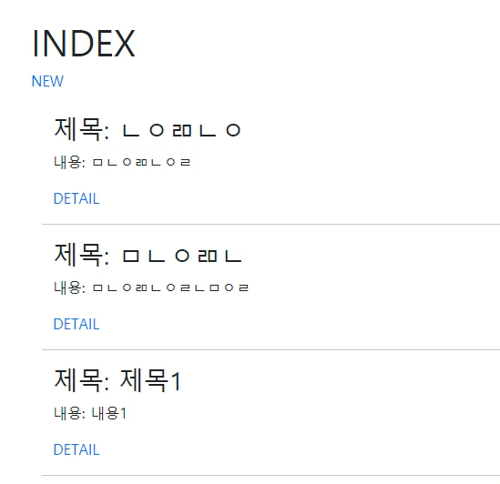

# Workshop



django_03_workshop에서 추가된 부분만 작성한다.

### 1. 'articles/\<int:pk>/edit/' 페이지

- urls.py

  ```
  urlpatterns = [
      path('<int:pk>/edit/', views.edit, name='edit'),
  ]
  ```

- views.py

  ```
  def edit(request, pk):
      article = Article.objects.get(pk=pk)
      context = {
          'article': article,
      }
      return render(request, 'articles/edit.html', context)
  ```

- edit.html

  ```
  
  
  
    <div class="container mt-5">
      <h1>EDIT</h1>
      <form action="" method="POST">
        
        <label for="title">TITLE:</label>
        <input type="text" name="title" id="title" value="{{ article.title }}"><br>
        <label for="content">CONTENT:</label>
        <textarea name="content" id="content" cols="30" rows="10">{{ article.content }}</textarea><br>
        <input type="submit" value="수정">
      </form>
      <a href="" style="text-decoration:none">BACK</a>
    </div>
  
  ```

  - `action=""` : form에 수정할 내용을 입력하고 submit 버튼을 누르면 `articles` app의 `update` name을 가진 url로 보내진다.
  - `value="{{ article.title }}"`, `{{ article.content }}` : 수정할 내용 작성 전 기존 내용이 보여지도록 한다.

### 1_1. 'articles/\<int:pk>/update/' 메소드

- urls.py

  ```
  urlpatterns = [
      path('<int:pk>/update/', views.update, name='update'),
  ]
  ```

- views.py

  ```
  def update(request, pk):
      article = Article.objects.get(pk=pk)
      article.title = request.POST.get('title')
      article.content = request.POST.get('content')
      article.save()
      return redirect('articles:detail', article.pk)
  ```

  - `article.OOO = request.POST.get('OOO')` : `article` 인스턴스에 기존에 작성된 내용을 불러온 다음, edit form에서 전송된 내용을 덮어씌운다.
  - `article.save()` : 수정된 내용을 저장한다.

### 2. 'articles/\<int:pk>/delete/' 메소드

- urls.py

  ```
  urlpatterns = [
      path('<int:pk>/delete/', views.delete, name='delete'),
  ]
  ```

- views.py

  ```
  def delete(request, pk):
      Article.objects.get(pk=pk).delete()
      return redirect('articles:index')
  ```

  - `Article.objects.get(pk=pk).delete()` : pk가 인자로 받은 pk인 Article 인스턴스를 불러온 후 삭제한다.


# Homework

### Django Model

##### 1)

```
python manage.py makemigrations
python manage.py migrate
```

##### 2)

3번이 오류

필드명을 명시해서 argument를 입력해야 한다.

##### 3)

2번

negative indexing은 허용되지 않는다.

##### 4)

```
my_post.title = '안녕하세요'
my_post.content = '반갑습니다'
```

##### 5)

(a) : `objects`

(b) : `all`

