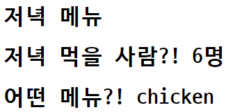

# Workshop



### 1. intro/urls.py

```
from pages import views

urlpatterns = [
    path('admin/', admin.site.urls),
    path('dinner/<str:menu>/<int:people>', views.dinner)
]
```

variable rounting을 위해 `<>`안에 형식(`str`, `int`)를 넣고 `name`을 지정해준다.

### 2. pages/views.py

```
def dinner(request, menu, people):
    context = {
        'menu': menu,
        'people': people,
    }
    return render(request, 'dinner.html', context)
```

요청에서 전달받은 `menu`와 `people`을 인자로 받는다.

그리고 `context`에 저장한 후 template으로 전달한다.

### 3. templates/dinner.html

```
<h1>저녁 메뉴</h1>
<h1>저녁 먹을 사람?! {{ people }}명</h1>
<h1>어떤 메뉴?! {{ menu }}</h1>
```


# Homework

### 1. MTV

M - Model : 데이터베이스 관리
MVC에서 같은 Model과 매칭된다.

T - Template : 레이아웃(화면) 구성. 화면에 보여주기 위한 로직만을 가진다.
MVC에서 View와 매칭된다.

V - View : 컨트롤러. Model과 View를 이어주는 역할.
MVC에서 Controller와 매칭된다.


### 2. URL

variable routing


### 3. Django template path

templates


### 4. Static web and Dynamic web

Static web

- 모든 사용자에게 똑같은 내용을 보여준다
- 서버에 미리 저장된 파일이 그대로 전달된다

Dynamic web

- 상황, 시간, 요청 등에 따라 다른 내용이 보여진다
- 사용자와의 상호작용이 가능하다
- 서버에 있는 데이터를 스크립트에 의해 가공처리하여 전달한다