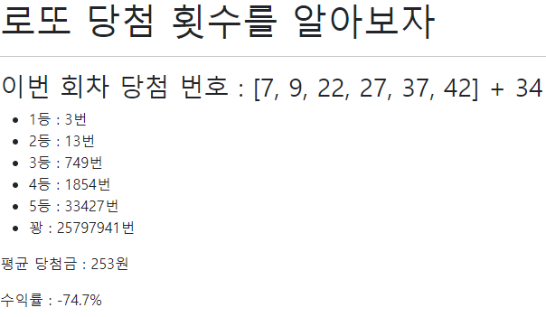

# Practice



### urls.py

```
from django.urls import path, include

urlpatterns = [
    path('pages/', include('pages.urls')),
    path('admin/', admin.site.urls),
]
```

`practice` project 내의 `urls.py`에 해당 코드를 추가하여 `pages/` 주소로 요청이 온다면 `pages/urls.py`로 연결되도록 한다.

```
from django.urls import path
from . import views

urlpatterns = [
    path('lotto/', views.lotto, name='lotto'),
]
```


### views.py

```
import random
import requests
from django.shortcuts import render
```

로또 번호를 생성하기 위해 `random`을, API로부터 json정보를 받아오기 위해 `requests`모듈을 import

```
response = requests.get('https://www.dhlottery.co.kr/common.do?method=getLottoNumber&drwNo=953').json()
result = []
for i in range(1, 7):  # 당첨번호를 result 리스트에 기록
	result.append(response[f'drwtNo{i}'])
bonus = response['bnusNo']  # 보너스번호를 기록
```

받아온 정보로부터 당첨번호 6개와 보너스번호를 변수에 저장

```
count = {'1등': 0, '2등': 0, '3등': 0, '4등': 0, '5등': 0, '꽝': 0}  # 1000회 반복의 결과를 저장할 딕셔너리 생성
    for i in range(1000):
        nums = random.sample(range(1, 46), 6)

        match = 0
        has_bonus = False
        for j in nums:  # 랜덤으로 생성한 6개의 번호에 대해
            if j in result:  # 당첨번호에 있다면
                match += 1
            elif j == bonus:  # 보너스번호라면
                has_bonus = True
```

1000회 반복으로 랜덤한 6개의 번호를 생성하며 맞춘 개수를 기록한다.

```
# 맞춘 개수에 따라 count 추가
if match == 6:
    count['1등'] += 1
elif match == 5:
    if has_bonus:
        count['2등'] += 1
    else:
        count['3등'] += 1
elif match == 4:
    if has_bonus:
        count['4등'] += 1
    else:
        count['5등'] += 1
else:
    count['꽝'] += 1
```

맞춘 개수에 따라 등수를 산출한다.

```
context = {
    'result': result,
    'bonus': bonus,
    'count': count,
}
return render(request, 'pages/lotto.html', context)
```

context에 전달할 결과값들을 저장하고 template으로 전달한다.


### lotto.html

```
<body>
  <h1>로또 당첨 횟수를 알아보자</h1>
  <hr>
  <h3>이번 회차 당첨 번호 : {{ result }} + {{ bonus }}</h3>
  <ul>
    
      <li>{{ position }} : {{ value }}번</li>
    
  </ul>
</body>
```

`count` 딕셔너리를 반복문을 돌며

key 값인 등수와 value 값인 횟수를 형식에 맞게 출력한다.


### ※ 평균 당첨금, 수익률 구하기

```
from bs4 import BeautifulSoup

PRIZE_URL = 'https://dhlottery.co.kr/gameResult.do?method=byWin'
    b_soup = BeautifulSoup(requests.get(PRIZE_URL).text, 'html.parser')
    total_prize = 0
    for i in range(1, 6):
        prize = b_soup.select(f'#article > div:nth-child(2) > div > table > tbody > tr:nth-child({i}) > td:nth-child(4)')
        prize = int(prize[0].text[:-1].replace(',', ''))
        total_prize += count[f'{i}등']*prize
    avg_prize = total_prize / trial
    yield = (avg_prize/1000)*100-100
```