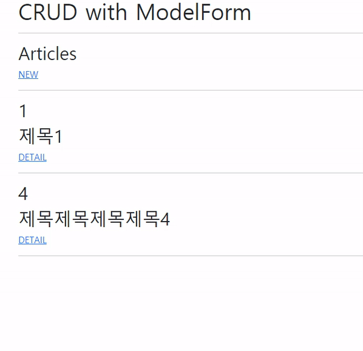

# Workshop



> 기존에 만들었던 workshop, project에서 추가된 부분만 작성한다.

### ModelForm 활용

```
# articles/forms.py

from django import forms
from .models import Article

class ArticleForm(forms.ModelForm):

    class Meta:
        model = Article
        fields = '__all__'
```

- `class Meta:` : ModelForm Helper 클래스를 사용하여 모델에서 form을 작성

```
# articles/views.py

from .forms import ArticleForm
from django.views.decorators.http import require_http_methods, require_safe, require_POST

@require_http_methods(['GET', 'POST'])
def update(request, pk):
    article = Article.objects.get(pk=pk)
    if request.method == 'POST':
        form = ArticleForm(request.POST, instance=article)
        if form.is_valid():
            form.save()
            return redirect('articles:detail', article.pk)
    else:
        form = ArticleForm(instance=article)
    context = {
        'form': form,
    }
    return render(request, 'articles/update.html', context)
```

- `@require_http_methods(['GET', 'POST'])` : GET과 POST method로 들어온 요청만을 허용하는 view decorator
- `form = ArticleForm(request.POST, instance=article)` : `instance`에 해당하는 article 레코드를 불러온 후 request를 통해 들어온 데이터를 자동으로 저장
- `if form.is_valid(): ` : form으로 전달받은 데이터가 유효할 경우에만 진행

```
# articles/templates/articles/update.html




  <h2>Edit</h2>
  <form action="" method="POST">
    
    
      <div class="container">
        {{ field.label_tag }}
        {{ field }}
      </div>
    
    <input type="submit" value="submit">
  </form>
  <a href="" class="text-decoration-none">BACK</a>

```

- ```
  
    <div class="container">
      {{ field.label_tag }}
      {{ field }}
    </div>
  
  ```

  form내의 각 field를 for문을 돌며 렌더링한다.


### Widgets

widget을 통해 데이터 타입에 맞는 표현 형식을 구현할 수 있다. Django에서는 기본적으로 데이터 타입에 맞는 형식을 제공하지만, forms.py에서 직접 widget을 지정할 수도 있다.

```
# articles/forms.py

class ArticleForm(forms.ModelForm):
    title = forms.CharField(
        label='제목',
        widget=forms.TextInput(
            attrs={
                'placeholder': 'Enter the Title',
                'maxlength': 10,
            }
        )
    )
    content = forms.CharField(
        label='내용',
        widget=forms.Textarea(
            attrs={
                'placeholder': 'Enter the Content',
                'rows': 5,
                'cols': 30,
            }
        )
    )
```

- ```
  attrs={
  	'placeholder': 'Enter the Title',
  	'maxlength': 10,
  }
  ```

  `attrs`를 통해 모양, 크기, `placeholder`와 같은 속성 또한 지정할 수 있다.


# Homework

### 1. static 파일 기본 설정

```
STATICFILES_DIRS = [
    BASE_DIR / 'project_name' / 'assets',
]
```

### 2. media 파일 기본 설정

```
MEDIA_ROOT = BASE_DIR / 'project_name' / 'uploaded_files`
```

### 3. Serving files uploaded by user during development

(a) : `settings`

(b) : `django.conf.urls.static`

(c) : `static`

(d) : `settings.MEDIA_URL, document_root=settings.MEDIA_ROOT)`

