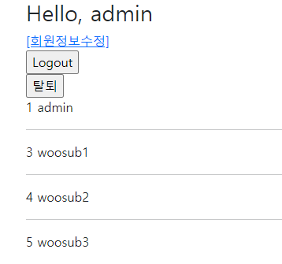
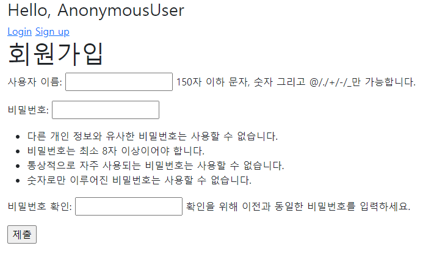

# Workshop

### 1



```
# accounts/urls.py

urlpatterns = [
    path('', views.index, name='index'),
]
```

```
# accounts/views.py

def index(request):
    users = get_user_model().objects.all()
    context = {
        'users': users
    }
    return render(request, 'accounts/index.html', context)
```

`get_user_model()`로 user 모델을 불러온 후 해당 모델의 데이터를 모두 불러와 `users`에 저장한다.

```
# accounts/templates/accounts/index.html




  
    {{ user.pk }}
    {{ user }}
    <hr>
  

```

for tag를 활용해 user 목록을 출력한다.

### 2



```
# accounts/urls.py

app_name ='accounts'
urlpatterns = [
    path('signup/', views.signup, name='signup'),
]
```

```
# accounts/views.py

def signup(request):
    if request.user.is_authenticated:
        return redirect('articles:index')

    if request.method == 'POST':
        form = UserCreationForm(request.POST)
        if form.is_valid():
            user = form.save()
            auth_login(request, user)
            return redirect('articles:index')
    else:
        form = UserCreationForm()
    context = {
        'form': form,
    }
    return render(request, 'accounts/signup.html', context)
```

- ```
  if request.user.is_authenticated:
  	return redirect('articles:index')
  ```

  만약 이미 가입된 유저라면 또 가입할 수 없으므로 index로 돌려보낸다.

- ```
  from django.contrib.auth.forms import UserCreationForm
  
  else:
  	form = UserCreationForm()
  context = {
  	'form': form,
  }
  return render(request, 'accounts/signup.html', context)
  ```

  django에서 제공하는 UserCreationForm을 활용하기 위해 import하고 html로 전달한다.

- ```
  if request.method == 'POST':
  	form = UserCreationForm(request.POST)
  	if form.is_valid():
  		user = form.save()
  		auth_login(request, user)
  		return redirect('articles:index')
  ```

```
# accounts/templates/accounts/signup.html




<h1>회원가입</h1>
<form action="" method="POST">
  
  {{ form.as_p}}
  <input type="submit">
</form>

```


# Homework

### 1

```
class User(AbstractUser):
    """
    Users within the Django authentication system are represented by this
    model.
    
    Username and password are required. Other fields are optional.
    """
    class Meta(AbstractUser.Meta):
        swappable = 'AUTH_USER_MODEL'
```

### 2

```
from django.contrib.auth.forms import UserCreationForm
```

### 3

```
from django.views.decorators.http import require_POST
```

