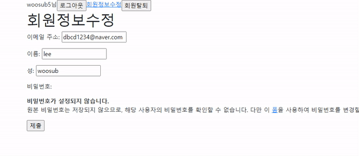

# Workshop



```
from django.contrib.auth import update_session_auth_hash

@login_required
def change_password(request):
    if request.method == 'POST':
        form = PasswordChangeForm(request.user, request.POST)
        if form.is_valid():
            update_session_auth_hash(request, form.save())
            return redirect('articles:index')
    else:
        form = PasswordChangeForm(request.user)
    context = {
        'form': form
    }
    return render(request, 'accounts/change_password.html', context)
```

- `form = PasswordChangeForm(request.user)` : django에서 제공하는 PasswordChangeForm을 활용한다.
- `update_session_auth_hash(request, form.save())` : 비밀번호를 바꾸면 기존 로그인 정보와 회원 정보가 일치하지 않게 되어 로그아웃 되는데, 로그인을 유지하기 위해 위 기능을 활용한다.

# Homework

### 1

##### 1)

User 모델의 부모인 AbstractUser 모델의

`is_staff`
`is_active`

두 칼럼과

AbstractUser 모델의 부모인 PermissionsMixin 모델의

`is_superuser`

칼럼이 BooleanField로 정의했음을 알 수 있다.

### 2

150

### 3

AbstractUser 클래스가 상속받고 있는 AbstractBaseUser의 속성에서 확인할 수 있다.

`is_authenticated`

### 4

(a) AuthenticationForm

(b) login

(c) form.get_user()

### 5

AnonymousUser

### 6

알고리즘 : PBKDF2

해시 함수 : SHA256

### 7

import해온 logout 메소드와 현재 작성 중인 메소드의 이름이 같아서 생기는 문제이다.

`import logout as auth_logout`과 같이 import문을 변경하여 해결 가능하다.