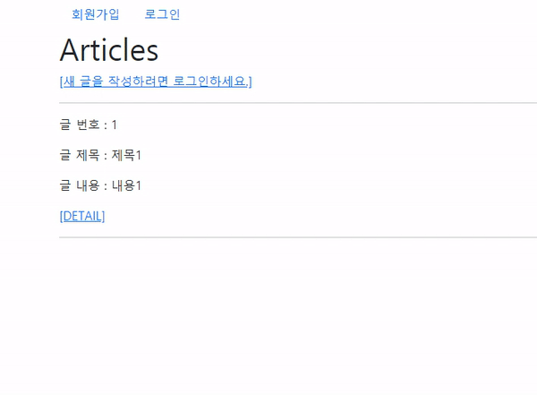
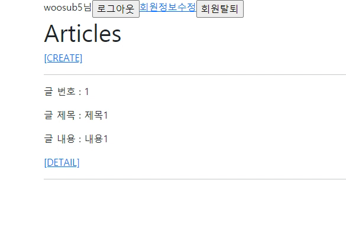
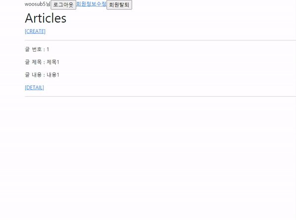

# Practice

### 1. User Create


```
from django.contrib.auth import login as auth_login
from django.contrib.auth.forms import UserCreationForm

def signup(request):
    if request.user.is_authenticated:
        return redirect('articles:index')

    if request.method == 'POST':
        form = UserCreationForm(request.POST)
        if form.is_valid():
            user = form.save()
            auth_login(request, user)
            return redirect('articles:index')
    else:
        form = UserCreationForm()
    context = {
        'form': form,
    }
    return render(request, 'accounts/signup.html', context)
```

django에서 제공하는 UserCreationForm을 활용한다.

### 2. Login



```
from django.contrib.auth import login as auth_login
from django.contrib.auth.forms import AuthenticationForm

def login(request):
    if request.user.is_authenticated:
        return redirect('articles:index')

    if request.method == 'POST':
        form = AuthenticationForm(request, request.POST)
        if form.is_valid():
            auth_login(request, form.get_user())
            return redirect(request.GET.get('next') or 'articles:index')
    else:
        form = AuthenticationForm()
    context = {
        'form': form,
    }
    return render(request, 'accounts/login.html', context)
```

django에서 제공하는 AuthenticationForm을 활용한다.

### 3. Logout



```
from django.contrib.auth import logout as auth_logout

@require_POST
def logout(request):
    auth_logout(request)
    return redirect('articles:index')
```

### 4. User Update



```
# accounts/forms.py

from django.contrib.auth.forms import UserChangeForm
from django.contrib.auth import get_user_model


class CustomUserChangeForm(UserChangeForm):

    class Meta:
        model = get_user_model()
        fields = ('email', 'first_name', 'last_name',)
```

```
@login_required
def update(request):
    if request.method == 'POST':
        form = CustomUserChangeForm(request.POST, instance=request.user)
        if form.is_valid():
            form.save()
            return redirect('articles:index')
    else:
        form = CustomUserChangeForm(instance=request.user)
    context = {
        'form': form,
    }
    return render(request, 'accounts/update.html', context)
```

### 5. User Delete

```
@require_POST
def delete(request):
    if request.user.is_authenticated:
        request.user.delete()
    return redirect('articles:index')
```

