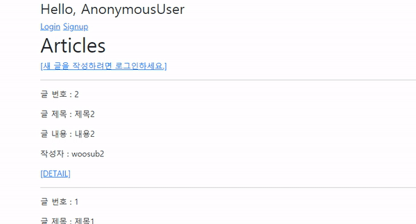
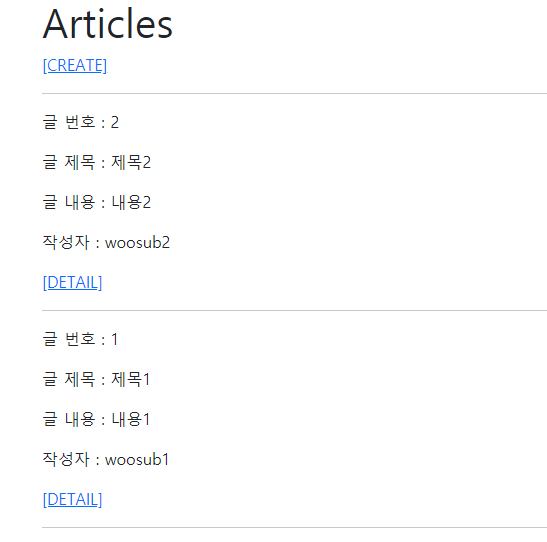
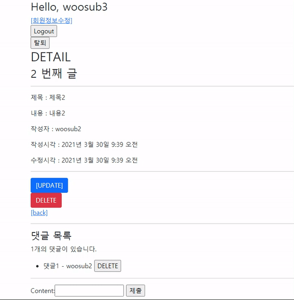
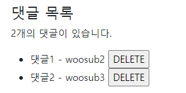
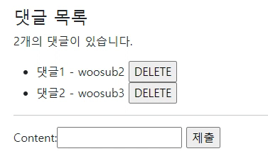

# Workshop

### 1)

```python
# accounts/models.py

from django.contrib.auth.models import AbstractUser

class User(AbstractUser):
    pass
```

```python
# crud/settings.py

AUTH_USER_MODEL = 'accounts.User'
```

### 2)



Django에서 제공하는 UserCreationForm은 기본 User 모델을 사용하므로
User 모델을 대체할 경우 CustomUserCreationForm 또한 만들어 주어야 한다.

```python
# accounts/forms.py

from django.contrib.auth.forms import UserCreationForm

class CustomUserCreationForm(UserCreationForm):

    class Meta:
        model = get_user_model()
        fields = ('username',)
```

```python
# accounts/views.py

from .forms import CustomUserCreationForm

def signup(request):
    ...
    if request.method == 'POST':
        form = CustomUserCreationForm(request.POST)
		...
    else:
        form = CustomUserCreationForm()
```

### 3)



```python
# articles/models.py

from django.conf import settings

class Article(models.Model):
    user = models.ForeignKey(settings.AUTH_USER_MODEL, on_delete=models.CASCADE)
```

User 모델을 Article 모델의 ForeignKey로 설정한다.

```python
# articles/views.py

def create(request):
    ...
        if form.is_valid():
            article = form.save(commit=False)
            article.user = request.user
            article.save()
            return redirect('articles:detail', article.pk)
    ...
```

commit=False를 사용하여 임시로 저장한 후
article의 user ForeignKey를 설정해주고 저장한다.

```html
# articles/templates/articles/index.html

...
    <p>글 내용 : {{ article.content }}</p>
    <p>작성자 : {{ article.user }}</p>
    <a href="">[DETAIL]</a>
...
```

### 4)



```python
# articles/views.py

def delete(request, pk):
    if request.user.is_authenticated:
        article = get_object_or_404(Article, pk=pk)
        if article.user == request.user:
            article.delete()
            return redirect('articles:index')
    return redirect('articles:detail', pk)

def update(request, pk):
    article = get_object_or_404(Article, pk=pk)
    if article.user == request.user:
        if request.method == 'POST':
            form = ArticleForm(request.POST, instance=article)
            if form.is_valid():
                form.save()
                return redirect('articles:detail', article.pk)
        else:
            form = ArticleForm(instance=article)
    else:
        return redirect('articles:detail', pk)
    context = {
        'form': form,
        'article': article,
    }
    return render(request, 'articles/update.html', context)
```

`if article.user == request.user:`를 통해 현재 요청을 보내는 사용자와 게시글 작성자가 같은지 확인한다.

### 5)



```python
# articles/models.py

class Comment(models.Model):
    user = models.ForeignKey(settings.AUTH_USER_MODEL, on_delete=models.CASCADE)
```

User 모델을 Comment 모델의 ForeignKey로 설정한다.

```python
# articles/forms.py

class CommentForm(forms.ModelForm):

    class Meta:
        model = Comment
        exclude = ('article', 'user',)
```

CommentForm에서 user를 고르는 란이 보이지 않도록 한다.

```python
# articles/views.py

def comments_create(request, pk):
    ...
    		comment = comment_form.save(commit=False)
            comment.article = article
            comment.user = request.user
            comment.save()
    ...
```

commit=False를 사용하여 임시로 저장한 후
comment의 user ForeignKey를 설정해주고 저장한다.

```html
# articles/templates/articles/detail.html

...
      <li>
        {{ comment }} - {{ comment.user }}
        <form action="" method="POST" class="d-inline">
...
```

### 6)



```python
# articles/views.py

def comments_delete(request, article_pk, comment_pk):
    if request.user.is_authenticated:
        comment = get_object_or_404(Comment, pk=comment_pk)
        if comment.user == request.user:
            comment.delete()
    return redirect('articles:detail', article_pk)
```

`if comment.user == request.user:`를 통해 현재 요청을 보내는 사용자와 댓글 작성자가 같은지 확인한다.


# Homework

### 1

**1)**  T

**2)**  F, modelname_set 형식을 통해 역참조(직접 참조 X)할 수 있다.

**3)**  T

**4)**  F, PrimaryKey 뿐만 아니라 Unique key여도 참조 가능하다.

### 2

컬럼 이름 : answer_id

테이블 이름 : articles_comment

### 3

`Question.comment_set.all()`

### 4

HTTP response status code : 405 Method Not Allowed

발생 원인 : next 파라미터를 이용해 다시 /articles/\<pk>/delete/ 경로로 redirect된다면 GET 방식으로 요청이 들어가기 때문에 Method Not Allowed 에러가 발생한다.

이를 해결하기 위해 사용자가 인증됐는지 확인하는 과정은 `@login_required`가 아니라 `if request.user.is_authenticated`로 함수 내에서 진행한다.

```python
@require_POST
def delete(request, article_pk):
    if request.user.is_authenticated:
        article = get_object_or_404(Article, pk=article_pk)
        article.delete()
        return redirect('articles:index')
```