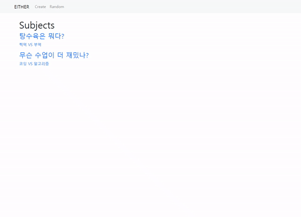
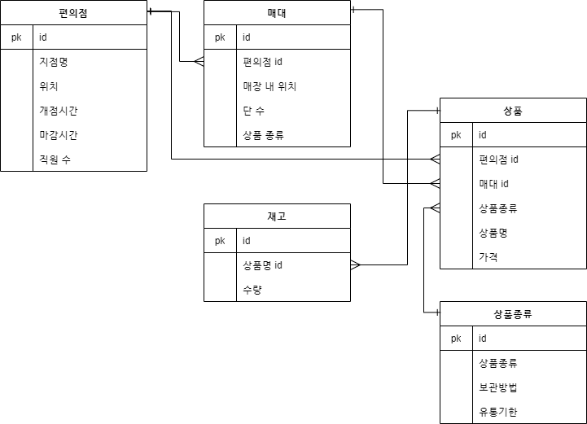

# Workshop



```
# 자료구조

-either
  -templates
     -base.html
  -settings.py
  -urls.py
-votes
  -templates
    -votes
      -create.html
      -detail.html
      -index.hml
  -models.py
  -forms.py
  -urls.py
  -views.py
-venv
-manage.py
```

```python
# votes/models.py

class Subject(models.Model):
    subject = models.CharField(max_length=100)
    choice_1 = models.CharField(max_length=100)
    choice_2 = models.CharField(max_length=100)


class Vote(models.Model):
    subject = models.ForeignKey(Subject, on_delete=models.CASCADE)
    choice = models.IntegerField()
    comment = models.TextField()
    created_at = models.DateTimeField(auto_now_add=True)
```

```python
# votes/forms.py

from django import forms
from .models import Subject, Vote


class SubjectForm(forms.ModelForm):

    class Meta:
        model = Subject
        fields = '__all__'
        

class VoteForm(forms.ModelForm):
    choice = forms.ChoiceField(
        choices=[
            (1, 'BLUE'),
            (2, 'RED'),
        ],
        label='',
    )
    comment = forms.CharField(
        label='',
        widget=forms.Textarea(
            attrs={
                'rows': 2,
                'placeholder': '댓글을 작성해 주세요.',
            }
        ),
    )

    class Meta:
        model = Vote
        exclude = ('subject',)
```

```python
# votes/views.py

from random import randrange
from django.shortcuts import render, redirect
from .models import Subject, Vote
from .forms import SubjectForm, VoteForm

def create(request):
    if request.method == 'POST':
        form = SubjectForm(request.POST)
        if form.is_valid():
            form.save()
            return redirect('votes:detail', form.instance.pk)
    else:
        form = SubjectForm()
    context = {
        'form': form,
    }
    return render(request, 'votes/create.html', context)


def index(request):
    subjects = Subject.objects.order_by('-pk')
    context = {
        'subjects': subjects,
    }
    return render(request, 'votes/index.html', context)


def detail(request, subject_pk):
    subject = Subject.objects.get(pk=subject_pk)
    votes = subject.vote_set.all()
    if votes:
        t_percent = int((votes.filter(choice=True).count() / votes.count()) * 100)
        f_percent = 100 - t_percent
    else:
        t_percent, f_percent = 50, 50
    form = VoteForm()
    context = {
        'subject': subject,
        'votes': votes,
        't_percent': t_percent,
        'f_percent': f_percent,
        'form': form,
    }
    return render(request, 'votes/detail.html', context)


def vote(request, subject_pk):
    form = VoteForm(request.POST)
    vote = form.save(commit=False)
    vote.subject = Subject.objects.get(pk=subject_pk)
    vote.save()
    return redirect('votes:detail', subject_pk)


def random(request):
    pk = randrange(1, Subject.objects.all().count()+1)
    return redirect('votes:detail', pk)
```

```html
# base.html

<!DOCTYPE html>
<html lang="en">
<head>
  <meta charset="UTF-8">
  <meta http-equiv="X-UA-Compatible" content="IE=edge">
  <meta name="viewport" content="width=device-width, initial-scale=1.0">
  <link href="https://cdn.jsdelivr.net/npm/bootstrap@5.0.0-beta3/dist/css/bootstrap.min.css" rel="stylesheet" integrity="sha384-eOJMYsd53ii+scO/bJGFsiCZc+5NDVN2yr8+0RDqr0Ql0h+rP48ckxlpbzKgwra6" crossorigin="anonymous">
  <title>Document</title>
</head>
<body>
  <nav class="navbar navbar-expand navbar-light bg-light mb-4">
    <div class="container-fluid d-flex justify-content-start mx-5">
      <a class="navbar-brand" href="">EITHER</a>
      <ul class="navbar-nav">
        <li class="nav-item">
          <a class="nav-link" href="">Create</a>
        </li>
        <li class="nav-item">
          <a class="nav-link" href="">Random</a>
        </li>
      </ul>
    </div>
  </nav>
  <div class="container">
    
    
  </div>
  <script src="https://cdn.jsdelivr.net/npm/bootstrap@5.0.0-beta3/dist/js/bootstrap.bundle.min.js" integrity="sha384-JEW9xMcG8R+pH31jmWH6WWP0WintQrMb4s7ZOdauHnUtxwoG2vI5DkLtS3qm9Ekf" crossorigin="anonymous"></script>
</body>
</html>
```

```html
# create.html




  <form action="" method="POST">
    
    {{ form.as_p }}
    <button>등록</button>
  </form>

```

```html
# index.html




  <h1>Subjects</h1>
  
    <a href="" class="text-decoration-none">
      <h3>{{ subject.subject }}</h3>
      <p>{{ subject.choice_1 }} VS {{ subject.choice_2 }}</p>
    </a>
  

```

```html
# detail.html





  <h1 class="text-center mb-4">{{ subject.subject }}</h1>
  <div class="progress" style="height: 100px"> 
    <div class="progress-bar progress-bar-striped" style="width: {{ t_percent }}%; font-size: 50px">{{ t_percent }}%</div>
    <div class="progress-bar progress-bar-striped bg-danger" style="width: {{ f_percent }}%; font-size: 50px">{{ f_percent }}%</div>
  </div>
    <h2 class="text-center my-4">{{ subject.choice_1}} VS {{ subject.choice_2 }}</h2>

  
  <form action="" method="POST" class="d-flex flex-column align-items-center my-4">
    
    {{ form.as_table }}
    <button class="my-4">제출</button>
  </form>
  
    <div class="d-flex justify-content-between">
      
        <span>[{{ subject.choice_1 }}] {{ vote.comment }}</span>
      
        <span>[{{ subject.choice_2 }}] {{ vote.comment }}</span>      
      
      <span>{{ vote.created_at }}</span>
    </div>
    <hr class="m-1">
  


```


# Homework



가장 상위 테이블로 편의점 지점을 설정하였다.

지점을 관리하기 위해 가장 주가되는 테이블은 상품 테이블이다. 상품은 매대별, 상품 종류별로 분류할 수 있으므로 매대와 상품종류 테이블을 만들어 참조하도록 하였다.