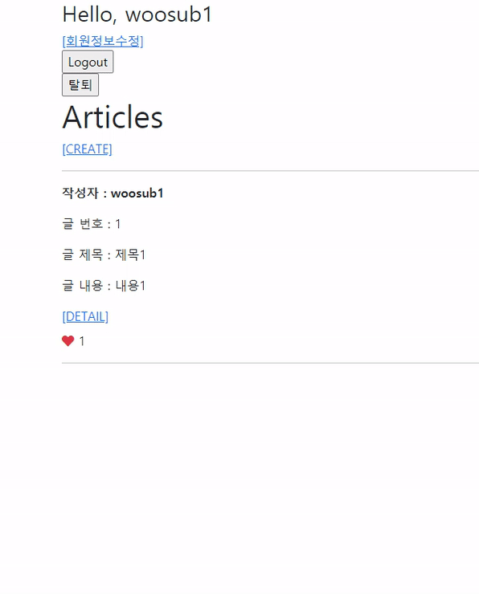

# Workshop



```python
# articles/models.py

class Article(models.Model):
    like_users = models.ManyToManyField(settings.AUTH_USER_MODEL, related_name='like_articles')
```

Article 모델에 like_users라는 필드를 추가해준다.

한 사용자가 여러 개의 게시글에 좋아요를 누를 수 있고,
한 게시글에 여러 명의 사용자가 좋아요를 누를 수 있으므로
ManyToManyField를 사용한다.

- `related_name='like_articles'` : User 모델에서 역참조를 할 시 사용할 이름을 지정한다.(ex- `User.like_articles.all()`)

```python
# articles/views.py

@require_POST
def like(request, article_pk):
    if request.user.is_authenticated:
        article = get_object_or_404(Article, pk=article_pk)
        if article.like_users.filter(pk=request.user.pk).exists():
            article.like_users.remove(request.user)
        else:
            article.like_users.add(request.user)
        return redirect('articles:detail', article_pk)
    return redirect('accounts:login')
```

- `if article.like_users.filter(pk=request.user.pk).exists():` : like_users 쿼리셋에 request.user가 존재한다면(좋아요를 눌렀다면) 좋아요 목록에서 제거한다.

```html
# articles/templates/articles/index.html

<div class="my-2">
  
    <i class="fas fa-heart text-danger"></i>
  
    <i class="far fa-heart text-danger"></i>
  
  {{ article.like_users.all|length }}
</div>
```

fontawesome에서 하트 아이콘을 가져오기 위해 base.html에 CDN을 적용하고 아이콘을 추가하였다.


# Homework

### 1

**1)** T

**2)** T

**3)** F, related_name은 필수가 아니다.

### 2

**(a)** request.user

**(b)** articles.like_users.all

### 3

**(a)** user_pk

**(b)** followers

**(c)** filter

**(d)** add

**(e)** remove

### 4

django에서 제공하는 UserCreationForm은 django 기본 User 모델을 사용한다.
따라서 커스텀 User 모델을 사용하는 경우 CustomUserCreationForm 또한 만들어주어야 한다.

```python
# accounts/forms.py

from django.contrib.auth.forms import UserCreationForm
from django.contrib.auth import get_user_model

class CustomUserCreationForm(UserCreationForm):

    class Meta(UserCreationForm.Meta):
        model = get_user_model()
        fields = UserCreationForm.Meta.fields
```

### 5

related_name을 설정하지 않을 경우 user 필드와 역참조 name이 겹치게 되어 에러가 발생한다.