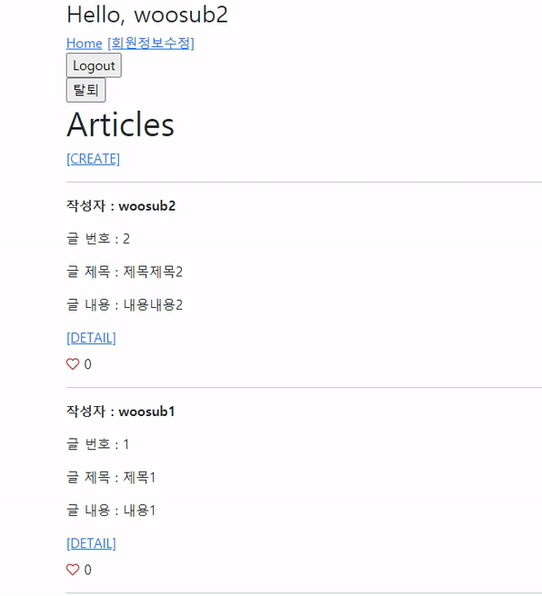

# Workshop



```python
# accounts/models.py

class User(AbstractUser):
    followings = models.ManyToManyField('self', symmetrical=False, related_name='followers')
```

- `'self'` : 자기 모델을 재귀적으로 참조하는 필드이므로 'self' 사용
- `symmetrical=False` : 한쪽에서 참조하면 다른쪽에서도 자동으로 참조하는(싸이월드 일촌, 페이스북 친구) 것이 아니므로 False로 준다(일방향 Follow).

```python
# accounts/views.py

@require_safe
def profile(request, username):
    person = get_object_or_404(get_user_model(), username=username)
    context = {
        'person': person,
    }
    return render(request, 'accounts/profile.html', context)

@require_POST
def follow(request, username):
    you = get_object_or_404(get_user_model(), username=username)
    if you.followers.filter(pk=request.user.pk).exists():
        you.followers.remove(request.user)
    else:
        you.followers.add(request.user)
    return redirect('accounts:profile', username)
```

Follow의 경우 로그인하지 않으면 버튼이 보여지지 않도록 할 것이므로 따로 사용자 인증 과정은 넣지 않았다.

- `if you.followers.filter(pk=request.user.pk).exists():` : 기존에 Follow를 해놨을 경우 -> Unfollow

```html
# accounts/templates/accounts/profile.html


  <h2>{{ person.username }}</h2>
  
  
    <form action="" method="POST">
      
      <button class="btn btn-primary btn-sm">
        
          Unfollow
        
          Follow
        
      </button>
    </form>
  
  
  ...

  <h3>팔로잉 {{ person.followings.all|length }}</h3>
  <hr>
  
    {{ following.username }}
  
  <hr>
  <h3>팔로워 {{ person.followers.all|length }}</h3>
  <hr>
  
    {{ follower.username }}
  
```

- `` : 로그인하지 않았거나, 자기 자신의 프로필을 보는 경우 팔로우 버튼이 보여지지 않도록 한다.
- `` : 이미 팔로우를 했을 경우 Unfollow가 보여지도록 한다.


# Homework

### 1

M : Model
데이터베이스를 담당한다.

T : Template
사용자에게 보여지는 부분을 담당한다.

V : View
Model과 Template 간의 연결다리.
Model의 데이터베이스를 조작하여 산출물을 Template으로 보내 출력되게 하고,
사용자가 보내온 데이터를 데이터베이스에 저장할 수 있게 한다.

### 2

**(a)** articles

**(b)** views

**(c)** views.index

### 3

**(a)** settings.py

**(b)** TEMPLATES

**(c)** STATICFILES_DIRS

### 4

**1)** python manage.py makemigrations

**2)** python manage.py showmigrations

**3)** python manage.py sqlmigrate

**4)** python manage.py migrate

### 5

**1)** F, GET 방식은 URL에 정보가 담겨서 전달되고, POST 방식은 body에 정보가 담겨서 전달된다.

**2)** T

**3)** F

**4)** T

### 6

MEDIA_ROOT, MEDIA_URL

### 7

**1)** T

**2)** F

**3)** T

**4)** T

**5)** T

### 8

PROTECT

### 9

**(a)** ManyToManyField

**(b)** related_name

related_name을 작성하지 않으면 user필드와 like_users 필드의 역참조시 이름이 같게 되어 에러가 발생한다.

### 10

테이블명 : accounts_user_followings

from_user_id, to_user_id