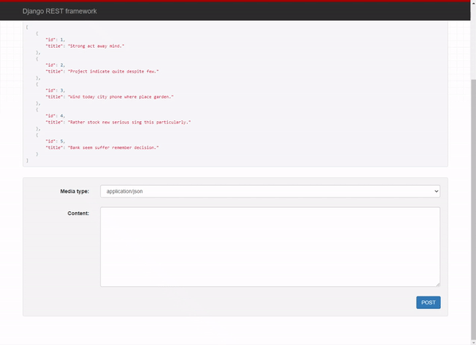
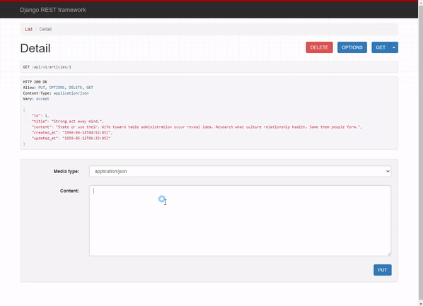

# Workshop

```python
# api/settings.py

INSTALLED_APPS = [
    'articles',
    'django_seed',
    'rest_framework',
]
```

dummy data를 추가하기 위해 django_seed와
rest_framework를 추가해준다.

```python
# articles/serializers.py

from rest_framework import serializers
from .models import Article

class ArticleListSerializer(serializers.ModelSerializer):

    class Meta:
        model = Article
        fields = ('id', 'title',)


class ArticleSerializer(serializers.ModelSerializer):

    class Meta:
        model = Article
        fields = '__all__'
```

#### api/v1/articles/



```python
# articles/views.py

@api_view(['GET', 'POST'])
def list(request):
    if request.method == 'GET':
        articles = get_list_or_404(Article)
        serializer = ArticleListSerializer(articles, many=True)
        return Response(serializer.data)
    elif request.method == 'POST':
        serializer = ArticleSerializer(data=request.data)
        if serializer.is_valid(raise_exception=True):
            serializer.save()
            return Response(serializer.data)
```

- GET
  - `@api_view(['GET', 'POST'])` : GET, POST method만 허용하는 decorator이다.
  - `articles = get_list_or_404(Article)` : 모든 데이터를 가져와야하므로 object가 아닌 list 사용
  - `serializer = ArticleListSerializer(articles, many=True)` : articles를 직렬화하여 전달하는데, queryset으로 다량의 인스턴스를 전달하므로 `many=True`를 추가한다.
- POST
  - `if serializer.is_valid(raise_exception=True):` : 검증이 실패하는 경우 400 Bad Request 오류를 발생시키기 위해 `raise_exception=True` 추가

#### api/v1/articles/<article_pk>/



```python
# articles/views.py

@api_view(['GET', 'PUT', 'DELETE'])
def detail(request, article_pk):
    article = get_object_or_404(Article, pk=article_pk)
    if request.method == 'GET':
        serializer = ArticleSerializer(article)
        return Response(serializer.data)
    elif request.method == 'PUT':
        serializer = ArticleSerializer(article, data=request.data)
        if serializer.is_valid(raise_exception=True):
            serializer.save()
            return Response(serializer.data)
    elif request.method == 'DELETE':
        article.delete()
        data = {
            'delete': f'{article_pk}번 데이터가 삭제되었습니다.'
        }
        return Response(data, status.HTTP_204_NO_CONTENT)
```

- DELETE

  - ```
    data = {
        'delete': f'{article_pk}번 데이터가 삭제되었습니다.'
    }
    return Response(data, status.HTTP_204_NO_CONTENT)
    ```

    데이터를 삭제할 경우 보여지게할 json 데이터를 설정한다.

# Homework

### 1.

- T
- F : PUT과 DELETE도 있다.
- T
- F : create는 행위이므로 method를 활용해야 한다.

### 2.

- 200 : OK
- 400 : Bad Request
- 401 : Unauthorized
- 403 : Forbidden
- 404 : Page Not Found
- 500 : 서버가 처리 방법을 모르는 상황이 발생했을 때

### 3.

```python
class StudentSerializer(serializers.ModelSerializer):

    class Meta:
        model = Student
        fields = '__all__'
```

### 4.

Serializers는 Queryset과 Model 같은 복잡한 데이터를 Python 데이터 타입으로 변환하여 준다.