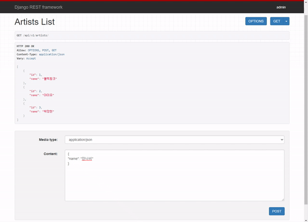
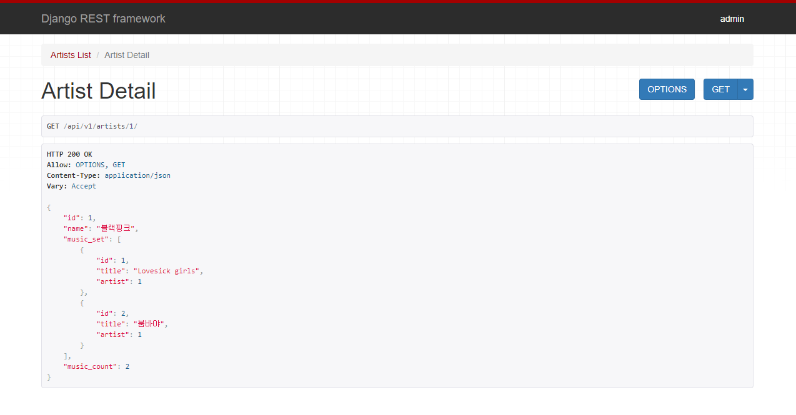

# Workshop

```python
# music/models.py

class Music(models.Model):
    artist = models.ForeignKey(Artist, on_delete=models.CASCADE)
```

Artist와 Music 모델은 1:N 관계이므로 위와 같이 설정해준다.

```python
# music/serializers.py

from rest_framework import serializers
from .models import Artist, Music

class ArtistListSerializer(serializers.ModelSerializer):

    class Meta:
        model = Artist
        fields = '__all__'


class MusicSerializer(serializers.ModelSerializer):

    class Meta:
        model = Music
        fields = '__all__'
        read_only_fields = ('artist',)


class ArtistSerializer(serializers.ModelSerializer):
    # 여기서 MusicSerializer 클래스가 필요하므로 MusicSerializer 클래스가 ArtistSerializer 클래스보다 위에 작성되어야 한다.
    music_set = MusicSerializer(many=True, read_only=True)
    music_count = serializers.IntegerField(source='music_set.count', read_only=True)

    class Meta:
        model = Artist
        fields = ('id', 'name', 'music_set', 'music_count',)


class MusicListSerializer(serializers.ModelSerializer):
    
    class Meta:
        model = Music
        fields = '__all__'
```

- MusicSerializer
  - `read_only_fields = ('artist',)` : artist 필드는 url 주소의 artist_pk를 자동 참조하여 따로 지정할 필요가 없도록 만든다.
- ArtistSerializer
  - `music_set = MusicSerializer(many=True, read_only=True)` : 위와 같이 자동으로 입력되도록 `read_only=True`를 설정한다.
  - `music_count = serializers.IntegerField(source='music_set.count', read_only=True)` : music_set의 숫자를 출력

#### api/v1/artists




```python
# music/views.py

from django.shortcuts import get_list_or_404
from rest_framework import status
from rest_framework.response import Response
from rest_framework.decorators import api_view
from .models import Artist
from .serializers import ArtistListSerializer, ArtistSerializer

@api_view(['GET', 'POST'])
def artists_list(request):
    if request.method == 'GET':
        artists = get_list_or_404(Artist)
        serializer = ArtistListSerializer(artists, many=True)
        return Response(serializer.data)
    elif request.method == 'POST':
        serializer = ArtistSerializer(data=request.data)
        if serializer.is_valid(raise_exception=True):
            serializer.save()
            return Response(serializer.data, status.HTTP_201_CREATED)
```

- `return Response(serializer.data, status.HTTP_201_CREATED)` : serializer가 유효하다면 201 Created를 응답한다.

#### api/v1/artists/<artist_pk>/



```python
# music/views.py

@api_view(['GET'])
def artist_detail(request, artist_pk):
    artist = get_object_or_404(Artist, pk=artist_pk)
    serializer = ArtistSerializer(artist)
    return Response(serializer.data)
```

#### api/vi/artists/<artist_pk>/music/

```python
# music/views.py

@api_view(['POST'])
def save_music(request, artist_pk):
    serializer = MusicSerializer(data=request.data)
    if serializer.is_valid(raise_exception=True):
        artist = get_object_or_404(Artist, pk=artist_pk)
        serializer.save(artist=artist)
        return Response(serializer.data, status.HTTP_201_CREATED)
```

- `serializer.save(artist=artist)` : serializer를 활용할 때에는 `commit=False`를 사용하지 않고 위와 같이도 가능하다.

#### api/v1/music/

```python
# music/views.py

@api_view(['GET'])
def music_list(request):
    musics = get_list_or_404(Music)
    serializer = MusicListSerializer(musics, many=True)
    return Response(serializer.data)
```

#### api/v1/music/<music_pk>/

```python
# music/views.py

@api_view(['GET', 'PUT', 'DELETE'])
def music_detail(request, music_pk):
    music = get_object_or_404(Music, pk=music_pk)
    if request.method == 'GET':
        serializer = MusicSerializer(music)
        return Response(serializer.data)
    elif request.method == 'PUT':
        serializer = MusicSerializer(music, request.data)
        if serializer.is_valid(raise_exception=True):
            serializer.save()
            return Response(serializer.data)
    elif request.method == 'DELETE':
        music.delete()
        return Response({'pk': f'{music_pk}번 음악 삭제'}, status.HTTP_204_NO_CONTENT)
```


# Homework

### 1.

- F
- F
- T
- T

### 2.

(a) : URI

(b) : HTTP Method

### 3.

(a) : ['POST']

(b) : request.data

(c) : raise_exception=True

(d) : serializer.data

(e) : status.HTTP_201_CREATED