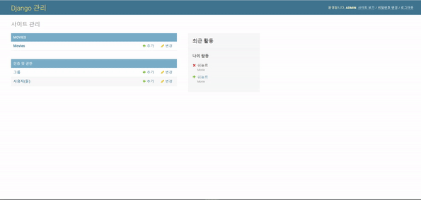
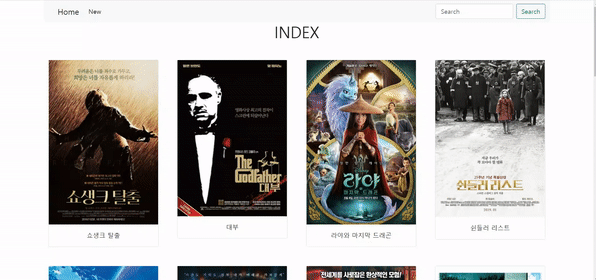
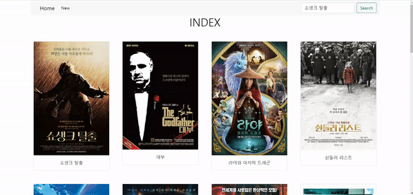
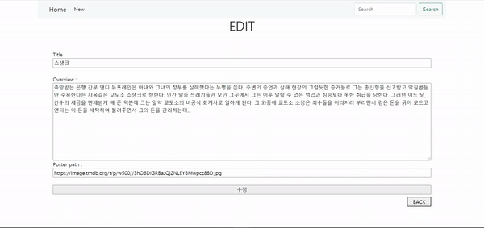
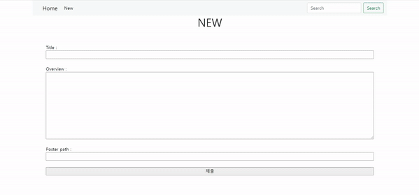

# Project 04

> 20210312에 진행한 프로젝트입니다.

### 1. Admin



```
from .models import Movie

class MovieAdmin(admin.ModelAdmin):
    list_display = ('pk', 'title', 'overview', 'poster_path',)
admin.site.register(Movie)
```

### 2. base.html



```
<body>
  <div class="container">
    <nav class="navbar navbar-expand-lg navbar-light bg-light sticky-top">
      <div class="container-fluid">
        <a class="navbar-brand ms-4" href="">Home</a>
        <button class="navbar-toggler" type="button" data-bs-toggle="collapse" data-bs-target="#navbarSupportedContent" aria-controls="navbarSupportedContent" aria-expanded="false" aria-label="Toggle navigation">
          <span class="navbar-toggler-icon"></span>
        </button>
        <div class="collapse navbar-collapse" id="navbarSupportedContent">
          <ul class="navbar-nav me-auto mb-2 mb-lg-0">
            <li class="nav-item">
              <a class="nav-link active" aria-current="page" href="">New</a>
            </li>
          </ul>
          <form action="" method="GET" class="d-flex">
            <input class="form-control me-2" type="search" placeholder="Search" aria-label="Search" name="title">
            <button class="btn btn-outline-success" type="submit">Search</button>
          </form>
        </div>
      </div>
    </nav>
    
    
  </div>
</body>
```

- `<nav class="navbar navbar-expand-lg navbar-light bg-light sticky-top">` : 상단에 navbar 활용

- `<a class="navbar-brand ms-4" href="">Home</a>` : Home 버튼을 누르면 index 페이지로 이동

- `<a class="nav-link active" aria-current="page" href="">New</a>` : New 버튼을 누르면 new 페이지(새 글 작성 페이지)로 이동

- ```
  <form action="" method="GET" class="d-flex">
      <input class="form-control me-2" type="search" placeholder="Search" aria-label="Search" name="title">
      <button class="btn btn-outline-success" type="submit">Search</button>
  </form>
  ```

  - input에 찾을 영화 제목을 입력하고 Search 버튼을 누르면 form의 GET method를 활용해 해당 제목을 가진 영화의 detail 페이지로 연결된다.

### 3. 'movies/' 페이지

- urls.py

  ```
  urlpatterns = [
      path('', views.index, name='index'),
  ]
  ```

  뒤에 다른 주소 없이 'movies/'로만 요청이 들어오면 views의 index 메소드로 연결된다.

- views.py

  ```
  def index(request):
      articles = Movie.objects.all()
      context = {
          'movies': movies,
      }
      return render(request, 'movies/index.html', context)
  ```

  Movie 모델 전체 데이터를 objects 매니저를 통해 가져온 후 `context`에 담아 html로 넘겨준다.

- index.html

  ```
  
  
  
  <h1 class="text-center">INDEX</h1>
  <section class="container my-5">
    <div class="row row-cols-1 row-cols-sm-4 g-5">
      
        <div class="col">
          <article class="card">
            
            <div class="card-body text-center">
              <a href="" class="card-title text-decoration-none text-dark">{{ movie.title }}</a><br>
            </div>
          </article>
        </div>
      
    </div>
  </section>
  
  ```

  - `<div class="row row-cols-1 row-cols-sm-4 g-5">` : Grid system을 활용 - sm 크기 이상일 때는 4줄씩 보이도록 하고, 그 미만일 때는 한줄씩만 보이도록 한다.
  - `` : movies의 각 movie에 대해
    - `` : poster_path에 저장된 경로의 이미지를 보여준다.
    - `<a href="">` : 제목 부분을 누르면 detail 페이지로 들어가도록 링크 설정.

### 4. 'movies/\<int:pk>/' 페이지



- urls.py

  ```
  urlpatterns = [
      path('<int:pk>/', views.detail, name='detail'),
  ]
  ```

- views.py

  ```
  def detail(request, pk):
      movie = Movie.objects.get(pk=pk)
      context = {
          'movie': movie,
      }
      return render(request, 'movies/detail.html', context)
  ```

  - `movie = Movie.objects.get(pk=pk)` : pk가 인자로 받은 `pk`와 같은 Movie 레코드를 불러온다.

- detail.html

  ```
  
  
  
    <h1 class="text-center">DETAIL</h1>
    <section class="container my-5">
      <div class="row">
        <div class="col-4">
          <article class="card">
            
          </article>
        </div>
        <div class="col-8 d-flex flex-column justify-content-between">
          <div>
            <h3>TITLE : {{ movie.title }}</h3>
            <p>OVERVIEW : {{ movie.overview }}</p>
          </div>
          <div class="d-flex justify-content-end m-3">
            <a href="" class="mx-1">
              <button>EDIT</button>
            </a>
            <form action="" method="POST" class="mx-1">
              
              <button>DELETE</button>
            </form>
            <a href="" class="mx-1">
              <button>BACK</button>
            </a>
          </div>
        </div>
      </div>
    </section>
  
  ```

  - ```
    <div class="col-4">
    <div class="col-8 d-flex flex-column justify-content-between">
    ```

    Grid system을 활용. 사진은 4줄을 차지하고, 제목과 내용은 8줄을 차지한다.

  - ```
    <a href="" class="mx-1">
      <button>EDIT</button>
    </a>
    ```

    EDIT 버튼을 누르면 해당 영화의 수정 페이지로 간다.

  - ```
    <form action="" method="POST" class="mx-1">
      
      <button>DELETE</button>
    </form>
    ```

    - `method="POST"` : 서버 데이터에 변화를 주기 위해 사용한다.

  - ```
    <a href="" class="mx-1">
      <button>BACK</button>
    </a>
    ```

    BACK 버튼을 누르면 이전 페이지(index 페이지)로 간다.

### 4_1. 'movies/\<int:pk>/edit' 페이지



- urls.py

  ```
  urlpatterns = [
      path('<int:pk>/edit/', views.edit, name='edit'),
  ]
  ```

- views.py

  ```
  def edit(request, pk):
      movie = Movie.objects.get(pk=pk)
      context = {
          'movie': movie,
      }
      return render(request, 'movies/edit.html', context)
  ```

  url에서 전달된 pk에 해당하는 Movie 레코드를 불러온 후 context에 담아 html로 전달한다.

- edit.html

  ```
  
  
  
    <h1 class="text-center">EDIT</h1>
    <div class="container p-5">
      <form action="" method="POST" class="d-flex flex-column">
        
        <label for="title">Title :</label>
        <input type="text" name="title" id="title" value={{ movie.title }}><br>
        <label for="overview">Overview :</label>
        <textarea name="overview" id="overview" cols="30" rows="10">{{ movie.overview }}</textarea>
        <label for="poster_path">Poster path :</label>
        <input type="text" name="poster_path" id="poster_path" value={{ movie.poster_path }}><br>
        <input type="submit" value="수정">
      </form>
      <div class="d-flex justify-content-end mt-2">
        <a href="">
          <button class="px-3">BACK</button>
        </a>
      </div>
    </div>
  
  ```

  - ```
    <a href="">
      <button class="px-3">BACK</button>
    </a>
    ```

    BACK 버튼을 누르면 다시 해당 영화의 detail 페이지로 돌아간다.

### 4_1_1. 'update' 메소드

- urls.py

  ```
  urlpatterns = [
      path('<int:pk>/update/', views.update, name='update'),
  ]
  ```

- views.py

  ```
  def update(request, pk):
      movie = Movie.objects.get(pk=pk)
      movie.title = request.POST.get('title')
      movie.overview = request.POST.get('overview')
      movie.poster_path = request.POST.get('poster_path')
      movie.save()
      return redirect('movies:detail', movie.pk)
  ```

  - `movie = Movie.objects.get(pk=pk)` : pk에 맞는 영화를 불러온다.

  수정 내용을 반영한 후 저장한다.

### 4_2. 'delete' 메소드

- urls.py

  ```
  urlpatterns = [
      path('<int:pk>/delete/', views.delete, name='delete'),
  ]
  ```

- views.py

  ```
  def delete(request, pk):
      movie = Movie.objects.get(pk=pk)
      if request.method == 'POST':
          movie.delete()
          return redirect('movies:index')
      else:
          return redirect('movies:detail', movie.pk)
  ```

  - `if request.method == 'POST':` : POST 메소드를 통한 접근만 삭제 기능을 사용할 수 있도록 하고, 이외에는 다시 detail 페이지로 돌려보낸다.

### 5. 'movies/new/' 페이지



- urls.py

  ```
  urlpatterns = [
      path('new/', views.new, name='new'),
  ]
  ```

- views.py

  ```
  def new(request):
      return render(request, 'movies/new.html')
  ```

- new.html

  ```
  
  
  
    <h1 class="text-center">NEW</h1>
    <form action="" method="POST" class="d-flex flex-column p-5">
      
      <label for="title">Title :</label>
      <input type="text" name="title" id="title"><br>
      <label for="overview">Overview :</label>
      <textarea name="overview" id="overview" cols="30" rows="10"></textarea><br>
      <label for="poster_path">Poster path :</label>
      <input type="text" name="poster_path" id="poster_path"><br>
      <input type="submit" value="제출">
    </form>
  
  ```

  - `<form action="" method="POST" class="d-flex flex-column p-5">` : form에서 작성된 내용은 create url로 전달된다.

### 5_1. 'create' 메소드

- urls.py

  ```
  urlpatterns = [
      path('create/', views.create, name='create'),
  ]
  ```

- views.py

  ```
  def create(request):
      movie = Movie()
      movie.title = request.POST.get('title')
      movie.overview = request.POST.get('overview')
      movie.poster_path = request.POST.get('poster_path')
      movie.save()
      return redirect('movies:detail', movie.pk)
  ```

  form에서 작성된 내용을 movie 인스턴스에 반영한 후 저장한다.

  그 후 작성된 내용을 보여주기 위해 detail url로 연결한다.


### ※ Pair programming

1. 놓치거나 실수하는 부분이 줄어든다.
   - 혼자할 떄는 이전에 작성했던 코드를 참고해가며 했는데
     페어 프로그래밍을 하면서는 페어가 알려주어 쉽게 할 수 있었다.
2. CSS를 작성할 때 다양한 아이디어가 나와 페이지에 어울리게 꾸밀 수 있다.
3. 페어와 떠들면서 하니 덜 힘들고 즐겁다.
   - 원래 Web 꾸미는거 안 좋아하는데 이번에는 시간 가는 줄 모르고 했다.

