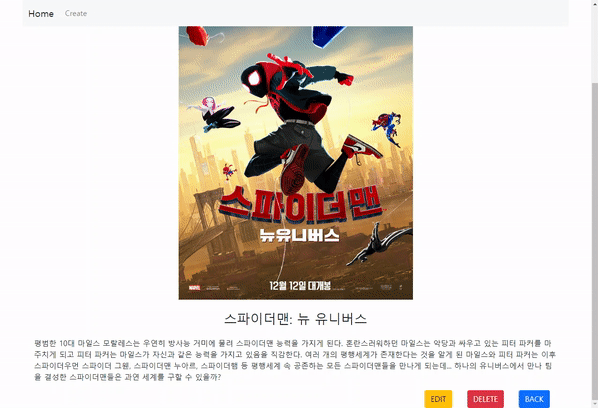

# Project 05

> 20210319에 진행한 프로젝트입니다.

### Model

```
# movies/models.py

class Movie(models.Model):
    title = models.CharField(max_length=100)
    overview = models.TextField()
    poster_path = models.CharField(max_length=500)
```

### Form

```
# movies/forms.py

from django import forms
from .models import Movie

class MovieForm(forms.ModelForm):
    title = forms.CharField(
        label='제목',
        widget=forms.TextInput(
            attrs={
                'class': 'title form-control',
                'placeholder': '제목을 입력해주세요.',
                'max_length': 100,
            }
        ),
        error_messages={
            'required': '제목은 필수 사항입니다.',
        }
    )
    
    ...

    class Meta:
        model = Movie
        fields = '__all__'
```

- `widget` : widget을 통해 데이터 타입에 맞는 표현 형식을 구현한다.
- `'class': 'form-control'` : bootstrap의 form-control 형식을 적용한다.
- `'placeholder': '제목을 입력해주세요.'` : input에 아무것도 작성되지 않았을 때 보여질 내용을 설정한다.
- `class Meta:` : ModelForm Helper 클래스를 사용하여 모델에서 form을 작성. models.py에서 작성한 필드를 그대로 가져다 쓴다.

### Admin


```
from .models import Movie

class MovieAdmin(admin.ModelAdmin):
	admin.site.register(Movie)
```

### base.html


```
# pjt05/templates/base.html

<body>
  <nav class="navbar navbar-expand-lg fixed-top navbar-light bg-light mx-5">
    <div class="container-fluid">
      <a class="navbar-brand" href="">Home</a>
      <div class="collapse navbar-collapse" id="navbarNav">
        <ul class="navbar-nav">
          <li class="nav-item">
            <a class="nav-link" aria-current="page" href="">Create</a>
          </li>
        </ul>
      </div>
    </div>
  </nav>
  <div class="container mt-5">
    
    
  </div>
  <script src="https://cdn.jsdelivr.net/npm/bootstrap@5.0.0-beta2/dist/js/bootstrap.bundle.min.js" integrity="sha384-b5kHyXgcpbZJO/tY9Ul7kGkf1S0CWuKcCD38l8YkeH8z8QjE0GmW1gYU5S9FOnJ0" crossorigin="anonymous"></script>
</body>
```

- `<nav class="navbar navbar-expand-lg fixed-top navbar-light bg-light mx-5">` : 상단에 navbar 활용

- `<a class="navbar-brand" href=""> `: Home 버튼을 누르면 index 페이지로 이동

- `<a class="nav-link" aria-current="page" href="">Create</a>` : New 버튼을 누르면 new 페이지(새 글 작성 페이지)로 이동


### movies/


- urls.py

  ```
  urlpatterns = [
      path('', views.index, name='index'),
  ]
  ```

  뒤에 다른 주소 없이 'movies/'로만 요청이 들어오면 views의 index 메소드로 연결된다.

- views.py

  ```
  @require_safe
  def index(request):
      movies = Movie.objects.all()[::-1]
      context = {
          'movies': movies,
      }
      return render(request, 'movies/index.html', context)
  ```

  Movie 모델 전체 데이터를 objects 매니저를 통해 가져온 후 `context`에 담아 html로 넘겨준다.

  - `@require_safe` : GET으로 요청이 들어올 경우에만 실행된다.

- index.html

  ```
  
  
  
    <h1 class="text-center">Index</h1>
    <hr>
    <div class="row row-cols-1 row-cols-md-4 g-4">
      
        <div class="col">
          <div class="card h-100">
            
            <div class="card-body text-center d-flex align-items-center justify-content-center">
              <a href="" class="card-title text-decoration-none text-dark">{{ movie.title }}</a>
            </div>
          </div>
        </div>
      
    </div>
  
  ```
  
- `<div class="row row-cols-1 row-cols-md-4 g-4">` : Grid system을 활용 - md크기 이상일 때는 4줄씩 보이도록 하고, 그 미만일 때는 한줄씩만 보이도록 한다.
  - `` : movies의 각 movie에 대해
    - `` : poster_path에 저장된 경로의 이미지를 보여준다.
    - `<a href="">` : 제목 부분을 누르면 detail 페이지로 들어가도록 링크 설정.

### movies/\<int:pk>/


- urls.py

  ```
  urlpatterns = [
      path('<int:pk>/', views.detail, name='detail'),
  ]
  ```

- views.py

  ```
  @require_safe
  def detail(request, pk):
      movie = Movie.objects.get(pk=pk)
      context = {
          'movie': movie,
      }
      return render(request, 'movies/detail.html', context)
  ```

  - `movie = Movie.objects.get(pk=pk)` : pk가 인자로 받은 `pk`와 같은 Movie 레코드를 불러온다.

- detail.html

  ```
  
  
  
    <h1 class="text-center">Detail</h1>
    <hr>
    <div class="d-flex justify-content-center">
      
    </div>
    <h3 class="text-center my-4">{{ movie.title }}</h3>
    <p>{{ movie.overview }}</p>
    <div class="d-flex justify-content-end">
      <a href="" class="btn btn-warning mx-3">EDIT</a>
      <form action="" method="POST">
        
        <button class="btn btn-danger mx-3">DELETE</button>
      </form>
      <a href="" class="btn btn-primary mx-3">BACK</a>
    </div>
  
  ```

  - ```
    <a href="" class="btn btn-warning mx-3">EDIT</a>
    ```
    
    EDIT 버튼을 누르면 해당 영화의 수정 페이지로 간다.

  - ```
    <form action="" method="POST">
      
      <button>DELETE</button>
    </form>
    ```

    DELETE 버튼을 누르면 해당 영화에 대한 정보가 삭제된다.

    - `method="POST"` : 서버 데이터에 변화를 주기 위해 사용한다.

  - ```
    <a href="" class="btn btn-primary mx-3">
      <button>BACK</button>
    </a>
    ```

    BACK 버튼을 누르면 이전 페이지(index 페이지)로 간다.

### form.html

create.html과 update.html은 구성이 거의 비슷하므로 form.html로 통합하여 사용할 수 있다.

```



  
    <h1 class="text-center">create</h1>
    <hr>
  
    <h1 class="text-center">update</h1>
    <hr>
  
  <form action="" method="POST">
    
    
      
        <div class="alert alert-danger" role="alert">
          {{ field.errors }}
        </div>
      
      {{ field.label_tag }}
      {{ field }}
      <br>
    
    <div class="d-flex justify-content-end m-3">
      <input type="submit" value="제출" class="btn btn-primary">
    </div>
  </form>
  <div class="d-flex justify-content-end">
    
      <a href="" class="btn btn-primary mx-3">BACK</a>
    
      <a href="" class="btn btn-primary mx-3">BACK</a>
    
  </div>

```

- ```
  
    <h1 class="text-center">create</h1>
    <hr>
  
    <h1 class="text-center">update</h1>
    <hr>
  
  ```

  요청 url이 create인지 update인지 구분하여 헤더를 표시한다.

- ```
  
    <div class="alert alert-danger" role="alert">
      {{ field.errors }}
    </div>
  
  ```

  만약 error가 있다면 field.errors 내용을 보여주고 아니면 보여주지 않는다.

### movies/create/

- urls.py

  ```
  urlpatterns = [
      path('create/', views.create, name='create'),
  ]
  ```

- views.py

  ```
  @require_http_methods(['GET', 'POST'])
  def create(request):
      if request.method == 'POST':
          form = MovieForm(request.POST)
          if form.is_valid():
              movie = form.save()
              return redirect('movies:detail', movie.pk)
      else:
          form = MovieForm()
      context = {
          'form': form,
      }
      return render(request, 'movies/form.html', context)
  ```

  - `@require_http_methods(['GET', 'POST'])` : GET과 POST로 들어온 요청만을 허용한다.
  - `form = MovieForm(request.POST)` : request에 저장된 데이터를 MovieForm에 반영하여 인스턴스를 생성한다.
  - `if form.is_valid(): ` : form으로 전달받은 데이터가 유효할 경우에만 진행한다.

### movies/\<int:pk>/update



- urls.py

  ```
  urlpatterns = [
      path('<int:pk>/edit/', views.update, name='update'),
  ]
  ```

- views.py

  기존에 edit와 update로 나누어져 있던 것을 `if request.method ==`문을 활용해 합침

  ```
  @require_http_methods(['GET', 'POST'])
  def update(request, pk):
      movie = Movie.objects.get(pk=pk)
      if request.method == 'POST':
          form = MovieForm(request.POST, instance=movie)
          if form.is_valid():
              movie = form.save()
              return redirect('movies:detail', movie.pk)
      else:
          form = MovieForm(instance=movie)
      context = {
          'form': form,
      }
      return render(request, 'movies/form.html', context)
  ```

  - `form = ArticleForm(request.POST, instance=article)` : `instance`에 해당하는 article 레코드를 불러온 후 request를 통해 들어온 데이터를 자동으로 저장

### 'movies/\<int:pk>/delete'

- urls.py

  ```
  urlpatterns = [
      path('<int:pk>/delete/', views.delete, name='delete'),
  ]
  ```

- views.py

  ```
  @require_POST
  def delete(request, pk):
      movie = Movie.objects.get(pk=pk)
      movie.delete()
      return redirect('movies:index')
  ```

### ※ 느낀 점

1. django를 활용해 웹을 구현하는 것이 반복 숙달을 통해 익숙해진 듯 하지만, 아직 이전에 작성했던 코드를 참고하는 등 부족한 부분이 많은 것 같다. 다시 복습을 해보며 전체적인 흐름을 파악하고 세부 개념의 의미와 목적을 공부해야할 것 같다.
2. 페어와 함께하니 서로 모르는 부분을 채워가며 할 수 있어 더 정확하고 빠르게 할 수 있었던 것 같다.