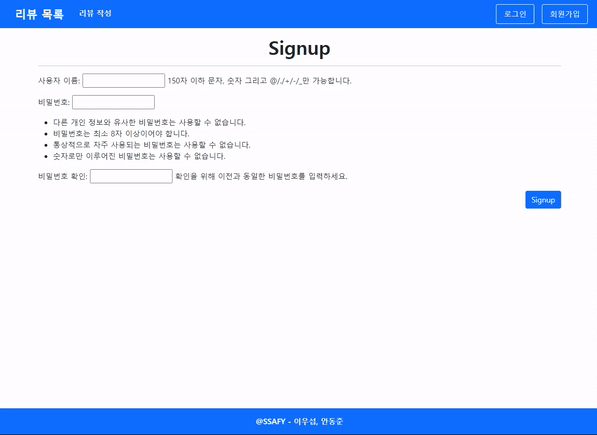
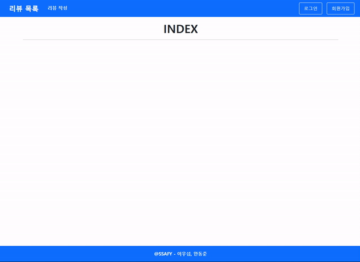
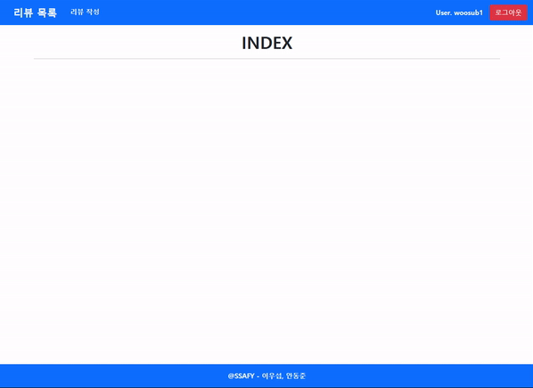
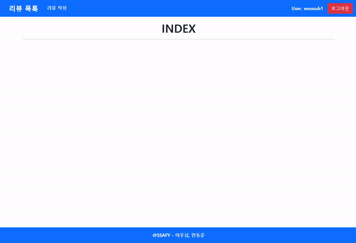
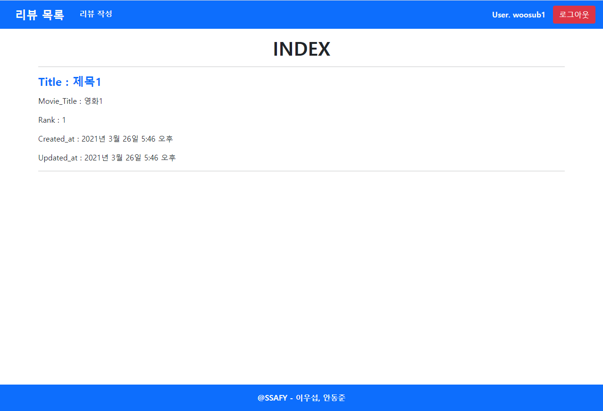
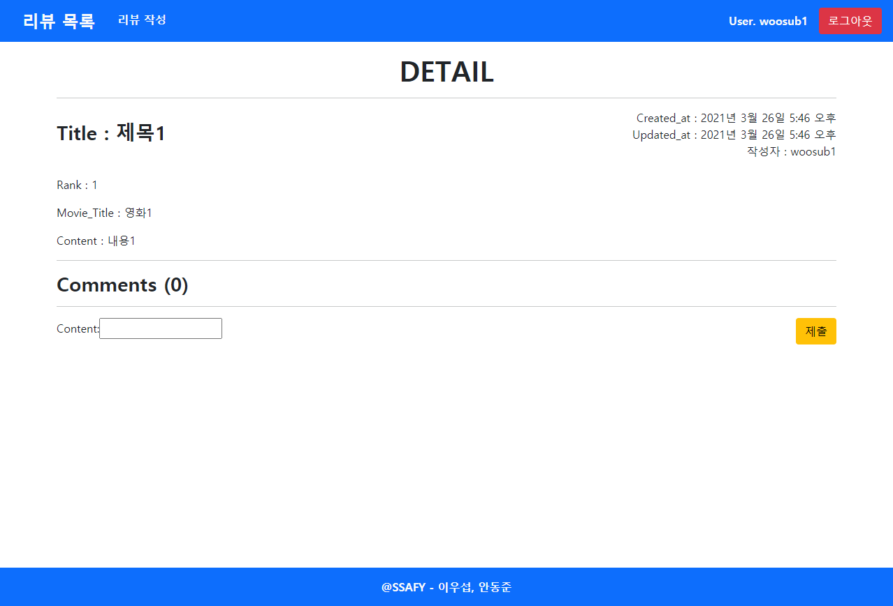

# Project 06

> 20210326에 진행한 프로젝트입니다.

### Model

```python
# accounts/models.py

from django.contrib.auth.models import AbstractUser

class User(AbstractUser):
    pass
```

AbstractUser를 상속받은 커스텀 User 모델을 만들어준다.

```python
# pjt06/settings.py

AUTH_USER_MODEL = 'accounts.User'
```

커스텀 User 모델을 프로젝트 내 기본 User 모델로 인식할 수 있도록 settings.py에 추가한다.

```python
# community/models.py

from django.conf import settings

class Review(models.Model):
    user = models.ForeignKey(settings.AUTH_USER_MODEL, on_delete=models.CASCADE)
    title = models.CharField(max_length=100)
    movie_title = models.CharField(max_length=50)
    rank = models.IntegerField()
    content = models.TextField()
    created_at = models.DateTimeField(auto_now_add=True)
    updated_at = models.DateTimeField(auto_now=True)

class Comment(models.Model):
    user = models.ForeignKey(settings.AUTH_USER_MODEL, on_delete=models.CASCADE)
    content = models.CharField(max_length=100)
    review = models.ForeignKey(Review, on_delete=models.CASCADE)

    def __str__(self):
        return self.content
```

Review와 Comment를 위한 Model을 생성해준다.

Review는 user를 ForeignKey로 참조하고
Comment는 user와 review를 ForeignKey로 참조한다.

- `on_delete=models.CASCADE` : 참조된 데이터가 삭제되면 해당 데이터도 삭제된다.

### Form

```python
# community/forms.py

from django import forms
from .models import Review, Comment

class ReviewForm(forms.ModelForm):

    class Meta:
        model = Review
        exclude = ('user',)

class CommentForm(forms.ModelForm):

    class Meta:
        model = Comment
        exclude = ('user', 'review',)
```

- `exclude = ('user',)` : 리뷰나 댓글을 작성할 때 user를 선택하는 란은 보이지 않게 하기 위해 exclude에 추가한다.

```python
# accounts/forms.py

from django.contrib.auth.forms import UserCreationForm
from django.contrib.auth import get_user_model

class CustomUserCreationForm(UserCreationForm):

    class Meta(UserCreationForm.Meta):
        model = get_user_model()
        fields = ('username',)
```

django에서 제공하는 UserCreationForm을 활용한다.

### Admin

```python
# community/admin.py

from .models import Review, Comment

admin.site.register(Review)
admin.site.register(Comment)
```

### base.html

```html
# pjt06/templates/base.html

...

  <div class='d-flex'>
    <p class='my-auto text-light fw-bold mx-3'>User. {{ request.user }}</p>
    <li class="nav-item d-flex align-items-center">
      <form action="" method="POST">
        
        <button class='btn btn-danger'>로그아웃</button>
      </form>
    </li>
  </div>

  <div class='d-flex'>
    <li class="nav-item">
      <a class="nav-link text-light btn btn-primary mx-2 border-light" href="">로그인</a>
    </li>
    <li class="nav-item">
      <a class="nav-link text-light btn btn-primary mx-2 border-light" href="">회원가입</a>
    </li>
  </div>

...
```

사용자가 인증되어 있다면 로그아웃 링크를,
사용자가 인증되어 있지 않다면 로그인과 회원가입 링크가 보여지도록 한다.

### Sign up



```python
# accounts/views.py

from django.contrib.auth import login as auth_login
from .forms import CustomUserCreationForm

@require_http_methods(['GET', 'POST'])
def signup(request):
    if request.user.is_authenticated:
        return redirect('community:index')

    if request.method == 'POST':
        form = CustomUserCreationForm(request.POST)
        if form.is_valid():
            user = form.save()
            auth_login(request, user)
            return redirect('community:index')
    else:
        form = CustomUserCreationForm()
    context = {
        'form': form,
    }
    return render(request, 'accounts/signup.html', context)
```

- ```python
  if request.user.is_authenticated:
      return redirect('community:index')
  ```

  이미 사용자가 인증되어 있다면 리뷰 목록 조회 페이지로 돌려보낸다.

- ```python
  user = form.save()
  auth_login(request, user)
  ```

  form에 저장된 내용의 user를 등록하고 로그인까지 시켜준다.

```html
# accounts/templates/accounts/signup.html




  <h1 class="text-center fw-bold">Signup</h1>
  <hr>
  <form action="" method="POST">
    
    {{ form.as_p }}
    <div class='d-flex justify-content-end'>
      <input type="submit" value="Signup" class='btn btn-primary'>
    </div>
  </form>

```

### Login



```python
# accounts/views.py

from django.contrib.auth import login as auth_login
from django.contrib.auth.forms import AuthenticationForm

@require_http_methods(['GET', 'POST'])
def login(request):
    if request.user.is_authenticated:
        return redirect('community:index')
    
    if request.method == 'POST':
        form = AuthenticationForm(request, request.POST)
        if form.is_valid():
            auth_login(request, form.get_user())
            return redirect(request.GET.get('next') or 'community:index')
    else:
        form = AuthenticationForm()
    context = {
        'form': form,
    }
    return render(request, 'accounts/login.html', context)
```

django에서 제공하는 AuthenticationForm을 사용한다.

- `return redirect(request.GET.get('next') or 'community:index')` : next가 전달되었다면 next의 value url로 이동하고, 아니라면 index 페이지로 간다.

```html
# accounts/templates/accounts/login.html




  <h1 class="text-center fw-bold">Log-in</h1>
  <hr>
  <form action="" method="POST">
    
    {{ form.as_p }}
    <div class='d-flex justify-content-end'>
      <input type="submit" value="Login" class='btn btn-primary'>
    </div>
  </form>

```

### Logout



```python
from django.contrib.auth import logout as auth_logout

@require_POST
def logout(request):
    if request.user.is_authenticated:
        auth_logout(request)
    return redirect('community:index')
```

### Review 작성



```python
# community/views.py

from .forms import ReviewForm

@login_required
@require_http_methods(['GET', 'POST'])
def create(request):
    if request.method == 'POST':
        form = ReviewForm(request.POST)
        if form.is_valid():
            review = form.save(commit=False)
            review.user = request.user
            review.save()
            return redirect('community:detail', review.pk)
    else:
        form = ReviewForm()
    context = {
        'form': form,
    }
    return render(request, 'community/form.html', context)
```

- ```python
  review = form.save(commit=False)
  review.user = request.user
  review.save()
  ```

  참조할 데이터를 지정해주기 위해 `commit=False`를 사용해 임시로 저장한다.

```html
# community/templates/community/form.html




  <h1 class="text-center fw-bold">CREATE</h1>
  <hr>
  <form action="" method="POST">
    
    {{ form.as_p }}
    <div class='d-flex justify-content-end'>
      <input type="submit" class='btn btn-warning'>
    </div>
  </form>
  <a href="" class='btn btn-outline-primary'>BACK</a>

```

### 리뷰 목록 조회



```python
# community/views.py

@require_safe
def index(request):
    reviews = Review.objects.all().order_by('-pk')
    context = {
        'reviews': reviews,
    }
    return render(request, 'community/index.html', context)
```

```html
# community/templates/community/index.html




  <h1 class="text-center fw-bold">INDEX</h1>
  <hr>
  
    <a href="" class='text-decoration-none fw-bold h4 d-inline-block mb-3'>Title : {{ review.title }}</a>
    <p>Movie_Title : {{ review.movie_title }}</p>
    <p>Rank : {{ review.rank }}</p>
    <p>Created_at : {{ review.created_at }}</p>
    <p>Updated_at : {{ review.updated_at }}</p>
    <hr>
  

```

### Detail



```python
# community/views.py

from .forms import CommentForm

@require_safe
def detail(request, review_pk):
    review = get_object_or_404(Review, pk=review_pk)
    comment_form = CommentForm()
    comments = review.comment_set.all()
    context = {
        'review': review,
        'comment_form': comment_form,
        'comments': comments,
    }
    return render(request, 'community/detail.html', context)
```

- `review = get_object_or_404(Review, pk=review_pk)` : 리뷰 데이터를 가져오는데 데이터가 없다면 404 에러 페이지를 표시한다.
- `comment_form = CommentForm()` : detail 페이지 내에 댓글을 작성하는 란을 만들기 위해 CommentForm을 활용한다.

```html
# community/templates/community/detail.html




  <h1 class="text-center fw-bold">DETAIL</h1>
  <hr>
  <div class='d-flex justify-content-between align-items-center'>
    <p class='fw-bold h3'>Title : {{ review.title }}</p>
    <div class='d-flex flex-column align-items-end'>
      <p class='my-auto'>Created_at : {{ review.created_at }}</p>
      <p class='my-auto'>Updated_at : {{ review.updated_at }}</p>
      <p class='my-auto'>작성자 : {{ review.user }}</p>
    </div>
  </div>
  <br>
  <p>Rank : {{ review.rank }}</p>
  <p>Movie_Title : {{ review.movie_title }}</p>
  <p>Content : {{ review.content }}</p>
  <hr>
  <h3 class='fw-bold'>Comments ({{ comments|length }})</h3>
  <ul>
    
      <div class='d-flex justify-content-between my-2'>
        <li>
          {{ comment }}
        </li>
        <p class='my-auto'>작성자 : {{ comment.user }}</p>
      </div>
    
  </ul>
  <hr>
  <form action="" method='POST'>
    
    <div class='d-flex justify-content-between'>
      <div>
        {{ comment_form }}
      </div>
      <input type="submit" class='btn btn-warning'>
    </div>
  </form>

```

### 댓글 생성


```python
# community/views.py

@require_POST
def comments_create(request, review_pk):
    if request.user.is_authenticated:
        review = get_object_or_404(Review, pk=review_pk)
        comment_form = CommentForm(request.POST)
        if comment_form.is_valid():
            comment = comment_form.save(commit=False)
            comment.review = review
            comment.user = request.user
            comment.save()
            return redirect('community:detail', review.pk)
        context = {
            'comment_form': comment_form,
            'review': review,
        }
        return render(request, 'community/detail.html', context)
    return redirect('accounts:login')
```

### 느낀 점

- 지난 프로젝트들보다 구현할 것이 많아지고, model, view, form을 복합적으로 활용하게 되면서 훨씬 어려워졌다. 작성된 코드를 보지 않으면 똑같이 못할 것이다. 다시 차근차근 보며 흐름을 잡고 세부 코드 작성 방법을 공부해야겠다.