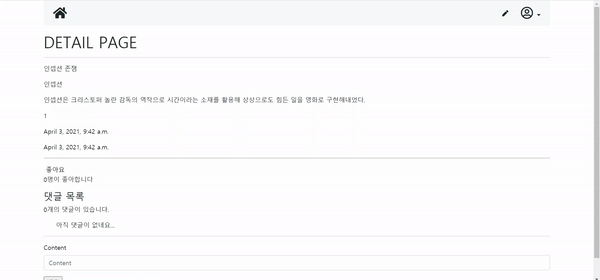
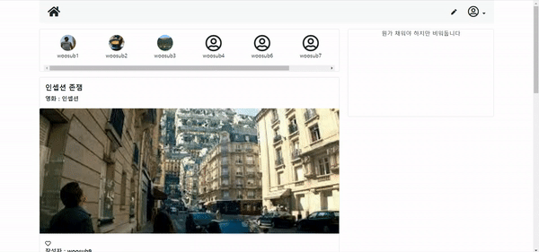

# Project 07

> 20210402에 진행한 프로젝트입니다

### Model

```python
# accounts/models.py

class User(AbstractUser):
    followings = models.ManyToManyField('self', symmetrical=False, related_name='followers')
    image = models.ImageField(blank=True)
```

- `image = models.ImageField(blank=True)` : 프로필 사진을 추가하기 위한 필드
  - `blank=True` : 사진을 등록하지 않아도 유저를 생성할 수 있도록 함

```python
# community/models.py

from imagekit.models import ProcessedImageField

class Review(models.Model):
    like_users = models.ManyToManyField(settings.AUTH_USER_MODEL, related_name='like_reviews')
    image = ProcessedImageField(upload_to='images/%Y/%m/%d/')
```

### base.html

```html
# pjt07/templates/base.html




<!DOCTYPE html>
<html lang="en">
<head>
  <meta charset="UTF-8">
  <meta http-equiv="X-UA-Compatible" content="IE=edge">
  <meta name="viewport" content="width=device-width, initial-scale=1.0">
  
  <link rel="stylesheet" href="https://pro.fontawesome.com/releases/v5.10.0/css/all.css" integrity="sha384-AYmEC3Yw5cVb3ZcuHtOA93w35dYTsvhLPVnYs9eStHfGJvOvKxVfELGroGkvsg+p" crossorigin="anonymous"/>
  <link rel="stylesheet" href="">
  <title>PJT07</title>
  <link rel="stylesheet" href="https://cdnjs.cloudflare.com/ajax/libs/font-awesome/5.15.3/css/all.min.css" integrity="sha512-iBBXm8fW90+nuLcSKlbmrPcLa0OT92xO1BIsZ+ywDWZCvqsWgccV3gFoRBv0z+8dLJgyAHIhR35VZc2oM/gI1w==" crossorigin="anonymous" />
</head>
<body>
  <div class="container">
    <ul class="nav justify-content-between bg-light p-2">
      <li>
        <a class="nav-link" href="">
          <i class="fas fa-home fa-2x text-dark"></i>
        </a>
      </li>
      <div class="d-flex">
        <li class="d-flex flex-column justify-content-center">
          <a class="nav-link" href="">
            <i class="fas fa-pen text-dark"></i>
          </a>
        </li>
        
          <li class="dropdown d-flex flex-column justify-content-center">
            <a class="nav-link dropdown-toggle text-dark" role="button" data-bs-toggle="dropdown">
              
                
              
                <i class="far fa-user-circle fa-2x"></i>
              
            </a>
            <ul class="dropdown-menu">
              <li>
                <a href="" class="dropdown-item">프로필</a>
              </li>
              <hr class="m-1">
              <li>
                <form class="dropdown-item" action="" method="POST">
                  
                  <button class="p-0">로그아웃</button>
                </form>
              </li>
            </ul>
          </li>
        
          <li class="nav-item d-flex flex-column justify-content-center">
            <a class="nav-link text-dark" href="">Sign in</a>
          </li>
          <li class="nav-item d-flex flex-column justify-content-center">
            <a class="nav-link text-dark" href="">Sign up</a>
          </li>
        
      </div>
    </ul>
  </div>
  
  <div class="container my-3">
    

    
  </div>
  
</body>
</html>
```

### Like



```python
# community/urls.py

urlpatterns = [
    path('<int:review_pk>/like/', views.like, name='like'),
]
```

```python
# community/views.py

@require_POST
def like(request, review_pk):
    if request.user.is_authenticated:
        review = get_object_or_404(Review, pk=review_pk)
        if review.like_users.filter(pk=request.user.pk).exists():
            review.like_users.remove(request.user)
        else:
            review.like_users.add(request.user)
        return redirect('community:detail', review_pk)
    return redirect('accounts:login')
```

```html
# templates/community/templates/detail.html





  <form action="" method="POST">
    
    
      <button>좋아요 취소</button>
    
      <button>좋아요</button>
    
    <p>{{ review.like_users.all|length }}명이 좋아합니다</p>
  </form>

```

### Profile & Follow



```python
# accounts/urls.py

urlpatterns = [
    path('<int:user_id>/', views.profile, name='profile'),
    path('<int:user_id>/follow/', views.follow, name='follow'),
]
```

```python
# accounts/views.py

def profile(request, user_id):
    person = get_object_or_404(get_user_model(), id=user_id)
    reviews = person.review_set.all()
    comments = person.comment_set.all()
    if request.method == 'POST':
        form = CustomProfileForm(request.POST,request.FILES, instance=person)
        if form.is_valid():
            form.save()
            return redirect('accounts:profile', user_id)
    else: 
        form = CustomProfileForm(instance=person)
    context = {
        'person': person,
        'form' : form,
        'reviews' : reviews,
        'comments' : comments,
        }
    return render(request, 'accounts/profile.html', context)


def follow(request, user_id):
    if request.user.is_authenticated:
        person = get_object_or_404(get_user_model(), id=user_id)
        if person.followers.filter(id=request.user.id).exists():
            person.followers.remove(request.user)
        else:
            person.followers.add(request.user)
        return redirect('accounts:profile', user_id)
    return redirect('accounts:login')
```

```html
# accounts/templates/accounts/profile.html






  <div class="container text-center border border-2">
    <h1 class = "my-4 pb-4">{{ person.username }}의 프로필</h1>
    <hr>
    
      <div class="d-inline-block mb-3">
        
          
        
          <i class="fas fa-user fa-5x"></i>
        
      
      </div>
      <div class=" d-inline-block ms-5">
        <div class="fs-1 d-inline-block mt-3">{{ person.username }}
          
            <form class="fs-1 d-inline-block"action="" method="POST">
              
              
                <button class="btn btn-primary btn-sm">언팔로우</button>
              
                <button class="btn btn-primary btn-sm">팔로우</button>
              
            </form>
          
        </div>
        <div class="dropdown ">
          <button class="btn btn-secondary dropdown-toggle mt-3" type="button" id="dropdownMenuButton1" data-bs-toggle="dropdown" aria-expanded="false">
            프로필 사진 편집
          </button>
          <ul class="dropdown-menu text-center" aria-labelledby="dropdownMenuButton1">
            <form class="" action="" method="POST" enctype="multipart/form-data">
              
              {{ form.image }}
              <br>
              <button class="btn btn-secondary">Submit</button>
            </form>
          </ul>
        </div>
        
      </div>
    
    <div class="container border my-2">
      <div class="d-inline-block px-5 py-2">follower : {{ person.followers.all|length }}</div>
      <div class="d-inline-block px-5 "> following : {{ person.followings.all|length }}</div> 
    </div>
    
  </div>
  <div >
    <div class="block bg-light text-center py-3 fs-5 border border-2 mt-2">작성한 글</div>
          
      <div class="card my-2 mt-0">
        <a href="" class="text-decoration-none text-dark">
          <div class="card-body">
            <h5 class="card-title fw-bold">{{ review.title }}</h5>
            <p class="card-text fw-bold">영화 : {{ review.movie_title }}</p>
          </div>
          </div>
        </a>
      </div>
    
    <div >
    <div class="block bg-light text-center py-3 fs-5 border border-2 mt-2">작성한 댓글</div>
            
        <div class="card my-2 mt-0">
          <a href="" class="text-decoration-none text-dark">
            <div class="card-body">
              <h5 class="card-title fw-bold">글 : {{ comment.review.movie_title }}</h5>
              <p class="card-text fw-bold">댓글 : {{ comment.content }}</p>
            </div>
            </div>
          </a>
        </div>
      
    </div>
  </div>
  

```

### 느낀 점

- 기능 구현 자체는 이전 수업과 Workshop 때 했던 내용이라 어렵지 않았다. M:N 참조를 활용해 다양한 기능을 구현할 수 있을 것 같다.
- Instagram과 비슷하게 구성하려 시도해보았는데 시행착오가 있었지만 bootstrap, html 요소와 media를 다루는 법에 대해 좀 더 익숙해질 수 있었던 좋은 기회였던 것 같다.