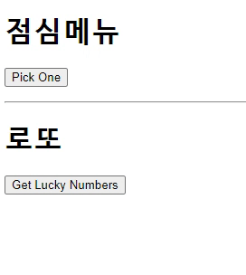

# Workshop



#### 점심메뉴

```html
<div id="lunch-app">
  <h1>점심메뉴</h1>
  <button @click="pick">Pick One</button>
  <p>{{ picked }}</p>
</div>
```

- `<button @click="pick">` : button에 click 이벤트 발생시 pick 메소드가 실행된다.

```javascript
<script src="https://cdn.jsdelivr.net/npm/lodash@4.17.21/lodash.min.js"></script>

const lunchApp = new Vue({
  el: '#lunch-app',
  data: {
    picked: '',
    menus: ['국밥', '햄버거', '돈까스', '초밥', '라멘']
  },
  methods: {
    pick: function () {
      this.picked = this.menus[_.random(this.menus.length - 1)]
    }
  }
})
```

- `this.picked = this.menus[_.random(this.menus.length - 1)]`

  lodash를 활용하여 random으로 숫자들 선택

#### 로또

```html
<div id="lotto-app">
  <h1>로또</h1>
  <button @click="pick">Get Lucky Numbers</button>
  <p>{{ picked }}</p>
</div>
```

```javascript
const lottoApp = new Vue({
  el: '#lotto-app',
  data: {
    picked: '',
  },
  methods: {
    pick: function () {
      this.picked = _.sampleSize(_.range(1, 46), 6)
    }
  }
})
```

#### todo list


```html
<div id="todo-app">
  <select v-model="status">
    <option value="all">전체</option>
    <option value="not-done">진행중</option>
    <option value="done">완료</option>
  </select>
  <input type="text" id=todo-input>
  <button @click="addTodo">+</button>

  <ul>
    <li v-for="todo in todoComputed">
      <input type="checkbox" :checked="todo.done" @click="check(todo)">
      <label>{{ todo.work }}</label>
    </li>
  </ul>
  <button @click="deleteTodo">완료된 할 일 지우기</button>
</div>
```

- `<select v-model="status">` : vue 인스턴스의 status data와 select 태그를 bind한다.
- `<input type="checkbox" :checked="todo.done" @click="check(todo)">`
  - `:checked="todo.done"` : input의 checked attribute에 todo.done을 bind. 이제 checked 값은 todo.done 값의 변경에 의해서면 변경된다(종속된다).
  - `@click="check(todo)"` : click 이벤트 발생 시 check() method 실행

```javascript
<script>
  const todoApp = new Vue({
    el: '#todo-app',
    data: {
      // todo를 담을 리스트
      todos: [],
      // 화면에 표시될 todo의 상태 설정(all, not-done, done)
      status: 'all',
    },
    methods: {
      addTodo: function () {
        const input = document.querySelector('#todo-input')
        // todos 리스트에 추가
        this.todos.push({
          'work': input.value,
          // '완료 상태 : 미완료'로 추가
          'done': false
        })
        // input value(내용) 초기화
        input.value = ""
      },
      check: function (todo) {
        // done 상태 변경(input checkbox의 checked 속성도 따라서 변경된다)
        todo.done = !todo.done
      },
      deleteTodo: function () {
        // filter 메소드를 이용해 done: false인 todo만 return
        this.todos = this.todos.filter(todo => {
          return !todo.done
        })
      }
    },
    computed: {
      // status가 변경될 때마다 보여질 todo list를 바꿈
      todoComputed: function () {
        return this.todos.filter(todo => {
          if (this.status === 'not-done') {
            return !todo.done
          }
          if (this.status === 'done') {
            return todo.done
          }
          return true
        })
      }
    }
  })
</script>
```

# Homework

### 1.

- F - Single Page Application
- T
- T

### 2.

Model - View - ViewModel

- Model : JavaScript의 Object 자료 구조. Vue instance 내부에서 data로 사용되는데 이 값이 바뀌면 View(DOM)가 반응
- View : DOM. Data의 변화에 따라서 바뀌는 대상
- ViewModel : 모든 Vue instance. View와 Model 사이에서 Data와 DOM에 관련된 모든 일을 처리.

### 3.

(a) : message

(b) : new Vue

(c) : '#app'

### 4.

- T
- F - 반대다
- F - v-model은 양방향 바인딩이다

### 5.

- computed : 계산해야 할 목표 데이터가 있다. '선언형 프로그래밍'
- watch : 특정 data가 변경하면 함수를 실행. '명령형 프로그래밍'

```javascript
# computed

var vm = new Vue({
  el: '#demo',
  data: {
    firstName: 'Foo',
    lastName: 'Bar'
  },
  computed: {
    fullName: function () {
      return this.firstName + ' ' + this.lastName
    }
  }
})
```

```javascript
# watch

var vm = new Vue({
  el: '#demo',
  data: {
    firstName: 'Foo',
    lastName: 'Bar',
    fullName: 'Foo Bar'
  },
  watch: {
    firstName: function (val) {
      this.fullName = val + ' ' + this.lastName
    },
    lastName: function (val) {
      this.fullName = this.firstName + ' ' + val
    }
  }
})
```

computed는
`fullName`이 변경 되어야 하면(`firstName` or `lastName`이 변동) => 다시 계산

watch는
`firstName` or `lastName`이 변동되면 => 다시 계산

### 6.

(a) : v-for

(b) : index

(c) : nums