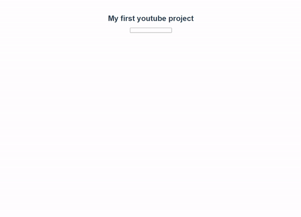

# Workshop



```vue
<template>
  <div id="app">
    <h1>My first youtube project</h1>
    <!-- search-input 이벤트가 SearchBar component로부터 emit되면 search method 실행  -->
    <SearchBar @search-input="search"/>
    <!-- VideoDetail component의 video data(prop)으로 selectedVideo를 보낸다 -->
    <VideoDetail :video="selectedVideo"/>
    <VideoList :videos="searchData" @select-video="sendVideo"/>
  </div>
</template>

<script>
import axios from 'axios'
import SearchBar from './components/SearchBar.vue'
import VideoDetail from './components/VideoDetail.vue'
import VideoList from './components/VideoList.vue'

// API_KEY 보안을 위해 .env 활용
// API 키 앞에는 반드시 'VUE_APP_'이 붙어야 한다
const API_KEY = process.env.VUE_APP_YOUTUBE_API_KEY
const API_URL = 'https://www.googleapis.com/youtube/v3/search'

export default {
  name: 'App',
  components: {
    SearchBar,
    VideoDetail,
    VideoList,
  },
  data: function () {
    return {
      searchData: [],
      selectedVideo: undefined,
    }
  },
  methods: {
    search: function (inputVal) {
      const params = {
        key: API_KEY,
        part: 'snippet',
        type: 'video',
        q: inputVal,
      }
      axios.get(API_URL, { params })
      .then(res => {
        this.searchData = res.data.items
      })
      .catch(err => {
        console.log(err)
      })
    },
    // VideoList component에서 emit된 video 데이터를 selectedVideo에 할당
    sendVideo: function (video) {
      this.selectedVideo = video
    }
  },
}
</script>
```

```vue
// src/components/SearchBar.vue

<template>
  <div>
    <input @keyup.enter="searchInput" type="text">
  </div>
</template>

<script>
export default {
  name: 'SearchBar',
  methods: {
    searchInput: function (event) {
      // 부모 component에 search-input 이벤트가 발생하도록 하고, event.target.value를 전달한다
      this.$emit('search-input', event.target.value)
    },
  },
}
</script>
```

```
// src/components/VideoDetail.vue

<template>
  <!-- video data가 빈 데이터가 아닐 때 -->
  <div v-if="video">
    <!-- computed의 videoURL 값을 src로 -->
    <iframe :src="videoURL" frameborder="0"></iframe>
    <hr>
    <h3>{{ video.snippet.title }}</h3>
    <p>{{ video.snippet.description }}</p>
  </div>
</template>

<script>
export default {
  name: 'VideoDetail',
  // 부모 객체인 App.vue로부터 video값을 내려받는다
  props: {
    video: {
      type: Object,
    },
  },
  computed: {
    videoURL: function () {
      // video data가 빈 데이터가 아닐 때(input값이 입력되고 enter키가 눌려졌을 때)
      if (this.video) {
        return `https://www.youtube.com/embed/${this.video.id.videoId}`
      }
      return ''
    }
  }
}
</script>
```

```vue
// src/components/VideoList.vue

<template>
  <div>
    <ul v-for="(video, index) in videos" :key="index">
      <!-- click event가 발생하면 index값을 인자로 하여 selectVideo method 실행 -->
      <li @click="selectVideo(index)">
        <!-- video를 prop으로 전달 -->
        <VideoListItem :video="video"/>
      </li>
    </ul>
  </div>
</template>

<script>
import VideoListItem from './VideoListItem'

export default {
  name: 'VideoList',
  components: {
    VideoListItem,
  },
  props: {
    videos: {
      type: Array,
    }
  },
  methods: {
    selectVideo: function (index) {
      this.$emit('select-video', this.videos[index])
    },
  },
}
</script>
```

```vue
// src/components/VideoListItem.vue

<template>
  <div>
    
    {{ video.snippet.title }}
  </div>
</template>

<script>
export default {
  name: 'VideoListItem',
  props: {
    video: {
      type: Object,
    },
  },
}
</script>
```

# Homework

### 1.

- F - 단방향으로 데이터가 이동한다.
- T
- F - `@click.native`
- F - props를 통해 '데이터'를 보내고, emit을 통해 '이벤트'를 보낸다.

### 2.

양방향 데이터를 허용하게 되면 하위 컴포넌트가 실수로 부모의 상태를 변경하여 앱의 데이터 흐름을 추론하기 더 어렵게 만들 수 있기 때문이다.

### 3.

(a) : `this.$emit`

(b) : `@addTodo="onAddTodo"`

(c)

```vue
onAddTodo: function (inputValue) {
  console.log(inputValue)
}
```

