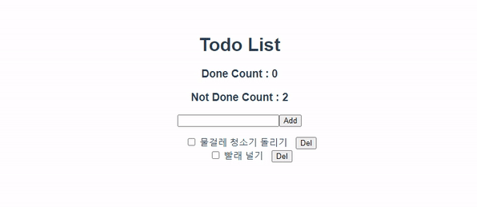

# Workshop



```javascript
// src/store/index.js

// 새로 고침하더라도 데이터가 없어지지 않도록
import createPersistedState from "vuex-persistedstate"

Vue.use(Vuex)

export default new Vuex.Store({
  state: {
    todos: []
  },
  // mutation으로 state(data)를 직접 조작
  mutations: {
    ADD_TODO: function (state, todo) {
      state.todos.push(todo)
    },
    DELETE_TODO: function (state, todo) {
      // splice : index부터 1 자리 만큼만 삭제하고 뒤에 이어 붙인다
      state.todos.splice(state.todos.indexOf(todo), 1)
    },
    UPDATE_TODO: function (state, todoItem) {
      // todoItem에 해당하는 부분의 done만 바꾼다
      state.todos = state.todos.map((todo) => {
        if (todo === todoItem) {
          return { ...todo, done: !todo.done }
        }
        return todo
      })
    }
  },
  // actions -> mutation : commit을 통해
  actions: {
    addTodo: function ({ commit }, todo) {
      commit('ADD_TODO', todo)
    },
    deleteTodo: function ({ commit }, todo) {
      commit('DELETE_TODO', todo)
    },
    updateTodo: function ({ commit }, todo) {
      commit('UPDATE_TODO', todo)
    }
  },
  // computed와 같은 역할
  getters: {
    doneCount: function (state) {
      return state.todos.filter((todo) => {
        return todo.done
      }).length
    },
    notDoneCount: function (state) {
      return state.todos.filter((todo) => {
        return !todo.done
      }).length
    }
  },
  modules: {
  },
  plugins: [
    createPersistedState()
  ]
})
```

```vue
// src/App.vue

<template>
  <div id="app">
    <h1>Todo List</h1>
    <h3>Done Count : {{ doneCount }}</h3>
    <h3>Not Done Count : {{ notDoneCount }}</h3>
    <TodoForm/>
    <TodoList/>
  </div>
</template>

<script>
import { mapGetters } from 'vuex'
import TodoForm from './components/TodoForm'
import TodoList from './components/TodoList'

export default {
  name: 'App',
  components: {
    TodoForm,
    TodoList
  },
  computed: {
    // doneCount: function () {
    //   return this.$store.getters.doneCount
    // }
    // 를 helper를 통해 간단히 구현할 수 있다
    ...mapGetters([
      'doneCount',
      'notDoneCount'
    ])
  }
}
</script>
```

```vue
// src/components/TodoForm.vue

<template>
  <div>
    <input v-model="job" @keyup.enter="addTodo" type="text">
    <button @click="addTodo">Add</button>
  </div>
</template>

<script>
export default {
  name: 'TodoForm',
  data: function () {
    return {
      job: '',
    }
  },
  methods : {
    addTodo: function () {
      const todo = {
        job: this.job,
        done: false
      }
      // component => action : dispatch를 통해 실행
      if (todo.job.trim()) {
        this.$store.dispatch('addTodo', todo)
      }
      this.job = ''
    }
  }
}
</script>
```

```vue
// src/components/TodoList.vue

<template>
  <ul>
    <Todo 
      v-for="(todo, idx) in todos" 
      :key="idx" 
      :todo="todo"
    />
  </ul>
</template>

<script>
import { mapState } from 'vuex'
import Todo from './Todo'

export default {
  name: 'TodoList',
  components: {
    Todo
  },
  computed: {
    // todos: function () {
    //   return this.$store.state.todos
    // }
    // 를 mapState로 축약할 수 있다
    ...mapState([
      'todos'
    ])
  }
}
</script>
```

```vue
// src/components/Todo.vue

<template>
  <li>
    <input v-model=todo.done type="checkbox">
    <!-- map 헬퍼를 사용하면 methods 부분에 인자를 넣을 수 없으므로 아래처럼 호출할 때 인자를 같이 넣어 보낸다 -->
    <span 
      :class="{ done: todo.done }" 
      @click="updateTodo(todo)"
    >
      {{ todo.job }}
    </span>
    <button @click="deleteTodo(todo)">Del</button>
  </li>
</template>

<script>
import { mapActions } from 'vuex'

export default {
  name: 'Todo',
  props: {
    todo: {
      type: Object
    }
  },
  methods: {
    ...mapActions([
      'deleteTodo',
      'updateTodo'
    ])
  }
}
</script>

<style scoped>
li {
  list-style-type: none;
}
.done {
  text-decoration: line-through;
}
button {
  margin-left: 10px;
}
</style>
```


# Homework

(a) : `Vuex.Store`

(b) : `state.count = state.count + 1`

(c) : `context.commit('increment')`

