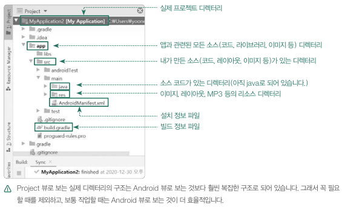

# Android

## Project architecture

기본적으로 안드로이드 스튜디오 화면에 보이는 디렉터리의 구조를 실제 파일 탐색기나 파인더로 열어보면 그 구조가 완전히 다릅니다. 

### Android 뷰의 구조

Android 뷰는 안드로이드 개발을 편하게 하기 위해 재배치한 가상의 디렉터리 구조를 보여줍니다. 크게 app과 Gradle Scripts로 구성되는데 app에는 코딩하면서 생성한 모든 파일이 저장되고, Gradle Scripts에는 빌드에 필요한 설정 정보들이 저장됩니다.

### Project 뷰의 구조

Project 뷰는 실제 디렉터리의 구조를 그대로 보여줍니다. 이미지를 추가하거나 다양한 화면 크기를 처리하는 작업 등의 리소스를 변경할 때 Project 뷰로 전환해서 작업하는 것이 좋습니다.

## Log

### Functions

| 함수      | 의미        | 내용                                                      |
| --------- | ----------- | --------------------------------------------------------- |
| `Log.v()` | verbose     | 상세한 로그 내용을 출력하기 위해 사용합니다.              |
| `Log.d()` | debug       | 개발에 필요한 내용을 출력하기 위해 사용합니다(개발자용).  |
| `Log.i()` | information | 정보성의 일반적인 메시지를 전달하기 위해 사용합니다.      |
| `Log.w()` | warning     | 에러는 아니지만 경고성 메시지를 전달하기 위해 사용합니다. |
| `Log.e()` | error       | 실제 에러 메시지를 출력하기 위해 사용합니다.              |

## Fragment

### What is a fragment

A fragment represents a reusable portion of your app's UI. A fragment defines and manages its own layout, has its own lifecycle, and can handle its own input events. Fragments must be hosted by an activity or another fragment.

## RecyclerView

### `LinearLayoutManager`

#### Parameters

- `orientation`
  - `LinearLayoutManager.HORIZONTAL` : 가로로 정렬

## ViewModel

### What is ViewModel for?

화면을 가로로 회전하니 증가되었던 값이 초기화되었다. 이런 현상이 발생하는 이유는 바로 lifecycle 때문이다. 화면 회전이 이루어지면 activity가 Destory 됐다가 다시 Create 되기 때문에 기존의 데이터가 날아가는 것이다. `ViewModel` 클래스를 사용하면 화면 회전과 같이 구성을 변경할 때도 데이터를 유지할 수 있다.

## Intent

An `Intent` is a messaging object you can use to request an action from another app component.

### Use cases

#### Starting an activity

An `Activity` represents a single screen in an app. You can start a new instance of an `Activity` by passing an `Intent` to `startActivity()`. The `Intent` describes the activity to start and carries any necessary data.

#### Starting a service

#### Delivering a broadcast

