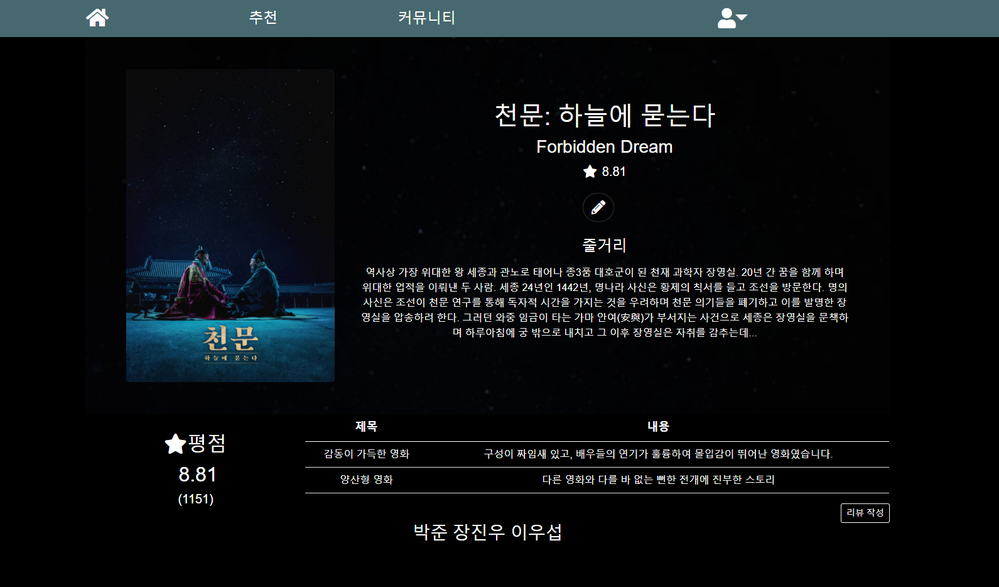
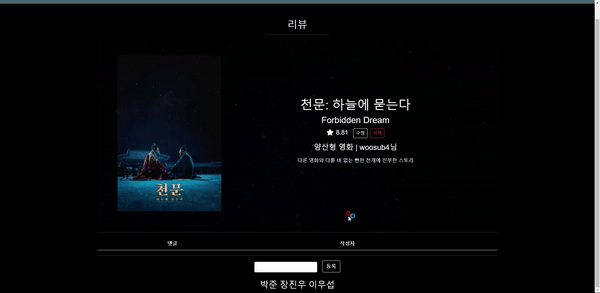
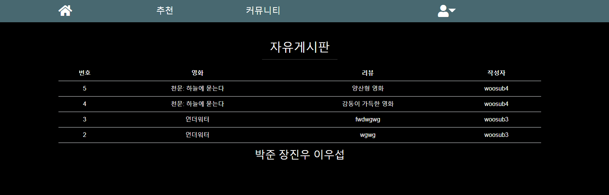
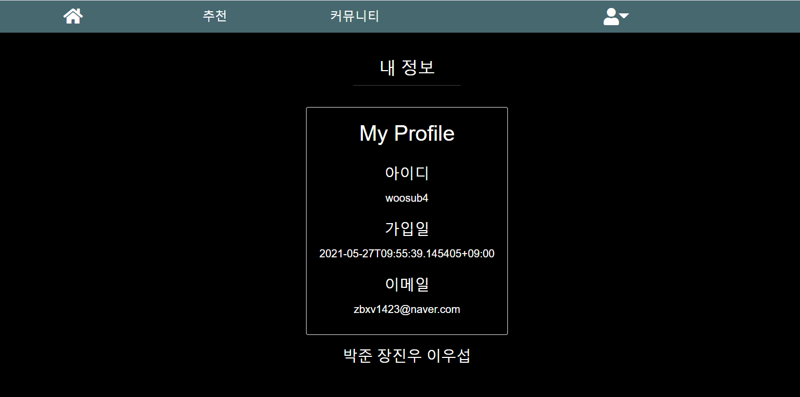

# final-pjt-front

### 팀원 정보 및 업무 분담 내역

- 박준
  - 팀장
  - Community 페이지 담당
- 장진우
  - My page 페이지 담당
- 이우섭
  - Home, Movie detail, 추천 페이지 담당

### 목표 서비스 구현 및 실제 구현 정도

- 목표 서비스

  - 전체 영화 목록
  - 영화 세부 정보
  - 리뷰 작성
  - 리뷰 내 댓글 작성
  - 전체 리뷰 목록
  - 내 정보

  모두 구현 완료하였습니다.

### 기능에 대한 설명

##### 영화 데이터 & 로그인 정보

```vue
created: function () {
  this.$store.dispatch('movieDataInitialize')
  const token = localStorage.getItem('jwt')
  if (token) {
    this.$store.dispatch('Login')
  }
}
```

App.vue에 created를 추가하여 vue 인스턴스가 생성될 때 영화 데이터와 로그인 되어있는지 여부(jwt 토큰이 localStorage에 존재하는지)를 state에 저장하도록 하였습니다.

##### 전체 영화 목록


Bootstrap의 Carousel 컴포넌트를 활용하여 화면을 구성하였습니다.

하단 최신 영화 목록에서는

```vue
.movie-item:hover {
  transform: scale(1.2);
  margin: 0 2%;
  z-index: 999;
}
.movie-item:hover .movie-text {
  visibility: visible;
}
```

의 CSS style을 적용하여

마우스가 해당 아이템 위로 올라갈 시, 아이템 크기가 커지고, 영화에 대한 정보가 보여지도록 하였습니다.

##### 영화 세부 정보



영화 제목, 영어 제목, 내용 등 세부 정보들이 보여지게 하였고,
네이버 영화에 등록된 평점 또한 확인할 수 있도록 하였습니다.

리뷰 목록에서는 사용자가 작성한 리뷰의 내용을 확인할 수 있고,
'리뷰 작성' 혹은 연필 모양 버튼을 클릭하여 해당 영화에 대한 리뷰를 작성할 수 있습니다.

##### 리뷰 작성


##### 리뷰 내 댓글 작성



##### 전체 리뷰 목록



커뮤니티에 전체 리뷰 목록을 보여주는 게시판을 만들고,
리뷰를 클릭하면 해당 리뷰 세부 정보로 가도록 하였습니다.

##### 내 정보



Navbar의 사람 모양 아이콘에서 내 정보 페이지로 들어올 수 있습니다.

```vue
login: function () {
  axios({
    method: 'post',
    url: 'http://127.0.0.1:8000/accounts/api-token-auth/',
    data: this.credentials
  })
    .then((res) => {
      localStorage.setItem('jwt', res.data.token)
      this.$store.dispatch('login')
      this.$store.dispatch('setUsername', {  <-----
        username: this.credentials.username  <-----
      })
      this.$router.push({ name: 'Home' })
    })
```

로그인 시 위와 같이 username을 state에 저장하는 방법으로 로그인한 유저가 누구인지 확인하였습니다.

### 느낀 점

1. Back-end와 Front-end를 같이 사용하여 프로젝트를 해본 것이 처음이라 쉽지 않았지만 웹사이트 제작에 대해 한 층 더 이해할 수 있었습니다.
2. Back-end의 Django가 어떤 역할을 해야하는지, RestAPI를 어떤 식으로 응답을 주어야 하는지 이해가 부족해 초반에 많은 고민을 하였습니다.
3. 팀원간 협업을 통해 서로 모르는 부분을 채울 수 있고, 문제 해결을 위해 다양한 아이디어가 나와 더 효율적인 진행이 가능했던 것 같습니다.

