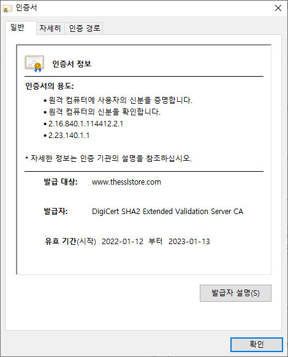
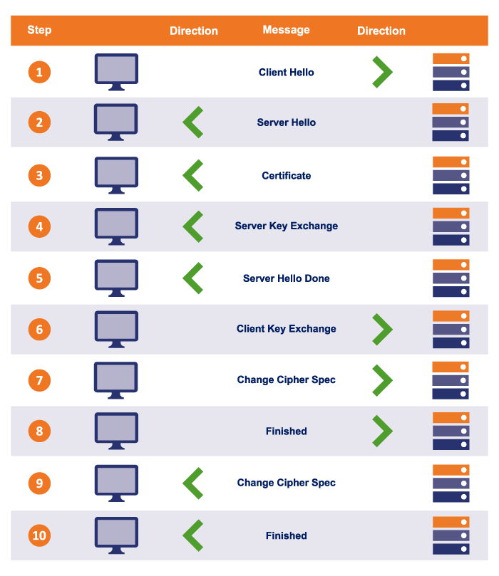

# HTTP

## What is HTTP?

HTTP is a protocol which allows the fetching of resources, such as HTML documents. It is the foundation of any data exchange on the Web and it is a client-server protocol, which means requests are initiated by the recipient, usually the Web browser. A complete document is reconstructed from the different sub-documents fetched, for instance text, layout description, images, videos, scripts, and more.

## References

https://developer.mozilla.org/en-US/docs/Web/HTTP/Overview

## Referer

HTTP request header에 담겨져 오는, an absolute or partial address of the page that makes the request에 대한 정보를 담고 있다.The `Referer` header allows a server to identify a page where people are visiting it from. This data can be used for analytics, logging, optimized caching, and more.

### References

https://developer.mozilla.org/en-US/docs/Web/HTTP/Headers/Referer

## HTTPS

Hypertext transfer protocol secure (HTTPS) is the secure version of [HTTP](https://www.cloudflare.com/learning/ddos/glossary/hypertext-transfer-protocol-http/), which is the primary protocol used to send data between a web browser and a website. HTTPS is encrypted in order to increase security of data transfer. This is particularly important when users transmit sensitive data.

HTTP is 'plain text', or a binary file (like an image) anyone can read or see. HTTPS is based on public/private-key cryptography. It uses port 443 by default, whereas HTTP uses port 80.

### TLS (SSL)

HTTPS uses an encryption protocol called Transport Layer Security (TLS), formerly known as Secure Sockets Layer (SSL). This protocol secures communications by using what’s known as an asymmetric public key infrastructure.

#### TLS vs SSL

Transport Layer Security (TLS) is the **successor** protocol to SSL. **TLS is an improved version of SSL.** It works in much the same way as the SSL, using encryption to protect the transfer of data and information. The two terms are often used interchangeably in the industry although SSL is still widely used.

When you visit an HTTPS website, the website sends its TLS/SSL certificate to your web browser. You can check the certificate on your broswer. Click on the padlock in your browser, then click to view certificate details:

***

### How HTTPS works

When you visit an HTTPS website, your browser is authenticating the website and encrypting the data sent to and from the client. To do that, your browser and the website server need to create a secure connection to communicate through. Setting up the secure connection is a process called the SSL/TLS handshake.

#### Steps 1~2 : Hello & Chiper suites

The browser and server say hello and agree on which cipher suite (encryption algorithm) to use. (HTTPS/SSL/TLS supports multiple cipher suites.)

#### Steps 3~5 : Certificate & Key exchange

Now that contact has been established, the server has to prove its identity to the client. This is achieved using its SSL certificate, which is a very tiny bit like its passport. An SSL certificate contains various pieces of data, including the name of the owner, the property (eg. domain) it is attached to, the certificate’s public key, the digital signature and information about the certificate’s validity dates. The client checks that it either implicitly trusts the certificate, or that it is verified and trusted by one of several Certificate Authorities (CAs) that it also implicitly trusts.

Provided that none of the checks fail, at this point, we technically have a secure communication channel:

- The browser has verified the web server’s SSL certificate, so the web server has been authenticated.
- The browser now has the server’s public key, so the browser can encrypt messages that can only be read by the server.

#### Steps 6~10 : Setting Up Symmetric Encryption

It turns out that symmetric encryption is actually more efficient. So the browser generates a random key to be used for the main, symmetric algorithm. It sends this encrypted key to the server, where it is decrypted using the server’s private key.

Once the session key is generated, the TLS handshake process completes. Your browser and the server will use the session key to encrypt and decrypt all data that they exchange.

***

### References

[How Does HTTPS Work?](https://www.thesslstore.com/blog/how-does-https-work/)

[How does HTTPS actually work?](https://robertheaton.com/2014/03/27/how-does-https-actually-work/)
