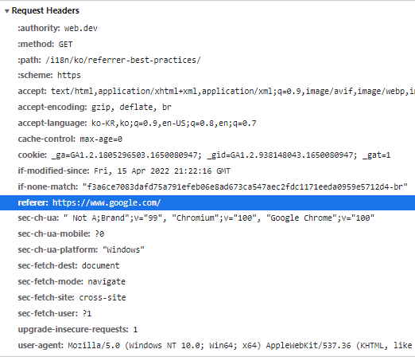

# HTTP

## What is HTTP?

HTTP is a protocol which allows the fetching of resources, such as HTML documents. It is the foundation of any data exchange on the Web and it is a client-server protocol, which means requests are initiated by the recipient, usually the Web browser. A complete document is reconstructed from the different sub-documents fetched, for instance text, layout description, images, videos, scripts, and more.

## References

https://developer.mozilla.org/en-US/docs/Web/HTTP/Overview

## Referer

HTTP request header에 담겨져 오는, an absolute or partial address of the page that makes the request에 대한 정보를 담고 있다.The `Referer` header allows a server to identify a page where people are visiting it from. This data can be used for analytics, logging, optimized caching, and more.

### References

https://developer.mozilla.org/en-US/docs/Web/HTTP/Headers/Referer

