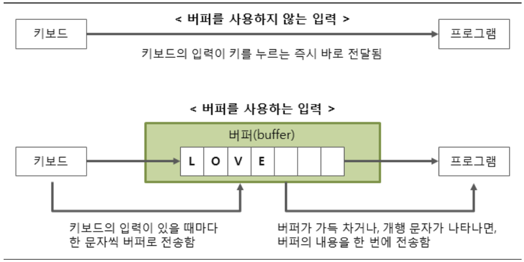

# input, output(Java)

## `BufferedReader`, `BufferedWriter`

### Why use buffer?

데이터가 출발하는 HDD, 키보드 등의 성능과 데이터를 처리하는 CPU의 성능 차이는 생각보다 엄청 크다. 이 때문에 buffer를 사용하지 않고 그때그때 전송해주게 되면 오히려 비효율적이게 된다. 이에 buffer에 데이터를 모아뒀다가 한 번에 전송시키는 것이 더 효율적이다.

## References

https://jhnyang.tistory.com/92