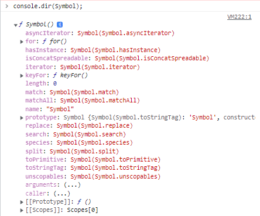

# JavaScript Symbol

Symbol은 ES6에 도입된 primitive data type이다. Symbol is guaranteed to be unique. It's often used to add unique property keys to an object that won't collide with keys any other code might add to the object.


## How to use

### How to create

Write `Symbol()` with an optional string as its description:

```js
let sym1 = Symbol()
let sym2 = Symbol('foo')
let sym3 = Symbol('foo')
```

The above code creates three new Symbols. 세번째 줄의 `Symbol('foo')`는 두번째 줄의 `sym2`와는 전혀 다른 Symbol을 만들어낸다 (위에 적힌대로 유일성이 보장된다).

```js
Symbol('foo') === Symbol('foo')  // false
```

`new` 연산자는 사용할 수 없다.

```js
let sym = new Symbol()  // TypeError
```

#### Global Symbol registry

`Symbol.for()` 메소드는 인자로 전달받은 문자열을 키로 사용하여 Symbol 값들이 저장되어 있는 전역 Symbol 레지스트리에서 해당 키와 일치하는 저장된 Symbol 값을 검색한다. 이때 검색에 성공하면 검색된 Symbol 값을 반환하고, 검색에 실패하면 새로운 Symbol 값을 생성하여 해당 키로 전역 Symbol 레지스트리에 저장한 후, Symbol 값을 반환한다.

```js
// 전역 Symbol 레지스트리에 foo라는 키로 저장된 Symbol이 없으면 새로운 Symbol 생성
const s1 = Symbol.for('foo');
// 전역 Symbol 레지스트리에 foo라는 키로 저장된 Symbol이 있으면 해당 Symbol을 반환
const s2 = Symbol.for('foo');

console.log(s1 === s2); // true
```

`Symbol.keyFor()` 메소드에 Symbol 값을 주면 key를 반환한다.

```js
Symbol.keyFor(s1);  // foo
```

***

### In Object

You can add symbols as a **key** in an object using square brackets `[]`. For example:

```js
let id = Symbol("id");

let person = {
    name: "Jack",
    age: 25,

    // adding symbol as a key
    [id]: 123 // not "id": 123
};

console.log(person); // {name: "Jack", Symbol(id): 123}
console.log(person[id]); // 123
```

#### Symbols are not included in `for...in` loop:

```js
for (let key in person) {
    console.log(key);
}
// name
// age
```

The method [`Object.getOwnPropertySymbols()`](https://developer.mozilla.org/en-US/docs/Web/JavaScript/Reference/Global_Objects/Object/getOwnPropertySymbols) returns an array of Symbols and lets you find Symbol properties on a given object.

***

### References

https://developer.mozilla.org/en-US/docs/Web/JavaScript/Reference/Global_Objects/Symbol

[7번째 타입 심볼(Symbol)](https://poiemaweb.com/es6-symbol)

[JavaScript Symbol](https://www.programiz.com/javascript/symbol)


## Well-known Symbols

Well-known Symbols are used by built-in JavaScript algorithms. For example `Symbol.iterator` is utilized to iterate over items in arrays, strings, or even to define your own iterator function.

Often for simplicity a well-known `Symbol.<name>` is abbreviated to *@@<name>* format. For example `Symbol.iterator` is *@@iterator* or `Symbol.toPrimitive` is *@@toPrimitive*.

`Symbol`은 함수 객체이고, 여러 property를 갖고있다:



보다시피 이 property 중 `length`와 `prototype`을 제외한 것들은 모두 Symbol 이다. Well-known Symbol을 활용하고자 하는(e.g. `Symbol.iterator`로 iterator protocol을 정의하는 경우) Object는 이 Symbol 값을 key로 가져다 property를 set하는 것이다.

코드를 바꿔서 보면 다음과 같다(동작 방식을 설명하기 위한 것이라 실제 코드와는 다르다):

```js
// Symbol은 함수 객체이다.
const Symbol = function () {};
// Symbol(객체)에 Symbol(데이터 타입)값을 가진 'iterator'라는 property를 정의한다.
// 이제 이 property는 모든 Object의 iterator의 key값으로 사용된다.
Symbol.iterator = Symbol('Symbol.iterator');

const a = Object();
const b = Object();

// a와 b의 iterator를 저장하는 key는 같다.
a[Symbol.iterator] = function () {};
b[Symbol.iterator] = function () {};
```

### References

[Detailed Overview of Well-known Symbols](https://dmitripavlutin.com/detailed-overview-of-well-known-symbols/)

