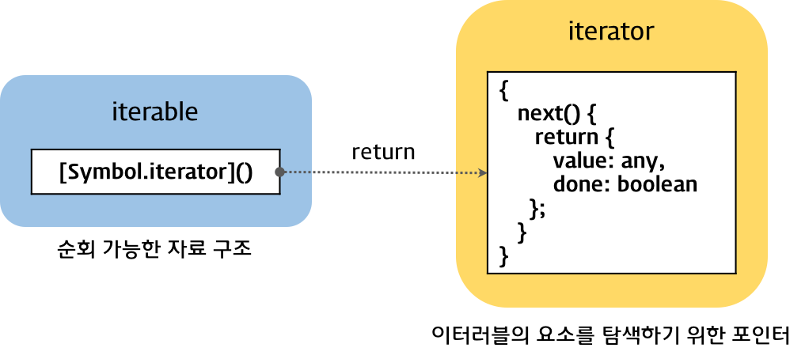

# Iteration protocols

ES6에서 도입된 Object를 순회하기 위한 protocol이다. iteration protocol을 준수한 객체는:

1. `for…of` 문으로 순회할 수 있고
2. spread 문법의 피연산자가 될 수 있고
3. destructuring assignment를 사용할 수 있다.

iterable protocol, iterator protocol 두 가지가 있다.




## Iterable protocol

**The iterable protocol** allows objects to define their iteration behavior. Some built-in types have default iteration behaviors, such as `Array` or `Map`. In order to be **iterable**, an object must implement the **`@@iterator`**(`Symbol.iterator`) method.

Whenever an object needs to be iterated (such as at the beginning of a `for...of` loop), its `@@iterator` method is called with no arguments, and the returned **iterator** is used to obtain the values to be iterated. This function can be an ordinary function, or it can be a generator function.


## Iterator protocol

**The iterator protocol** defines a standard way to produce a sequence of values. Object가 iterator가 되기 위해선 `next()` 메소드를 갖추면 된다:

| Property | Value                                                        |
| -------- | ------------------------------------------------------------ |
| `next()` | - `done` (boolean)<br />Has the value `false` if the iterator was able to produce the next value in the sequence. (This is equivalent to not specifying the `done` property altogether.)<br />Has the value `true` if the iterator has completed its sequence. In this case, `value` optionally specifies the return value of the iterator.<br /><br />- `value`<br />Any JavaScript value returned by the iterator. Can be omitted when `done` is `true`. |

iterable protocol과 iterator protocol을 모두 만족한 Object는 다음과 같다:

```js
const myIterator = {
    // myIterator Object는 next() 메소드가 있으므로 iterator이다.
    next: function() {
        // ...
    },
    // iterator인 자기 자신을 [Symbol.iterator]로 두고 있으므로 iterable이다.
    [Symbol.iterator]: function() { return this; }
};
```


## Examples

A `String` is a built-in iterable Object:

```js
const someString = 'hi';

const iterator = someString[Symbol.iterator]();
console.log(iterator.toString()); // "[object String Iterator]"

console.log(iterator.next()); // { value: "h", done: false }
console.log(iterator.next()); // { value: "i", done: false }
console.log(iterator.next()); // { value: undefined, done: true }
```

You can redefine the iteration behavior by supplying our own `@@iterator`:

```js
// need to construct a String object explicitly to avoid auto-boxing
const someString = new String('hi');

someString[Symbol.iterator] = function () {
  return {
    // this is the iterator object, returning a single element (the string "bye")
    next: function () {
      return this._first ? {
        value: 'bye',
        done: (this._first = false)
      } : {
        done: true
      }
    },
    _first: true
  };
};
```

위와 같이 전혀 반복문이 아닌 iteration도 만들 수 있다.

```js
const iterator = someString[Symbol.iterator]();

console.log(iterator.next()); // { value: 'bye', done: false }
console.log(iterator.next()); // { done: true }
```

### Built-in iterables

`String`, `Array`, `TypedArray`, `Map`, and `Set` are all built-in iterables, because each of their prototype objects implements an `@@iterator` method.

### User-defined iterables

You can make your own iterables like this:

```js
const myIterable = {};
// generator function은 next() 메소드를 갖고 있기 때문에 iterator protocol을 준수하였다.
myIterable[Symbol.iterator] = function* () {
    yield 1;
    yield 2;
    yield 3;
};
console.log([...myIterable]); // [1, 2, 3]
```


## References

https://developer.mozilla.org/en-US/docs/Web/JavaScript/Reference/Iteration_protocols

[이터레이션과 for...of 문](https://poiemaweb.com/es6-iteration-for-of)