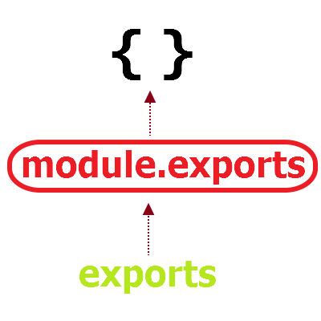

# Node.js

## Node.js vs JavaScript

JavaScript는 독립적인 언어가 아니라 Scripting 언어로써, 특정한 프로그램 안에서만 동작을 할 수 있는데, 브라우저가 없으면 사용할 수 없는 단점이 공존했다. 따라서 client 개발을 위한 용도로만 국한되어 있었다.

Node.js는 terminal에서 node를 입력하여 브라우저 없이도 실행할 수 있게 만든 runtime 환경이다. JavaScript를 Chrome 같은 브라우저에서만 쓰는 것이 아닌 브라우저 밖. 즉, 내 컴퓨터에서 다양한 용도로 확장하기 위해 만들어진 것이 바로 Node.js이다.

| JavaScript             | Node.js                   |
| ---------------------- | ------------------------- |
| programming language   | runtime environment       |
| 브라우저에서 사용 가능 | 브라우저 밖에서 사용 가능 |
| client-side            | server-side               |
| DOM 조작 가능          | DOM 조작 불가             |

### References

[Javascript와 Node의 차이점을 정리해보자](https://hazel-developer.tistory.com/152)

[Difference between Node.JS and Javascript](https://www.geeksforgeeks.org/difference-between-node-js-and-javascript/)


## Events

Node.js는 event 기반 비동기 방식의 서버프레임워크이다. Node.js에서는 기본적으로 아래의 세 가지 함수와 객체를 이용해서 event 처리를 하게된다.

- `EventEmitter` : Node.js의 모든 event 처리가 정의된 기본객체이다. event를 사용하기 위해서는 이 객체를 재정의해서 사용할 수 있다.
- `on()` : event를 연결하는 메소드다.
- `emit()` : event를 발생시킨다.

### event를 가진 객체 만들기

```js
// 1. 이벤트가 정의되어있는 events 모듈 생성
var EventEmitter = require('events');

// 2. 생성된 이벤트 모듈을 사용하기 위해 custom_object로 초기화
var custom_object = new EventEmitter();

// 3. events 모듈에 선언되어 있는 on( ) 함수를 재정의 하여 'call' 이벤트를 처리 
custom_object.on('call', ()=> {
    console.log('called events!');
});

// 4. call 이벤트를 강제로 발생
custom_object.emit('call');
```

### References

[event 사용하기](https://javafa.gitbooks.io/nodejs_server_basic/content/chapter7.html)


## npm

### scripts

The `"scripts"` property of your `package.json` file supports a number of built-in scripts and their preset life cycle events as well as arbitrary scripts. These all can be executed by running `npm run-script <stage>` or `npm run <stage>` for short.

#### Pre & Post scripts

To create "pre" or "post" scripts for any scripts defined in the `"scripts"` section of the `package.json`, simply create another script *with a matching name* and add "pre" or "post" to the beginning of them.

```js
{
  "scripts": {
    "precompress": "{{ executes BEFORE the `compress` script }}",
    "compress": "{{ run command to compress files }}",
    "postcompress": "{{ executes AFTER `compress` script }}"
  }
}
```


## Modules

Node.js에서는 module을 불러오기 위해 `require()` 함수를 쓴다.

```js
// foo.js

const a = 10;
exports.a = a;
```

```js
// bar.js

const foo = require('./foo.js');
console.log(foo.a)  // 10
```

### `require()`

`require()` 함수는 `module.exports`를 return한다. `require()` 소스 코드를 요약하면 다음과 같다.

```js
var require = function(src) {                //line 1
    var fileAsStr = readFile(src)            //line 2
    var module.exports = {}                  //line 3
    eval(fileAsStr)                          //line 4
    return module.exports                    //line 5
}
```

line 1에서는 `src`의 인자를 받아온다. 이 파일을 어떻게 찾는 것인지는 몇 가지 규칙이 있지만 여기서는 언급하지 않는다([공식 문서 참조](https://nodejs.sideeffect.kr/docs/v0.10.7/api/modules.html#modules_file_modules)).

line 2에서는 파일을 읽어서 `fileAsStr`에 저장한다.

line 3에서는 `module.exports`라는 빈 해시를 만든다.

line 4에서는 `fileAsStr`을 `eval`한다. 다음과 같이 `src`를 복붙한다고 생각하면 된다.

```js
var require = function(src){                 //line 1
    var fileAsStr = readFile(src)            //line 2
    var module.exports = {}                  //line 3
    const a = 10
    exports.a = a;                           
    return module.exports                    //line 5
}
```

#### `module.exports` vs `exports`

`exports`가 call by reference로 `module.exports`와 같은 객체를 바라보고 있다. 따라서 `exports`에 key-value를 추가하면 결국 `module.exports`에도 같은 값이 추가되는 것이다.

```js
var module = {
    exports: {}
};
var exports = module.exports;

return module.exports;
```



#### References

[require(), exports, module.exports 공식문서로 이해하기](https://medium.com/@chullino/require-exports-module-exports-%EA%B3%B5%EC%8B%9D%EB%AC%B8%EC%84%9C%EB%A1%9C-%EC%9D%B4%ED%95%B4%ED%95%98%EA%B8%B0-1d024ec5aca3)

https://programmingsummaries.tistory.com/340

### `require()` vs `import`


You **can't** selectively load only the pieces you need with `require` but with `import`, you can selectively load only the pieces you need, which can save memory.

Loading is **synchronous**(step by step) for `require` on the other hand `import` can be asynchronous(without waiting for previous import) so it *can perform a little better than* `require`.

#### References

[The difference between "require(x)" and "import x"](https://stackoverflow.com/questions/46677752/the-difference-between-requirex-and-import-x)
