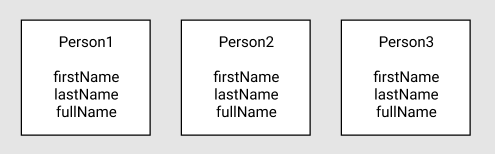
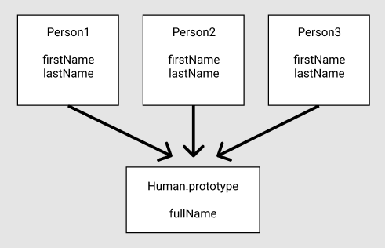

# Prototype

## `.prototype`

Properties in the `prototype` are shared among ALL instances of an object.

```js
Bird.prototype.numLegs = 2;

console.log(duck.numLegs);  // 2
console.log(canary.numLegs);  // 2
```

You can set the `prototype` to a new object that already contains the properties. This way, the properties are added all at once.

But there is one crucial side effect of manually setting the prototype to a new object. It erases the `constructor` property. To fix this, whenever a prototype is manually set to a new object, remember to define the `constructor` property.

```js
Bird.prototype = {
  constructor: Bird,  // manually set constructor property
  numLegs: 2, 
  eat: function() {
    console.log("nom nom nom");
  },
  describe: function() {
    console.log("My name is " + this.name);
  }
};
```

### `isPrototypeOf()`

Checks if an object exists in another object's prototype chain.

```js
let duck = new Bird("Donald");Bird.prototype.isPrototypeOf(duck);  // true
```


## Why use `prototype`?

By using `prototype` property on the constructor function,  `prototype` will enable us to easily define methods to all instances of the instances while saving memory. What's great is that the method will be applied to the `prototype` of the object, so it is only stored in the memory once, because objects coming from the same constructor point to one common `prototype` object.





In addition to that, all instances of `person1` , `person2`,  `person3` will have access to that method. Thus, we will be able to save quite a good amount of memory compared to the constructor approach. Apart from low memory usage, the `prototype` approach is obviously faster in execution when creating new object instances since no time is spent on re-declaring any methods.


## `prototype` & `constructor`

When a function is created in JavaScript, the JavaScript engine adds a `prototype` property to the function. This `prototype` property is an object (called a prototype object) that has a `constructor` property by default. The `constructor` property points back to the function on which `prototype` object is a property. We can access the function’s prototype property using `functionName.prototype`.


### `__proto__`

When an object is created in JavaScript, JavaScript engine adds a `__proto__ `property to the newly created object which is called *dunder proto*. *dunder proto* or `__proto__` points to the prototype object of the constructor function.


Both `person1’s`  `__proto__` property and `Human.prototype` property is equal.


```js
Human.prototype === person1.__proto__ //true
```


## Own property vs `prototype` property

When we try to access a property of an object, the JS engine first tries to find the property on the object, if the property is present on the object it outputs its value. But, if the property is not present on the object then it tries to find the property on the `prototype` object or *dunder proto* of the object.

```js
function Person() {
    
}

Person.prototype.name = 'Ashwin';

var person1 = new Person();
console.log(person1.name)  // Ashwin
```

```js
person1.name = "Anil"
console.log(person1.name)  // Anil
```


## References

https://betterprogramming.pub/prototypes-in-javascript-5bba2990e04b (Prototypes in JavaScript)

