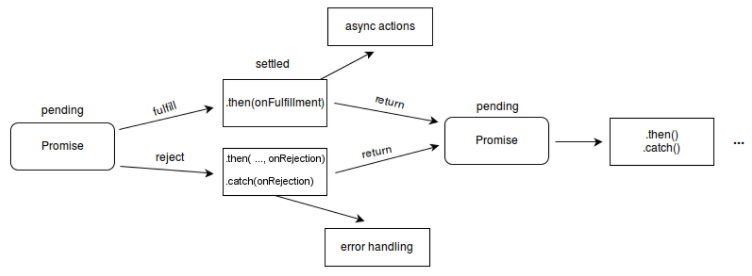

# Promise

## Promise란?

Promise는 비동기 작업의 최종 완료 또는 실패를 나타내는 객체이다. It allows you to associate handlers with an asynchronous action's eventual success value or failure reason.

Promise has 3 states.

1. pending : initial state, neither fulfilled nor rejected.
2. fulfilled : meaning that the operation was completed successfully.
3. rejected : meaning that the operation failed.



Using Promise comes with some guarantees:

- Callbacks added with `then()` will never be invoked before the completion of the current run of the JavaScript event loop.

- Multiple callbacks may be added by calling `then()` several times. They will be invoked one after another, in the order in which they were inserted.


## Using Promises

`Promise` is a constructor function, so you need to use the `new` keyword to create one. It takes a function, as its argument, with two parameters - `resolve` and `reject`. These are methods used to determine the outcome of the promise. The syntax looks like this:

```js
const myPromise = new Promise((resolve, reject) => {
  if (true) {
    resolve("fulfilled");
  } else {
    reject("rejected");
  }
});
```

The methods `promise.then()`, `promise.catch()`, and `promise.finally()` are used to associate further action with a promise that becomes settled.

The `.then()` method takes up to two arguments; the first argument is a callback function for the resolved case of the promise, and the second argument is a callback function for the rejected case. Each `.then()` returns a newly generated promise object, which can optionally be used for chaining.

```js
const myPromise = new Promise((resolve, reject) => {
    if (value) {  // value == true 혹은 false
        resolve('fulfilled');
    } else {
        reject('rejected');
    }
})

myPromise
.then((successMsg) => {  // successMsg == resolve의 parameter로 전달된 'fulfilled'
    console.log(successMsg);
}, (rejectMsg) => {  // rejectMsg == reject의 parameter로 전달된 'rejected'
    console.log(rejectMsg);
})

// 'fulfilled' if (value == true)
// 'rejected' if (value == false)
```

### Chaining

기존의 callback을 활용한다면 다음과 같이 코드가 짜여질 것이다.

```js
doSomething(function(result) {
  doSomethingElse(result, function(newResult) {
    doThirdThing(newResult, function(finalResult) {
      console.log('Got the final result: ' + finalResult);
    }, failureCallback);
  }, failureCallback);
}, failureCallback);
```

promise chaing을 활용한다면 다음과 같이 바꿀 수 있다.

```js
doSomething()
.then(function(result) {
  return doSomethingElse(result);
})
.then(function(newResult) {
  return doThirdThing(newResult);
})
.then(function(finalResult) {
  console.log('Got the final result: ' + finalResult);
})
.catch(failureCallback);
```

`.then` chain에서는 Promise 객체가 없더라도 계속 이어서 다음 link로 이어서 실행한다. 중간에 reject 되는 경우 바로 `.catch`문으로 이동한다.

## References

https://developer.mozilla.org/en-US/docs/Web/JavaScript/Reference/Global_Objects/Promise

https://developer.mozilla.org/en-US/docs/Web/JavaScript/Guide/Using_promises

