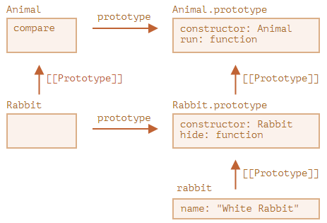

# JavaScript Class

## static

Static members(properties and methods) are called without instantiating their class and can't be called through a class instance. Static methods are often used to create utility functions for an application, whereas static properties are useful for caches, fixed-configuration, or any other data you don't need to be replicated across instances.

To make static method or property, use `static` keyword:

```js
class ClassWithStaticMethod {
  static staticProperty = 'someValue';
  static staticMethod() {
    return 'static method has been called.';
  }
}

console.log(ClassWithStaticMethod.staticProperty);
// output: "someValue"
console.log(ClassWithStaticMethod.staticMethod());
// output: "static method has been called."

const instance = new ClassWithStaticMethod();
console.log(instance.staticProperty);
// undefined
```

- A class with a static member can be sub-classed.

  아래 예시에서 `Animal.compare`와 `Animal.planet`은 상속되어서 각각 `Rabbit.compare`와 `Rabbit.planet`에서 접근할 수 있습니다.

  ```js
  class Animal {
    static planet = "지구";
  
    constructor(name, speed) {
      this.speed = speed;
      this.name = name;
    }
  
    run(speed = 0) {
      this.speed += speed;
      alert(`${this.name}가 속도 ${this.speed}로 달립니다.`);
    }
  
    static compare(animalA, animalB) {
      return animalA.speed - animalB.speed;
    }
  
  }
  
  // Animal을 상속받음
  class Rabbit extends Animal {
    hide() {
      alert(`${this.name}가 숨었습니다!`);
    }
  }
  
  let rabbits = [
    new Rabbit("흰 토끼", 10),
    new Rabbit("검은 토끼", 5)
  ];
  
  rabbits.sort(Rabbit.compare);
  
  rabbits[0].run(); // 검은 토끼가 속도 5로 달립니다.
  
  alert(Rabbit.planet); // 지구
  ```

  이제 `Rabbit.compare`을 호출하면 `Animal.compare`가 호출됩니다.

  이게 가능한 이유는 프로토타입 때문입니다. 이미 예상하셨겠지만, `extends` 키워드는 `Rabbit`의 `[[Prototype]]`이 `Animal`을 참조하도록 해줍니다.

  

- Calling static members:

  - From another static method

    In order to call a static member within another static method of the same class, use `this` keyword:

    ```js
    class StaticMethodCall {
      static staticProperty = 'static property';
      static staticMethod() {
        return 'Static method and ' + this.staticProperty + ' has been called';
      }
      static anotherStaticMethod() {
        return this.staticMethod() + ' from another static method';
      }
    }
    ```

  - From a class constructor and other methods

    Static members are not directly accessible using the `this` keyword from non-static methods. You need to call them using the class name: `CLASSNAME.STATIC_METHOD_NAME()` / `CLASSNAME.STATIC_PROPERTY_NAME` or by calling the method as a property of the `constructor`: `this.constructor.STATIC_METHOD_NAME()` / `this.constructor.STATIC_PROPERTY_NAME`

    ```js
    class StaticMethodCall {
      constructor() {
        console.log(StaticMethodCall.staticProperty); // 'static property'
        console.log(this.constructor.staticProperty); // 'static property'
        console.log(StaticMethodCall.staticMethod()); // 'static method has been called.'
        console.log(this.constructor.staticMethod()); // 'static method has been called.'
      }
    
      static staticProperty = 'static property';
      static staticMethod() {
        return 'static method has been called.';
      }
    }
    ```

### class static initialization blocks

**Class static initialization blocks** are a special feature of a `class` that enable more flexible initialization of `static` properties than can be achieved using per-field initialization.

Initialization is performed in the context of the current class declaration, with privileged access to private state. This means that static blocks can also be used to share information between classes with instance private fields and other classes or functions declared in the same scope.

```js
class ClassWithStaticInitializationBlock {
  static staticProperty1 = 'Property 1';
  static staticProperty2;
  static {
    this.staticProperty2 = 'Property 2';
  }
}

console.log(ClassWithStaticInitializationBlock.staticProperty1);
// output: "Property 1"
console.log(ClassWithStaticInitializationBlock.staticProperty2);
// output: "Property 2"
```

A class can have any number of static initialization blocks. Any static initialization of a super class is performed first, before that of its sub classes.

The scope of the variables declared inside the static block is local to the block. Since `var`, `function`, `const` or `let` declared in a `static {}` initialization block are local to the block, any `var` declarations in the block are not hoisted.

The `this` inside a static block refers to the constructor object of the class. `super.<property>` can be used to access properties of a super class. Note however that it is a syntax error to call `super()` in a class static initialization block, or to attempt to access arguments of the class constructor function.

### References

https://developer.mozilla.org/en-US/docs/Web/JavaScript/Reference/Classes

https://developer.mozilla.org/en-US/docs/Web/JavaScript/Reference/Classes/static

https://developer.mozilla.org/en-US/docs/Web/JavaScript/Reference/Classes/Class_static_initialization_blocks

[정적 메서드와 정적 프로퍼티](https://ko.javascript.info/static-properties-methods)

