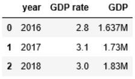
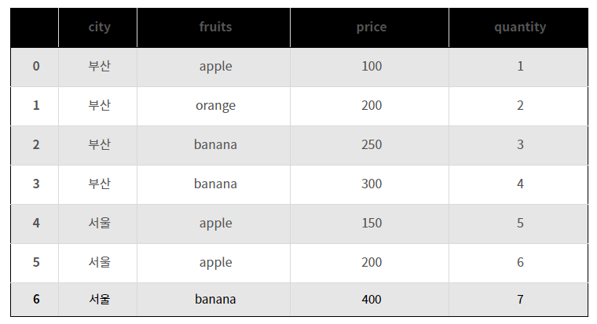
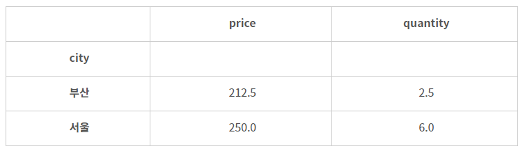
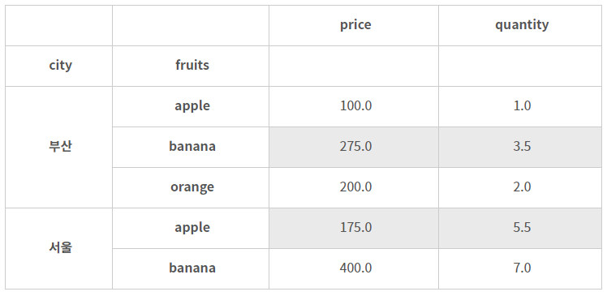

# pandas

#### 자료구조

##### 1차원 자료구조 Series

List와 같은 자료구조. List와 다른 점은 별도의 index label을 지정 가능하다.

```python
obj = pd.Series([4, 7, -5, 3])
```

```python
obj2 = pd.Series([4, 7, -5, 3], index=['a', 'b', 'c', 'd'])
print(obj2['b']) # 7
```

index를 dictionary 형식으로 주는 것도 가능하다.

```python
obj3 = pd.Series({ 'a': 4, 'b': 7, 'c': -5, 'd': 3 })
print(obj['c']) # -5
```

##### 2차원 자료구조 DataFrame

행과 열이 있는 table 데이터를 받아들인다. 데이터로 ndarray, Iterable, dict, DataFrame을 줄 수 있는데, dict의 경우엔 key를 column label로 사용하고, 따로 지정되지 않은 데이터의 경우에는 `columns` parameter를 줄 수 있다.

```python
data = [
    [2016, 2.8, '1.637M'],
    [2017, 3.1, '1.73M'],
    [2018, 3.0, '1.83M']
]

df = pd.DataFrame(data, columns=['year', 'GDP rate', 'GDP'])
```

```python
data = {
    'year': [2016, 2017, 2018],
    'GDP rate': [2.8, 3.1, 3.0],
    'GDP': ['1.637M', '1.73M', '1.83M']
}
 
df = pd.DataFrame(data)
```



##### 3차원 자료구조 Panel

Panel은 Axis 0 (items), Axis 1 (major_axis), Axis 2 (minor_axis) 등 3개의 축을 가지고 있는데, Axis 0은 그 한 요소가 2차원의 DataFrame 에 해당되며, Axis 1은 DataFrame의 행(row)에 해당되고, Axis 2는 DataFrame의 열(column)에 해당된다.


#### Functions

##### `pandas.merge(left, right, how='inner', on=None, left_on=None, right_on=None, ...)`

Merge DataFrame or named Series objects with a database-style join.

###### Parameters

- `how`

  - `left` : left frame의 key만 기준으로 병합한다.
  - `right` : right frame의 key만 기준으로 병합한다. 

  - `outer` : 양 frame의 key를 모두 사용한다.
  - `inner` : 양 frame 간 겹치는 key만 사용한다.

  

- `on` : 기준열. 양 frame의 기준열 이름이 같다면 `on` parameter를 사용한다.

양 frame의 기준열 이름이 다르면

- `left_on` : left frame의 기준열
- `right_on` : right frame의 기준열

을 사용한다.


##### `pandas.DataFrame.groupby(by=None, ...)`

같은 값을 하나로 묶어 통계 또는 집계 결과를 얻기 위해 사용하는 것이 `groupby`이다.



위와 같은 DataFrame `df`가 있다고 하자.

예를 들어, 도시(city)별로 가격(price) 평균을 구하고 싶은 경우 다음과 같이 `groupby`를 사용하여 평균값을 구할 수 있다.

```python
df.groupby('city').mean()
```



그룹 지정은 여러 단계로 할 수도 있다.

```python
df.groupby(['city', 'fruits']).mean()
```




##### `pandas.DataFrame.sort_values(by, axis=0, ascending=True, ...)`

Sort by the values along either axis.


##### `pandas.cut(x, bins, right=True, labels=None, ...)`

Use `cut` when you need to segment and sort data values into bins. For example, `cut` could convert ages to groups of age ranges.

###### Parameters

- `x` : Input array
- `bins` : array를 나누는 기준

## References

https://pandas.pydata.org/docs/index.html

http://pythonstudy.xyz/python/article/408-pandas-%EB%8D%B0%EC%9D%B4%ED%83%80-%EB%B6%84%EC%84%9D (pandas 데이타 분석)

https://ponyozzang.tistory.com/291 (Python Pandas 데이터 분석 groupby 사용 방법 예제)

