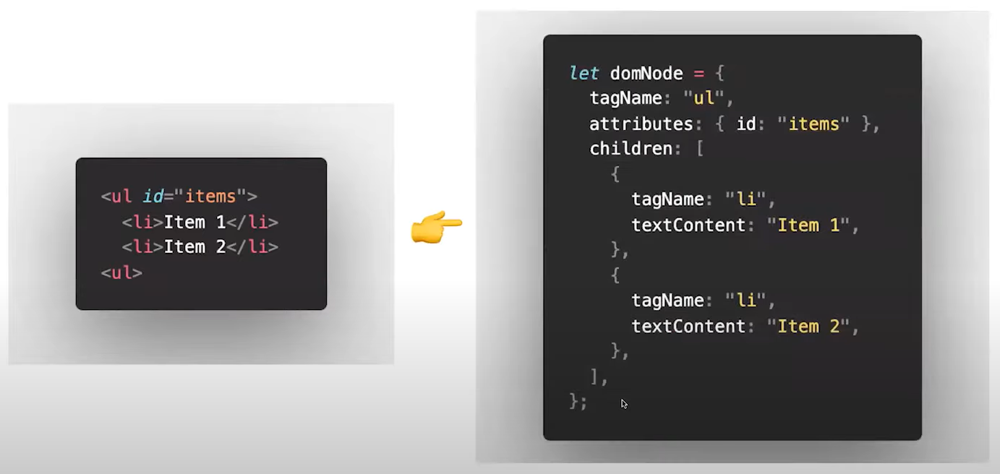

# React.js

## Virtual DOM

The virtual DOM (VDOM) is a programming concept where an ideal, or “virtual”, representation of a UI is kept in memory and synced with the “real” DOM by a library such as ReactDOM. It's like a lightweight copy of the actual DOM. This process is called reconciliation.

실제 DOM과 같은 속성들(e.g. `class`)은 갖고 있지만, DOM이 가진 API(e.g. `getElementById`)는 갖고 있지 않다. 코드가 변경되면 전체 UI는 일단 Virtual DOM에 렌더링된다. 그 후 이전 Virtual DOM과 내용을 비교하여 변경이 필요한 부분만 실제 DOM에 반영되게 된다.

Virtual DOM은 HTML 객체에 기반한 자바스크립트 객체로 표현할 수 있다. 이러한 처리는 실제 DOM이 아닌 메모리 상에서 동작하고, 실제 rendering이 이루어지지 않으므로 연산 비용이 최소화된다.



### Reconciliation

You can think of the `render()` function as creating a tree of React elements. On every render, React needs to figure out how to efficiently update the UI to match the most recent tree. To transform one tree into another, even the state of the art algorithms have a complexity in the order of O(n<sup>3</sup> ) where n is the number of elements in the tree.

### References

https://reactjs.org/docs/faq-internals.html

[[10분 테코톡] 🥁 지그의 Virtual DOM](https://youtu.be/PN_WmsgbQCo)


## DOM elements

### Differences in attributes

There are a number of attributes that work differently between React and HTML:

#### `dangerouslySetInnerHTML`

`dangerouslySetInnerHTML` is React’s replacement for using `innerHTML` in the browser DOM. In general, setting HTML from code is risky because it’s easy to inadvertently expose your users to a cross-site scripting (XSS) attack. So, you can set HTML directly from React, but you have to type out `dangerouslySetInnerHTML` and pass an object with a `__html` key, to remind yourself that it’s dangerous. For example:

```jsx
function createMarkup() {
  return {__html: 'First &middot; Second'};
}

function MyComponent() {
  return <div dangerouslySetInnerHTML={createMarkup()} />;
}
```

