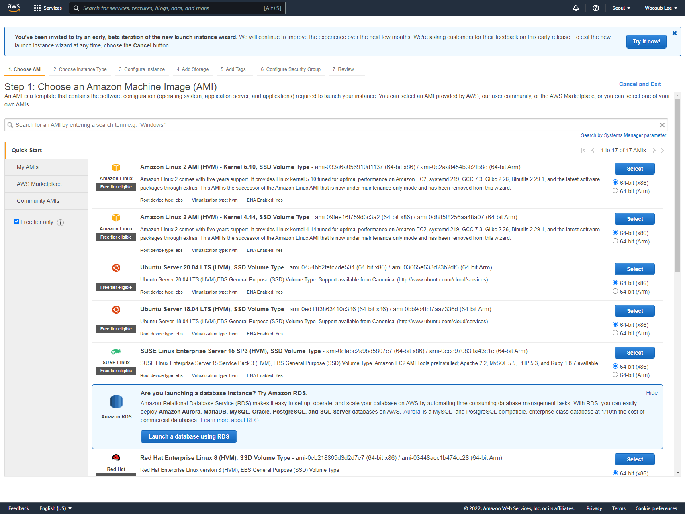
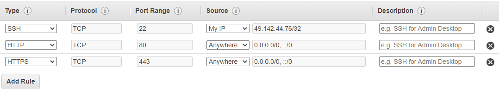
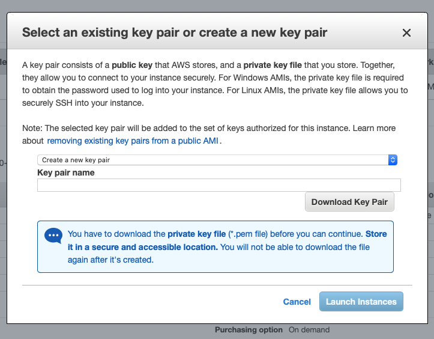
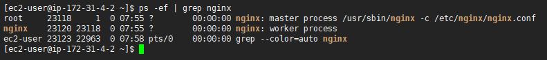
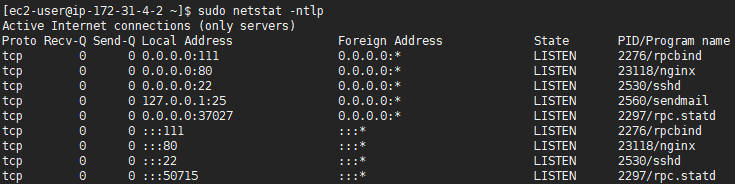

# React Deployment

## Development environment vs Production environment

개발 시와 배포 시에는 API 주소, port, 타이틀 같은 사용 환경이 다르다. 이렇게 개발 환경과 배포 환경에서의 변수 값을 다르게 설정해야 할 경우 환경변수(`.env`)를 사용하면 된다. `.env`도 종류가 여러 가지 있는데 `.env.local`, `.env.development`, `.env.test`, `.env.production` 등이 있다.

각각의 상황에 따라 실행 script는 다음과 같다.

```bash
# production 배포 env실행
$ npm run build

# development 개발 env실행
$ npm run start

# test 개발 env실행
$ npm run test
```

### .env 종류

#### .env.local

로컬 사용 환경으로 `.env`보다 우선권이 있다.

#### .env.development

개발할 시 사용하는 환경이다.

`npm run start` 혹은 `npm start` 시에 아래와 같은 우선순위로 실행된다.

```
.env.development.local > .env.development > .env.local > .env
```

#### .env.production

배포할 시 사용하는 환경이다.

`npm run build` 시에 아래와 같은 우선순위로 실행된다.

```
.env.production .local > .env.production > .env.local > .env
```

#### .env.test

테스트 시 사용하는 환경이다.

`npm run test` 시에 아래와 같은 우선순위로 실행된다.

```
.env.test.local > .env.test > .env.local > .env
```

### 방법

React에서는 변수명에 `REACT_APP_`을 붙여줘야 인식한다.

```
// .env.development

REACT_APP_HOST=localhost
```

```
// .env.production

REACT_APP_HOST=API 주소
```

JSX에서는 `process.env.REACT_APP_변수명`으로 작성하면 된다.

`index.html`에서 사용하는 방법은 `%REACT_APP_변수명%`으로 사용해주면 된다.

```html
<script src="https://maps.googleapis.com/maps/api/jskey=%REACT_APP_MAP_API%&v=3.exp&libraries=places" async></script>
```

#### AWS EC2에 `.env` 올리기

환경 변수는 원격 repository에 올리는 것을 지양해야 한다. 그러므로 EC2와 같은 클라우드 instance에는 clone이 안되므로 다른 방법으로 파일을 올려주어야 한다.

파일이 있는 경로에서 다음 명령을 수행하면 된다.

```bash
$ scp -i [pem파일경로] [업로드할 파일 이름] [instance user]@[instance IP]:~/[경로]
```

##### References

[[AWS] EC2 ssh 원격 접속과 scp를 통한 파일 전송](https://ict-nroo.tistory.com/40)


## AWS EC2

AWS의 EC2를 활용해 배포하는 방법이다.

### 1. Create EC2 instance

AWS EC2 화면에서 Launch instance를 클릭하면 아래와 같이 AMI(Amazon Machine Image)를 선택하는 화면이 나타난다. 이 중 대표적인 운영체제인 CentOS 기반 'Amazon Linux 2 AMI'를 선택한다.

Ubuntu도 많이 활용하는데 Ubuntu를 선택해도 큰 차이는 없는데, Amazon Linux에서는 `yum`을 쓰지만 Ubuntu에서는 `apt-get`을 쓴다는 점을 알아야 한다.



Step 2: Choose an Instance Type에서는 유일한 Free tier eligible인 t2.micro를 선택하는데 여기서 다음으로 넘어갈 때 'Next: Configure Instance Details'로 넘어간다.

Step 3는 넘기고, Step 4: Add Storage에서는 Free tier의 최대 SSD 크기인 30GB를 설정해준다. 그리고 Step 5는 넘어가고

Step 6는 중요한데, 내 instance에 어떤 방법으로 어디서 접근할 수 있는지를 결정하기 때문이다. 모든 사용자가 접근할 수 있는 서비스는 HTTP와 HTTPS에서는 'Anywhere'를 설정해준다. 각 Type은 기본적으로 port가 정해져있다. 0.0.0.0은 IPv4의 모든 IP 주소, ::0은 IPv6의 모든 IP 주소를 뜻한다.

SSH는 'Anywhere'보다는 좀 더 제한적인 설정을 해주는 것이 좋다. SSH는 Secure Shell의 약자로 네트워크를 통해 다른 컴퓨터에 접속하고 다룰 수 있게 해주는 프로토콜이다. 때문에 보안을 향상시켜주는 것이 좋다. 여기서는 My IP로 설정해줬다.



그러면 SSH 접속을 위한 key pair 창이 나타난다. 이 key는 보안을 조심하여 저장하여야 한다.



### 2. SSH로 instance 접속하기

```bash
$ ssh -i [pem 경로] ec2-user@[instance ip]
```

`ec2-user`는 username인데 만약 AMI로 Ubuntu를 선택했다면 `ubuntu`를 입력해줘야 한다.

### 3. Package 설치하기

```bash
$ sudo yum update
```

일단 package들의 업데이트를 한 번 해준 후, 필요한 것들을 설치한다.

```bash
$ sudo yum install git
$ sudo amazon-linux-extras install nginx1.12
```

Nginx를 위와 같은 방식으로 설치하는 이유는, Amazon Linux 2의 환경에서는 `nginx is available in Amazon Linux Extra topics “nginx1.12” and “nginx1”` 과 같은 말이 표시될 것이다. 사람들이 자주 사용하는 라이브러리들을 카탈로그 느낌으로 따로 준비해놨으니 이걸 이용해서 설치하라는 뜻이니까 해당 방식으로 nginx 1.12 버전을 설치하도록 한다.

```bash
$ git clone [프로젝트]
```

Git을 통해 프로젝트를 받아온 후

```bash
$ curl -o- -L https://yarnpkg.com/install.sh | bash
$ source ~/.bashrc
$ curl -o- https://raw.githubusercontent.com/nvm-sh/nvm/v0.34.0/install.sh | bash
$ . ~/.nvm/nvm.sh
$ nvm install node
```

yarn과 nvm, Node.js를 설치한다.

이제 프로젝트 디렉토리 안으로 들어간 다음 build를 해준다.

```bash
$ yarn install
$ yarn run build
```

#### 4. Nginx 설정하기

Nginx는 지금 다루고 있는 instance처럼 특정 컴퓨터 내의 데이터를 외부에 빠르게 제공하고, 외부로부터의 요청을 받아 처리할 수 있도록 하는 웹 서버이다. Nginx와 관련된 설정 파일들은 /etc 하위에 존재하므로, sudo 권한을 이용해서 파일 생성과 수정 등을 해야한다.

Nginx의 설정 파일은 `/etc/nginx/nginx.conf`이다. `nginx.conf`에서 바로 React 프로젝트로 이어지도록 설정할 수 있지만, 일반적으로 선호되는 방식은 `sites-available` 디렉토리를 만들어 각 프로젝트의 설정을 저장하고, `sites-enabled`에 해당 설정들에 대한 symbolic link(바로가기)를 모으고 이것들을 `nginx.conf`에서 확인하도록 하는 것이다.

일단 `nginx.conf`에서 `sites-enabled` 디렉토리의 파일들을 포함하도록 해준다. `server` 블록의 행들을 주석처리하고 그 위에 `include /etc/nginx/sites-enabled/*.conf;`를 추가한다.

```
...

include /etc/nginx/conf.d/*.conf;
include /etc/nginx/sites-enabled/*.conf;

#server {
#    listen       80 default_server;
#    listen       [::]:80 default_server;
#    server_name  _;
#    root         /usr/share/nginx/html;

    # Load configuration files for the default server block.
#    include /etc/nginx/default.d/*.conf;

#    location / {
#    }

#    error_page 404 /404.html;
#        location = /40x.html {
#    }

#    error_page 500 502 503 504 /50x.html;
#        location = /50x.html {
#    }
#}

...
```

그리고 `sites-enabled`와 `sites-available` 디렉토리를 추가해주고, `sites-available` 내에 원하는 이름으로 설정 파일을 생성해 연다.

```bash
$ sudo mkdir /etc/nginx/sites-enabled
$ sudo mkdir /etc/nginx/sites-available
$ sudo vi /etc/nginx/sites-available/[설정 이름].conf
```

HTTP에 해당하는 기본적인 설정만 해본다. location 블록의 `/`는 directive라고 하는데, IP 주소나 도메인의 뒷 부분인 URI에 대응된다. 그냥 `/`만 쓰면 ‘/’로 시작하는 모든 URI에 해당한다는 것으로 현재는 이 instance의 IP 주소로 port 80을 통해 들어오는 모든 URL을 연결시켜주는 셈이다. `root` 행에는 아까 Git을 통해 가져온 프로젝트 내부의 build 디렉토리 경로를 입력한다.

```
server {
  listen 80;
  
  location / {
    root /home/ec2-user/[프로젝트 디렉토리]/build;
    index index.html index.htm;
    try_files $uri $uri/ /index.html;
  }
}
```

아래 명령어를 통해 `sites-enabled`에 symbolic link를 생성해준다. 여기서 경로를 꼭 `/etc/nginx/~~` 부터 입력해주어야 한다. 상대경로로 입력했더니 오류가 났다.

```bash
$ sudo ln -s /etc/nginx/sites-available/[설정 이름].conf /etc/nginx/sites-enabled/[설정 이름].conf
```

#### 4.1 Test

테스트를 해본다.

```bash
$ sudo nginx -t
```

```
nginx: the configuration file /etc/nginx/nginx.conf syntax is ok
nginx: configuration file /etc/nginx/nginx.conf test is successful
```

위와 같이 출력되면 설정의 문법이 정상적이라는 것을 의미한다.

```bash
$ ps -ef | grep nginx
```



Nginx가 정상적으로 동작한다.

```bash
$ sudo netstat -ntlp
```



80 port를 Nginx가 사용하고 있으므로 정상적으로 동작하고 있다.

이제 Nginx를 동작시키면 된다.

```bash
$ sudo systemctl start nginx
```

### 5. 도메인 연결하기

도메인을 IP 주소와 연결하기 위해서는 DNS(Domain Name System)라는 시스템이 이용된다. 이 DNS를 운영하는 서버를 name server라고 한다. name server가 하는 일은 휴대폰에 전화번호를 내가 지정한 이름으로 저장해 갖고 있는 연락처(전화번호부)가 하는 일과 비슷하다. 도메인 이름과 IP 주소를 양쪽으로 서로 변환해주는 역할을 하는데, 따로 만들거나 사용할 name server가 없다면 도메인 서비스에서 제공하는 name server를사용하는 것이 편리하다.(물론 구매 후 바꿀 수 있다) 지금 구입하는 도메인과 IP 주소를 상호 변환하는 데에 도메인 서비스가 운영하는 name server를 이용하겠다는 것이다.


## References

[][react] [[react] 실무 개발 환경/배포 환경 설정(.env)](https://han-py.tistory.com/441)

[AWS EC2에서 Nginx로 React 앱 직접 배포하기](https://medium.com/@bdv111/aws-ec2%EC%97%90%EC%84%9C-nginx%EB%A1%9C-react-%EC%95%B1-%EC%A7%81%EC%A0%91-%EB%B0%B0%ED%8F%AC%ED%95%98%EA%B8%B0-c1e09639171e)

[도메인을 IP 주소에 연결하는 방법과 nslookup](https://medium.com/@bdv111/%EB%8F%84%EB%A9%94%EC%9D%B8%EC%9D%84-ip-%EC%A3%BC%EC%86%8C%EC%97%90-%EC%97%B0%EA%B2%B0%ED%95%98%EB%8A%94-%EB%B0%A9%EB%B2%95%EA%B3%BC-nslookup-9e70a32eec57)