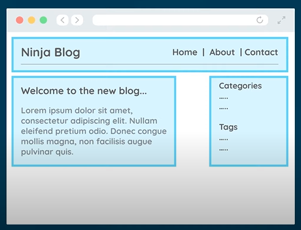
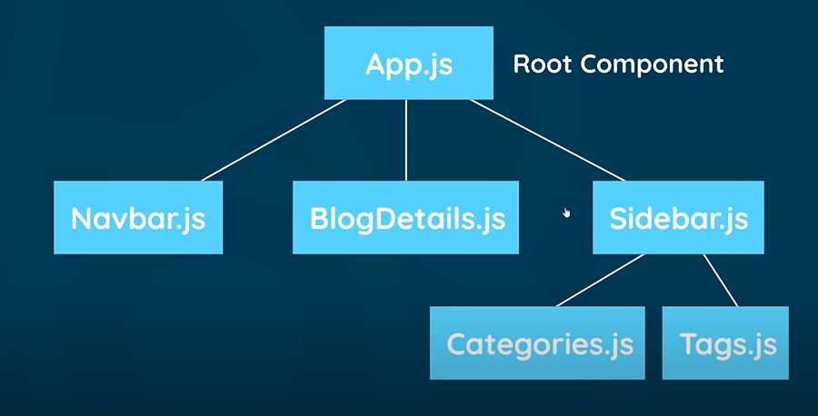
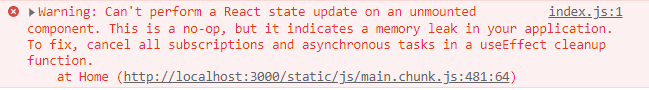

# React.js tutorial - The Net Ninja

[Link](https://youtube.com/playlist?list=PL4cUxeGkcC9gZD-Tvwfod2gaISzfRiP9d)


## #2 Creating a React Application

Node.js가 설치된 상태여야 한다.

React app을 생성하는 방법은 다음과 같다.

```bash
$ npx create-react-app app-name
```

### 디렉토리 구조

```
.
├─ node_modules  : Where all the dependencies are in
├─ public  : all public files
   └─ index.html  : The one html file that is served to the browser and the all react code is injected into this one file, inside a div tag with an id of 'root'
├─ src  : most of codes we write would be in this folder
   └─ index.js  : The file that kind of kickstarts application. Responsible for mounting all components to the dom.
├─ .gitignore
├─ package.json
├─ README.md
└─ yarn.lock
```

### How to start an app

```bash
$ npm run start
```


## #3 Components & Templates



Components contain:

- Template
- Logic


`index.js` 파일을 들여다보면 다음과 같이 코드가 작성되어 있다.

```jsx
ReactDOM.render(
  <React.StrictMode>
    <App />
  </React.StrictMode>,
  document.getElementById('root')
);
```

해석해보면, `App`이라는 component를 `root`라는 id를 가진 element에 render한다는 의미가 되겠다.

`App.js`를 보면,

```jsx
function App() {
  return (
    <div className="App">
      <header className="App-header">
        
        <p>
          Edit <code>src/App.js</code> and save to reload.
        </p>
        <a
          className="App-link"
          href="https://reactjs.org"
          target="_blank"
          rel="noopener noreferrer"
        >
          Learn React
        </a>
      </header>
    </div>
  );
}

export default App;
```

`App()`이라는 function이 있다. 이 function은 HTML 코드 처럼 보이는 코드를 반환하는데 실은 이 코드는 HTML이 아니라 JSX라는 문법으로 작성된 코드이다.


## #4 Dynamic Values in Templates

Component에서 변수를 선언하고 사용하려면 `return`문 이전에 선언하고, 중괄호 사이에 담아서 사용하면 된다.

```jsx
function App() {
  const title = 'Welcome to the new blog';
    
  return {
    <div className="App">
      <div className="content">
        <h1>{ title }</h1>
      </div>
    </div> 
  }
}
```

아래와 같은 코드도 가능하다.

```jsx
<p>{ 10 }</p>
<p>{ "hello, ninjas" }</p>
<p>{ [1, 2, 3, 4, 5] }</p>
<p>{ Math.random() * 10 }</p>
```

태그의 속성에서도 사용 가능하다.

```jsx
const link = "http://www.google.com";

function App() {
    return {
        ...
        <a href={ link }>Google Site</a>
    }
}
```


## #5 Multiple Components



최상위 component인 `App.js` 아래 component들이 tree처럼 들어가 있는 구조가 된다.

`sfc` 스니펫 명령어를 입력해 stateless functional component라는 component의 기본 형식을 불러올 수 있다.

```jsx
const  = () => {
  return (  );
}
 
export default ;
```

Component에 다른 하위 component를 삽입하려면 먼저 `import`한 후 코드에 하위 component 이름 그대로 넣으면 된다.

```jsx
import Navbar from './Navbar';

function App() {
  return (
    <div className="App">
   	  <Navbar />
    </div>
  )
}
```


## #6 Adding Styles

CSS 스타일을 적용하려면 CSS 파일을 `import` 해오면 된다. CSS 스타일은 `import` 해온 component에만 적용되는 것이 아니라 모든 component에 다 적용된다.

```jsx
import './index.css';
```

JSX코드에 직접 style을 적용하려면 다음과 같이 작성하면 된다.

```jsx
<a href="/create" style={{
  color: "white",
  backgroundColor: "#f1356d",
  borderRadius: "8px"
}}>New Blog</a>
```

`style={{}}`에서 첫번째 중괄호는 dynamic value를 위한 것이고, 두번째는 JS object를 의미하는 것이다.
JSX 코드이므로 key-value 페어의 key 또한 kebab-case가 아닌 camelCase로 작성한다.


## # 7 Click Events

React에서도 HTML과 같은 이벤트(`click`, `change`, `mouseover` 등)를 사용한다.

몇 가지 차이점이 있다면 React에서는

- Event 이름에 camelCase를사용하고
- event handler는 JSX 형태로 함수를 표기한다.


기본 형태는 다음과 같다.

```jsx
const handleClick = (e) => {
  console.log('hello, ninjas', e)
}

<button onClick={handleClick}>Click me</button>
```

여기서 `e`는 event handler가 자동으로 전달받는 합성 이벤트 객체이다.

Parameter를 전달하고 싶은 경우에는

```jsx
const handleClick = (name, e) => {
  console.log('hello, ' + name, e)
}

<button onClick={(e) => handleClick('woosub', e)}>Click me</button>
```

위와 같이 anonymous function을 선언해주면 된다.


## #8 Using State(useState hook)

Variable을 변경하고 싶을 때

```jsx
const Home = () => {
  let name = 'mario';
  
  const handleClick = () => {
    name = 'luigi';
  }
  
  return (
    <p>{ name }</p>
    <button onClick={handleClick}>Click me</button>
  )
}
```

위와 같이 코드를 작성하면 `name`이 변경되지 않는다. 위의 `name`은 reactive하지 않기 때문이다.

`name`을 reactive하게 활용하기 위해서는, `useState` hook을 사용해야 한다.

```jsx
import { useState } from 'react';

const Home = () => {
  // useState hook이 return하는 두 value를 저장한다.
  const [name, setName] = useState('mario');
  
  // 두번째 value인 setName을 활용해 데이터를 변경할 수 있다.
  const handleClick = () => {
    setName('luigi');
  }
  
  return (
    <div className="home">
      ...
      <p>{ name }</p>
      ...
    </div>
  );
}
```


## #10 Outputting Lists

Array 내용을 반복문을 통해 보여주려면 `map`을 활용하면 된다.

```jsx
const [blogs, setBlogs] = useState([
  { title: 'My new website', body: 'lorem ipsum...', author: 'mario', id: 1 },
  { title: 'Welcome party!', body: 'lorem ipsum...', author: 'yoshi', id: 2 },
  { title: 'Web dev top tips', body: 'lorem ipsum...', author: 'mario', id: 3 }
]);
```

위와 같은 array를 다음과 같이 작성하여 보여줄 수 있다.

```jsx
return (
  <div className="home">
    {blogs.map((blog) => (
      <div className="blog-preview" key={blog.id}>
        <h2>{ blog.title }</h2>
        <p>Written by { blog.author }</p>
      </div>
    ))}
  </div>
);
```

반복되는 데이터들을 구별하기 위해 `key`를 지정해주는데 일반적으로 `id`가 사용된다.


## #11 Props

부모 component에서 자식 component로 데이터를 전달하려면 props를 사용하면 된다. Props를 사용하면 여러 component에서 자식 component를 사용할 수 있으므로 재사용성이 높아진다.

다음과 같이 활용하면 된다.

```jsx
// 부모 component

const Home = () => {
  const [blogs, setBlogs] = useState([
    { title: 'My new website', body: 'lorem ipsum...', author: 'mario', id: 1 },
    { title: 'Welcome party!', body: 'lorem ipsum...', author: 'yoshi', id: 2 },
    { title: 'Web dev top tips', body: 'lorem ipsum...', author: 'mario', id: 3 }
  ]);

  return (
    <div className="home">
      <BlogList blogs={blogs} title="All Blogs!" />
    </div>
  );
}
```

```jsx
// 자식 component

const BlogList = (props) => {
  const blogs = props.blogs;
  const title = props.title;

  return (
    <div className="blog-list">
      <h2>{ title }</h2>
      {blogs.map((blog) => (
        <div className="blog-preview" key={blog.id}>
          <h2>{ blog.title }</h2>
          <p>Written by { blog.author }</p>
        </div>
      ))}
    </div>
  );
}
```

자식 component에서 props를 받아올 때 destruction을 이용하여, 다음과 같이 받아올 수 있다. 둘은 같은 결과를 내는 코드다.

```jsx
// 기존

const BlogList = (props) => {
  const blogs = props.blogs;
  const title = props.title;
}

// 변경

const BlogList = ({ blogs, title }) => {
    
}
```


## #14 useEffect Hook (the basics)

## #15 useEffect Dependencies

`useEffect`는 component가 render 될 때 특정 작업을 수행하도록 하는 hook이다. component가 mount 됐을 때, unmount 됐을 때, update 됐을 때 특정 작업을 처리할 수 있다.

`useEffect(function, deps)`

- `function` : 수행하고자 하는 작업
- `deps` : array 형태이며, 안에는 검사하고자 하는 값을 넣을 수 있다.


1. `deps` 를 생략할 경우

```jsx
useEffect(() => {
  console.log('use effect ran');
});
```

처음 mount 될 때, 그 후 데이터가 업데이트 되어 re-render 될 때(즉, 모든 render)마다 작업이 수행되게 된다.

2. `deps` 에 빈 배열을 넣을 경우

```jsx
useEffect(() => {
  console.log('use effect ran');
}, []);
```

처음 mount 될 때 한 번만 실행된다.

3. `deps`에 값을 넣을 경우

```jsx
useEffect(() => {
  console.log('use effect ran');
}, [name]);
```

처음 mount 될 때,  그리고 `name` 값이 변경될 때마다 실행된다.


## #16 Using JSON Server

```bash
$ npx json-server --watch data/db.json --port 8000
```


## #17 Fetching Data with useEffect

`useEffect` hook을 사용, API로 초기 데이터를 받아와 삽입하는 방법을 살펴본다.

일단 `state`는 `null` 값으로 둔다.

```jsx
const [blogs, setBlogs] = useState(null);
```

그 후 `useEffect()` 에서 `fetch()`를 사용하여 데이터를 요청한다. 이때 처음 한 번만 요청을 보낼 수 있도록 `deps` 에 빈 array를 넣어준다.

```jsx
useEffect(() => {
  fetch('http://localhost:8000/blogs')
    .then(res => {
      return res.json()
    })
    .then((data) => {
      setBlogs(data);
    })
}, []);
```

앞에 `blogs &&` 을 넣어 `blogs`에 데이터가 들어온 경우에만 렌더링하도록 해준다. 이렇게 하지 않을 경우, `blogs`에 데이터가 없는데 `map` function이 실행되어 에러가 발생하게 된다.

```jsx
{blogs && <BlogList blogs={blogs} title="All Blogs!" />}
```


## #18 Conditional Loading Message

데이터 응답이 올 동안 보여질 loading message를 만들어 보자.

다음과 같은 `state`를 설정하는데, 처음에는 데이터가 요청되어지는 중이므로 `true` 값을 준다.

```jsx
const [isPending, setIsPending] = useState(true);
```

응답이 정상적으로 오면 `isPending` 을 `false`로 바꿔준다.

```jsx
useEffect(() => {
  setTimeout(() => {
    fetch('http://localhost:8000/blogs')
      .then(res => {
        return res.json()
      })
      .then((data) => {
        setBlogs(data);
        setIsPending(false);
      });
  }, 1000);
}, []);
```

```jsx
<div className="home">
  { isPending && <div>Loading...</div> }
  {blogs && <BlogList blogs={blogs} title="All Blogs!" />}
</div>
```


## #20 Making a Custom Hook

When we want to share logic between two JS functions, we extract it to a third function. 기존에 component에 작성했었던 `useEffect` 코드를 다른 js 파일에 옮겨본다.

```jsx
import { useState, useEffect } from 'react';

const useFetch = url => {
  const [data, setData] = useState(null);
  const [isPending, setIsPending] = useState(true);
  const [error, setError] = useState(null);

  useEffect(() => {
    setTimeout(() => {
      fetch(url)
        .then(res => {
          if (!res.ok) {
            throw Error('could not fetch the data for that resource');
          }
          return res.json()
        })
        .then(data => {
          setData(data);
          setIsPending(false);
          setError(null);
        })
        .catch(err => {
          setIsPending(false);
          setError(err.message);
        })
    }, 1000);
  }, [url]);

  return { data, isPending, error }
}

export default useFetch;
```

Custom hook 또한 이름은 `use`로 시작해야한다(convention 이다). 기존에 component에 작성했던 코드와 거의 흡사함을 알 수 있다.

추가, 변경된 부분

- 인자로 `url`을 받아온다 => 다른 component에도 사용하기 위해서
- `deps`에 `[url]`을 추가해준다. 이로써 `url`이 변경될 때 `useEffect()`가 실행된다.
- `Object` 에 담아 `return` 한다.

```jsx
// component 코드

import useFetch from './useFetch';

const Home = () => {
  const { data: blogs, isPending, error } = useFetch('http://localhost:8000/blogs');

  return (
    <div className="home">
      { error && <div>{ error }</div>}
      { isPending && <div>Loading...</div> }
      {blogs && <BlogList blogs={blogs} title="All Blogs!" />}
    </div>
  );
}
```

`useFetch` 를 `import` 하여 사용한다.

반환값을 저장할 때 사용한 `{ data: blogs }`는 destructure 된 값 중 `data` 라는 값을 `blogs` 라는 이름으로 사용하겠다는 의미이다.

### References

https://reactjs.org/docs/hooks-custom.html


## #21 The React Router

SPA를 구현하기 위해 최상위 component들에 각각 route를 배정한다.


React에서 router를 이용하기 위해

```bash
$ npm install react-router-dom
# $ npm install react-router-dom@5 이 튜토리얼에서는 5 버전을 이용한다.
```

그 후 root component인 `App.js`에 `import` 한다.

```jsx
import { BrowserRouter as Router, Route, Switch } from 'react-router-dom';
```

`Router` 는 element hierarchy의 root에 render 될 수 있도록 한다. 보통 아래와 같이 `App` element를 감싸면 된다.

```jsx
function App() {
  return (
    <Router>
      <div className="App">
          
      </div>
    </Router>
  );
}
```

`Switch`와 `Route`는 route matchers 다.  When a `<Switch>` is rendered, it searches through its `children` `<Route>` elements to find one whose `path` matches the current URL. When it finds one, it renders that `<Route>` and ignores all others. This means that you should put `<Route>`s with more specific (typically longer) `path`s before less-specific ones.

```jsx
function App() {
  return (
    <Router>
      <div className="App">
        <Navbar />
        <div className="content">
          <Switch>
            <Route path="/">
              <Home />
            </Route>
          </Switch>
        </div>
      </div>
    </Router>
  );
}
```

### References

https://v5.reactrouter.com/web/guides/primary-components


## #22 Exact Match Routes

```jsx
<Switch>
  <Route path="/">
    <Home />
  </Route>
  <Route path="/create">
    <Create />
  </Route>
</Switch>
```

위와 같이 작성하면 브라우저에서 `/create` 주소로 이동하더라도 `Create` component 가 아닌 `Home` component가 render 된다. `Route` 는 위에서부터 매치되는 url을 찾는데, `path="/"` 가 먼저 인식되었기 때문이다.

이를 해결하는 방법 중 한 가지로 다음과 같이 `path` 앞에 `exact`를 더해주는 방법이 있다.

```jsx
<Switch>
  <Route exact path="/">
    <Home />
  </Route>
  <Route path="/create">
    <Create />
  </Route>
</Switch>
```


## #23 Router Links

React router에서는 `a` 태그 대신 `Link` 태그를 이용한다. `a` 태그는 페이지 전체를 새로 불러오는 반면, `Link` 태그는 브라우저의 주소만 바꾸게 된다.

```jsx
<div className="links">
  <Link to="/">Home</Link>
  <Link to="/create">New Blog</Link>
</div>
```

속성도 `href` 대신 `to`를 사용한다.


## #24 useEffect Cleanup

두 `Link`를 연달아 번갈아가며 클릭하면 다음과 같은 에러가 나타나는 경우가 있다.



위 에러는 `state`를 업데이트 했으나 업데이트 되기 전 `Link`를 통해 component가 변경되어 `state`가 적용될 component가 `unmount` 되어 발생한 것이다. 이 에러를 해결하기 위해선 `state`를 업데이트하는 `useEffect` hook을 직접 중지시켜줘야 한다. 이를 위해 `clean-up` 함수와 `AbortController`를 활용할 것이다.


`useEffect` hook에는 `clean-up` 함수라는 개념이 있다. Just like the name implies, the `useEffect` cleanup is a function in the `useEffect` hook that allows us to tidy up our code before our component unmounts.

- `useEffect(func, [특정값])` : `deps`에 특정값을 주었다면, 특정값이 update되어 다시 `useEffect`가 작동하기 직전 `clean-up` 함수가 실행될 것이다.

- `useEffect(func, [])` : `deps`에 빈 배열을 넣었다면 처음 mount될 때만 `useEffect` hook이 작동할 것이다. 그렇다면 `clean-up` 함수는 component가 unmount 될 때 실행된다.

```jsx
// useFetch.js

useEffect(() => {
  setTimeout(() => {
    fetch(url)
      .
  }, 1000);

  return () => {}; // 이 return문이 clean-up 함수이다.
}, [url]);
```


`AbortController`는 asynchronous 작업을 중지시키기 위해 활용된다. 사용 방법은 다음과 같다.

```jsx
// useFetch.js

useEffect(() => {
  const abortCont = new AbortController(); // 1

  setTimeout(() => {
    fetch(url, { signal: abortCont.signal }) // 2
      .then(res => {
        if (!res.ok) {
          throw Error('could not fetch the data for that resource');
        }
        return res.json()
      })
      .then(data => {
        setData(data);
        setIsPending(false);
        setError(null);
      })
      .catch(err => {
        if (err.name === 'AbortError') { // 4
          console.log('fetch aborted');
        } else {
          setIsPending(false);
          setError(err.message);
        }
      })
  }, 1000);

  return () => abortCont.abort(); // 3
}, [url]);
```

`AbortController` 인스턴스를 생성하고 (1) 해당 인스턴스의 `signal` property를 `fetch()`의 option으로 준다. (2) 그리고 `clean-up` 함수에 `fetch()`를 중지시키기 위해 `abortCont.abort()`를 호출한다. (3) `abort()`는 에러를 발생시키므로 `catch`문에 `AbortError`만을 따로 처리할 수 있도록 수정한다.

### References

https://velog.io/@enjoywater/React-Effect-Hook-Clean-up (React - Effect Hook ( Clean-up ))

https://blog.logrocket.com/understanding-react-useeffect-cleanup-function/ (Understanding React’s `useEffect` cleanup function)
https://ckeditor.com/blog/Aborting-a-signal-how-to-cancel-an-asynchronous-task-in-JavaScript/ (Aborting a signal: How to cancel an asynchronous task in JavaScript)


## #25 Route Parameters

Route로 parameter를 전달하는 방법을 알아보자. 글 상세 component로 글의 `id`를 전달해보자.

먼저 `<Route>`는 다음과 같이 작성된다.

```jsx
// App.js

<Route path="/blogs/:id">
  <BlogDetails />
</Route>
```

`:`를 앞에 붙여주면 route parameter로 인식할 수 있게 해준다.

글 목록에서는 다음과 같이 작성해준다.

```jsx
// BlogList.js

{blogs.map((blog) => (
  <div className="blog-preview" key={blog.id}>
    <Link to={`/blogs/${blog.id}`}>
      <h2>{ blog.title }</h2>
      <p>Written by { blog.author }</p>
    </Link>
  </div>
))}
```

component에서 parameter로 전달된 `id`를 확인하는 것은 `useParams`를 사용하면 된다.

```jsx
// BlogDetail.js

import { useParams } from "react-router-dom";

const BlogDetails = () => {
  const { id } = useParams();

  return (
    <div className="blog-details">
      <h2>Blog details - { id }</h2>
    </div>
  );
}
```


## #27 Controlled Inputs (forms)

State와 input을 연동하는 방법을 알아보자. 아래 `<input>`을 `title` state와 연동하려고 한다.

```jsx
// Create.js

const Create = () => {
  const [title, setTitle] = useState('');

  return (
    <div className="create">
      <h2>Add a New Blog</h2>
      <form>
        <label>Blog title:</label>
        <input
          type="text"
          required
        />
      </form>
    </div>
  );
}
```

`<input>`의 `value` 와 `onChange` 옵션을 주면 된다.

```jsx
<input
  type="text"
  required
  value={title}
  onChange={(e) => setTitle(e.target.value)}
/>
```

`<select>`는 다음과 같이 하면 된다.

```jsx
const Create = () => {
  const [author, setAuthor] = useState('mario');

  return (
    <div className="create">
      <h2>Add a New Blog</h2>
      <form>
        <label>Blog author:</label>
        <select
          value={author}
          onChange={(e) => setAuthor(e.target.value)}
        >
          <option value="mario">mario</option>
          <option value="yoshi">yoshi</option>
        </select>
        <button>Add Blog</button>
      </form>
    </div>
  );
}
```


## #28 Submit Events

## #29 Making a POST Request

When a `button` is pressed inside a `form`, it fires a `submit` event on the `form` itself. `submit` event를 사용하는 방법을 알아보자.

일단 `form`에 `onSubmit` attribute를 추가하고, `handleSubmit`이란 method를 value로 준다.

```jsx
<form onSubmit={handleSubmit}>
```

`handleSubmit`은 다음과 같다.

```jsx
const handleSubmit = (e) => {
  e.preventDefault();
  const blog = { title, body, author };
}
```

`submit` event의 기본 동작인 페이지 리프레쉬를 막기 위해 `preventDefault()`를 실행한다. 그리고 서버로 넘겨줄 데이터인 `blog`를 선언한다.

그 후 `handleSubmit()` 내에 POST request를 보내는 로직을 작성해준다.

```jsx
const [isPending, setIsPending] = useState(false);

const handleSubmit = (e) => {
  e.preventDefault();
  const blog = { title, body, author };

  setIsPending(true);

  fetch('http://localhost:8000/blogs', {
    method: 'POST',
    headers: { "Content-Type": "application/json" },
    body: JSON.stringify(blog)
  }).then(() => {
    console.log('new blog added');
    setIsPending(false);
  })
}
```

`setIsPending`은 POST request를 서버로 보내고 응답을 받는 동안 loading 메시지를 출력하기 위한 state다.

`fetch()`에서 URL을 입력하고, 두번째 인자로 옵션들을 넣어준다. `JSON.stringify(blog)`는 Object인 `blog`를 JSON 형태로 바꿔주는 것이다.


## #30 Programmatic Redirects

`useHistory` hook은 화면 이동(navigation)에 사용할 수 있는 `history` instance에 접근하게 해준다.

```jsx
// Create.js

import { useHistory } from "react-router-dom";
```

글을 생성하는 POST request가 성공적으로 요청되면 `history.push()`를 사용해 다른 URL로 이동한다.

```jsx
fetch('http://localhost:8000/blogs', {
  method: 'POST',
  headers: { "Content-Type": "application/json" },
  body: JSON.stringify(blog)
}).then(() => {
  console.log('new blog added');
  setIsPending(false);
  history.push('/');
})
```


## #31 Deleting Blogs

글 삭제를 구현해보자.

`BlogDetail.js`에 삭제 버튼을 추가해준다.

```jsx
// BlogDetail.js

return (
  <div className="blog-details">
    ...
    { blog && (
      <article>
        ...
        <button onClick={handleClick}>delete</button>
      </article>
    )}
  </div>
);
```

그리고 `handleClick()` method를 작성해준다.

```jsx
const handleClick = () => {
  fetch('http://localhost:8000/blogs/' + blog.id, {
    method: 'DELETE',
  }).then(() => {
    history.push('/');
  })
}
```


## #32 - 404 Pages & Next Steps

404 에러를 처리하기 위해 component를 생성한 후 route는 다음과 같이 연결한다.

```jsx
// App.js

<Route path="*">
  <NotFound />
</Route>
```

