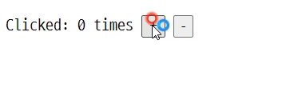

# Redux

> Redux 공식 문서 tutorial을 따라가며 작성한 내용이다.

**Redux** is a pattern and library for managing and updating application state, using events called "actions".


## Why use Redux?

Redux helps you manage "global" state - state that is needed across various components of your application.

Redux를 이용하지 않을 경우 - when we have multiple components that need to share and use the same state, we have to do **lifting state up** to parent components. This can be inefficient.


## Basics

### `store`

The center of every Redux application is the **store**. A "store" is a container that holds your application's global **state**.

`store`의 동작 방식은 다음과 같다.

- You must never directly modify or change the state that is kept inside the Redux store
- Instead, the only way to cause an update to the state is to create a plain **action** object that describes "something that happened in the application", and then **dispatch** the action to the store to tell it what happened.
- When an action is dispatched, the store runs the root **reducer** function, and lets it calculate the new state based on the old state and the action
- Finally, the store notifies **subscribers** that the state has been updated so the UI can be updated with the new data.

### Terminology

#### Actions

**An event that describes something that happened in the application.** We usually write that type string like `"domain/eventName"`, where the first part is the feature or category that this action belongs to, and the second part is the specific thing that happened.

We normally put any extra data needed to describe what's happening into the `action.payload` field. This could be a number, a string, or an object with multiple fields inside.

#### Reducers

**An event listener which handles events based on the received action (event) type.**

Reducers must always follow some specific rules:

- They should only calculate the new state value based on the `state` and `action` arguments

- They are not allowed to modify the existing `state`. Instead, they must make *immutable updates*, by copying the existing `state` and making changes to the copied values.

- They must not do any asynchronous logic, calculate random values, or cause other "side effects"

#### Store

The object where the current Redux app state lives in.

#### Dispatch

**The only way to update the state is to call `store.dispatch()` and pass in an action object**. **You can think of dispatching actions as "triggering an event".**

### Basic example



```html
<!DOCTYPE html>
<html>
  <head>
    <title>Redux basic example</title>
    <script src="https://unpkg.com/redux@latest/dist/redux.min.js"></script>
  </head>
  <body>
    <div>
      <p>
        Clicked: <span id="value">0</span> times
        <button id="increment">+</button>
        <button id="decrement">-</button>
      </p>
    </div>
    <script>
      // Define an initial state value for the app
      const initialState = {
        value: 0
      };

      // Create a "reducer" function that determines what the new state
      // should be when something happens in the app
      function counterReducer(state = initialState, action) {
        // Reducers usually look at the type of action that happened
        // to decide how to update the state
        switch (action.type) {
          case "counter/incremented":
            return { ...state, value: state.value + 1 };
          case "counter/decremented":
            return { ...state, value: state.value - 1 };
          default:
            // If the reducer doesn't care about this action type,
            // return the existing state unchanged
            return state;
        }
      }

      // Create a new Redux store with the `createStore` function,
      // and use the `counterReducer` for the update logic
      const store = Redux.createStore(counterReducer);

      // Our "user interface" is some text in a single HTML element
      const valueEl = document.getElementById("value");

      // Whenever the store state changes, update the UI by
      // reading the latest store state and showing new data
      function render() {
        const state = store.getState();
        valueEl.innerHTML = state.value.toString();
      }

      // Update the UI with the initial data
      render();
      // And subscribe to redraw whenever the data changes in the future
      store.subscribe(render);

      // Handle user inputs by "dispatching" action objects,
      // which should describe "what happened" in the app
      document
        .getElementById("increment")
        .addEventListener("click", function () {
          store.dispatch({ type: "counter/incremented" });
        });

      document
        .getElementById("decrement")
        .addEventListener("click", function () {
          store.dispatch({ type: "counter/decremented" });
        });
    </script>
  </body>
</html>
```

위 코드는 Redux의 가장 기본적인 내용만 담은 코드이다. 기능별로 분석해서 살펴보도록 한다.

#### state

We start by defining an initial **state** value to describe the application. Redux apps normally have a JS object as the root piece of the state, with other values inside that object.

```js
const initialState = {
  value: 0
}
```

#### reducer

Then, we define a **reducer** function. The reducer receives two arguments, the current `state` and an `action` object describing what happened.

```js
// Create a "reducer" function that determines what the new state
// should be when something happens in the app
function counterReducer(state = initialState, action) {
  // Reducers usually look at the type of action that happened
  // to decide how to update the state
  switch (action.type) {
    case 'counter/incremented':
      return { ...state, value: state.value + 1 }
    case 'counter/decremented':
      return { ...state, value: state.value - 1 }
    default:
      // If the reducer doesn't care about this action type,
      // return the existing state unchanged
      return state
  }
}
```

Action objects always have a `type` field, which is a string you provide that acts as a unique name for the action.

Based on the type of the action, we either need to return a brand-new object to be the new `state` result, or return the existing `state` object if nothing should change. Note that we update the state *immutably* by copying the existing state and updating the copy, instead of modifying the original object directly. **Redux expects that all state updates are done immutably**.

#### store

We can create a **store** instance by calling the Redux library `createStore` API.

```js
const store = Redux.createStore(counterReducer)
```

#### UI

When a user does something, the app will update its data and then redraw the UI with those values. The Redux store lets us call `store.subscribe()` and pass a subscriber callback function that will be called every time the store is updated. So, we can pass our `render` function as the subscriber, and know that each time the store updates, we can update the UI with the latest value.

```js
const valueEl = document.getElementById('value')

// Whenever the store state changes, update the UI by
// reading the latest store state and showing new data
function render() {
  const state = store.getState()
  valueEl.innerHTML = state.value.toString()
}

// Update the UI with the initial data
render()
// And subscribe to redraw whenever the data changes in the future
store.subscribe(render)
```

#### Dispatching actions

Finally, we need to respond to user input by creating **action** objects that describe what happened, and **dispatching** them to the store. When we call `store.dispatch(action)`, the store runs the reducer, calculates the updated state, and runs the subscribers to update the UI.

```js
// Handle user inputs by "dispatching" action objects,
// which should describe "what happened" in the app
document.getElementById('increment').addEventListener('click', function () {
  store.dispatch({ type: 'counter/incremented' })
})

document.getElementById('decrement').addEventListener('click', function () {
  store.dispatch({ type: 'counter/decremented' })
})
```

### Data Flow

- actions are dispatched in response to a user interaction like a click
- the store runs the reducer function to calculate a new state
- the UI reads the new state to display the new values


