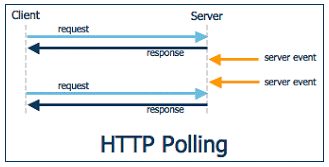

# WebSocket

## What is WebSocket?

WebSocket은 서버와 클라이언트 간의 동적인 양방향 연결 채널을 구성한다. Socket Connection을 유지해서 언제든 양방향 통신 또는 데이터 전송이 가능하도록 하는 기술이다. Real-time web application(SNS, 멀티플레이어 게임, 구글 Docs, 증권 등) 구현을 위해 널리 사용되어지고 있다.

## 등장 배경

초창기 Web은 서버에 요청을 보내고 응답을 받으면 브라우저의 화면을 모두 지우고 다시 처음부터 새로 구성하는 방식이었다.

그 후 Ajax와 같은 기술이 나타나면서 페이지 요청이 아닌 데이터 요청을 하여 부분적으로 정보를 갱신할 수 있게 되었다. 하지만 이 Ajax도 결국 HTTP를 이용하기 때문에 요청을 보내야 응답이 온다. 가령, 실시간 연동이 되는 SNS를 구축하려 한다면 일정 시간마다 요청을 보내야하는 비효율성이 발생하게 된다.

## 작동원리

서버에서도 클라이언트에게 요청을 보낼 수 있다.

## 문제점

1. 프로그램 구현에 보다 많은 복잡성을 초래한다.

   WebSocket은 HTTP와 달리 stateful protocol이기 때문에 서버와 클라이언트 간의 연결을 항상 유지해야 하며 만약 비정상적으로 연결이 끊어졌을 때 적절하게 대응해야 한다.

2. 비용이 많이 들 수 있다.

   트래픽이 많은 서버의 경우 CPU에 큰 부담이 될 수 있다.

3. 아직 지원하지 않는 브라우저가 있다.

### WebSocket을 지원하지 않는 경우

#### polling

클라이언트가 서버로 계속 요청을 보내는 방식이다. 가장 쉬운 방법이지만 클라이언트가 지속적으로 요청을 보내기 때문에 서버의 부담이 증가할 수 있다. 그럼에도 불구하고 클라이언트에서 실시간 정도의 빠른 응답을 기대하기도 어려운 방식이다.

#### long polling

클라이언트가 서버로 일단 요청을 보낸다. 서버는 클라이언트로 전달할 이벤트가 생길 때까지 응답을 보류한다. 그 후 이벤트가 발생하면 그 때 응답을 보낸다.

polling 방식보다는 서버의 부담이 줄 수 있으나, 이벤트들의 시간 간격이 짧다면 polling과 큰 차이가 없게 된다.

#### streaming

long polling과 마찬가지로 클라이언트가 서버로 일단 요청을 보낸다. 하지만 차이점은, 서버가 클라이언트에게 응답을 보낼 때 요청을 종료시키지 않는다는 것이다. 요청이 살아 있으므로 이벤트가 발생할 때마다 서버가 계속 응답을 보낼 수 있다.

## SockJS

Under the hood SockJS tries to use native WebSockets first. If that fails it can use a variety of browser-specific transport protocols and presents them through WebSocket-like abstractions.