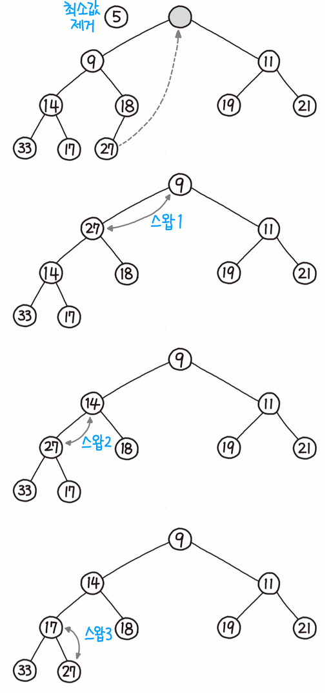

# Heap

## What is heap?

- 완전 이진 트리의 일종으로 우선순위 큐를 위하여 만들어진 자료구조
- 최댓값, 최솟값을 빠르게 찾아내도록 만들어진 자료구조.
- 힙에서의 부모 노드와 자식 노드의 관계
  - 왼쪽 자식의 인덱스 = (부모의 인덱스) * 2
  - 오른쪽 자식의 인덱스 = (부모의 인덱스) * 2 + 1
  - 부모의 인덱스 = (자식의 인덱스) / 2


## Heap의 종류

- max heap : 부모 노드의 키 값이 자식 노드의 키 값보다 크거나 같은 완전 이진 트리
- min heap : 부모 노드의 키 값이 자식 노드의 키 값보다 작거나 같은 완전 이진 트리


## Heap 구현

- Heap을 저장하는 표준적인 자료구조는 배열이다.

- 구현을 쉽게 하기 위하여 배열의 첫번째 인덱스인 0은 사용하지 않는다.

  

### 데이터 삽입

1. 가장 끝의 자리에 노드를 삽입한다.
2. 그 노드와 부모 노드를 서로 비교한다.
3. 규칙에 맞으면 그대로 두고, 그렇지 않으면 부모와 교환한다.
4. 규칙에 맞을 때까지 3번 과정을 반복한다.


### 데이터 삭제

최댓값 혹은 최솟값이 저장된 루트 노드만 제거할 수 있다.

1. 루트 노드를 제거한다.
2. 루트 자리에 가장 마지막 노드를 삽입한다.
3. 올라간 노드와 그의 자식 노드(들)와 비교한다.
4. 조건에 만족하면 그대로 두고, 그렇지 않으면 자식과 교환한다.
   - 최대 힙
     1. 부모보다 더 큰 자식이 없으면 교환하지 않고 끝낸다.
     2. 부모보다 더 큰 자식이 하나만 있으면 그 자식하고 교환하면 된다.
     3. 부모보다 더 큰 자식이 둘 있으면 자식들 중 큰 값과 교환한다.
   - 최소 힙
     1. 부모보다 더 작은 자식이 없으면 교환하지 않고 끝낸다.
     2. 부모보다 더 작은 자식이 하나만 있으면 그 자식하고 교환하면 된다.
     3. 부모보다 더 작은 자식이 둘 있으면 자식들 중 작은 값과 교환한다.
5. 조건을 만족할 때까지 4의 과정을 반복한다.




## Python `heapq` 모듈

```python
import heapq
```

### 기존 리스트를 Heap으로 변환

```python
heapq.heapify(리스트)
```

### Heap에 원소 추가

```python
heapq.heappush(heap, element)
```

### Heap에서 원소 삭제

```python
heapq.heappop(heap)
```


## References

https://gmlwjd9405.github.io/2018/05/10/data-structure-heap.html ([자료구조] 힙(heap)이란)

https://namu.wiki/w/%ED%9E%99%20%ED%8A%B8%EB%A6%AC