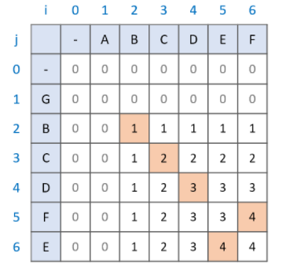

# LCS

## Subsequence vs Substring

LCS는 주로 **최장 공통 부분수열(Longest Common Subsequence)**을 말하지만, **최장 공통 문자열(Longest Common Substring)**을 말하기도 한다. 차이점을 살펴보면:


## Longest Common Subsequence

### 점화식

```python
for i in range(len(string_A)):
    for j in range(len(string_B)):
        if i == 0 or j == 0:  # 마진 설정
            LCS[i][j] = 0
        elif string_A[i] == string_B[j]:
            LCS[i][j] = LCS[i - 1][j - 1] + 1
        else:
            LCS[i][j] = max(LCS[i - 1][j], LCS[i][j - 1])
```

1. 문자열A, 문자열B의 **한글자씩** 비교해본다.

2. 두 문자가 **같다면 `LCS[i - 1][j - 1]` 값을 찾아 `+1`** 한다.

   

   위 문제를 예로 들면, 그림의 초록색 부분인 문자열 **GBC** 와 **AB**를 비교하는 과정이다. `string_A[i]`인 **C**와 `string_B[j]`인 **B**가 서로 다르므로,

   **GBC**와 **A**의 LCS, **GB**와 **AB**의 LCS 중 최댓값이 **GBC**와 **AB**의 LCS가 된다.

   

3. 두 문자가 **다르다면 `LCS[i - 1][j]`와 `LCS[i][j - 1]` 중에 큰값을 표시**한다.

   

   그림의 초록색 부분 중 숫자 2가 적힌 부분인 문자열 **GBC**와 **ABC**를 비교하는 과정이다. `string_A[i]`인 **C**와 `string_B[j]`인 **C**가 서로 같으므로,

   **GB**와 **AB**의 LCS에 문자열 **C**를 추가한 것이 새 LCS가 된다.

   

4. 위 과정을 반복.

5. 결과

   


## References

https://velog.io/@emplam27/%EC%95%8C%EA%B3%A0%EB%A6%AC%EC%A6%98-%EA%B7%B8%EB%A6%BC%EC%9C%BC%EB%A1%9C-%EC%95%8C%EC%95%84%EB%B3%B4%EB%8A%94-LCS-%EC%95%8C%EA%B3%A0%EB%A6%AC%EC%A6%98-Longest-Common-Substring%EC%99%80-Longest-Common-Subsequence ([알고리즘] 그림으로 알아보는 LCS 알고리즘 - Longest Common Substring와 Longest Common Subsequence)

