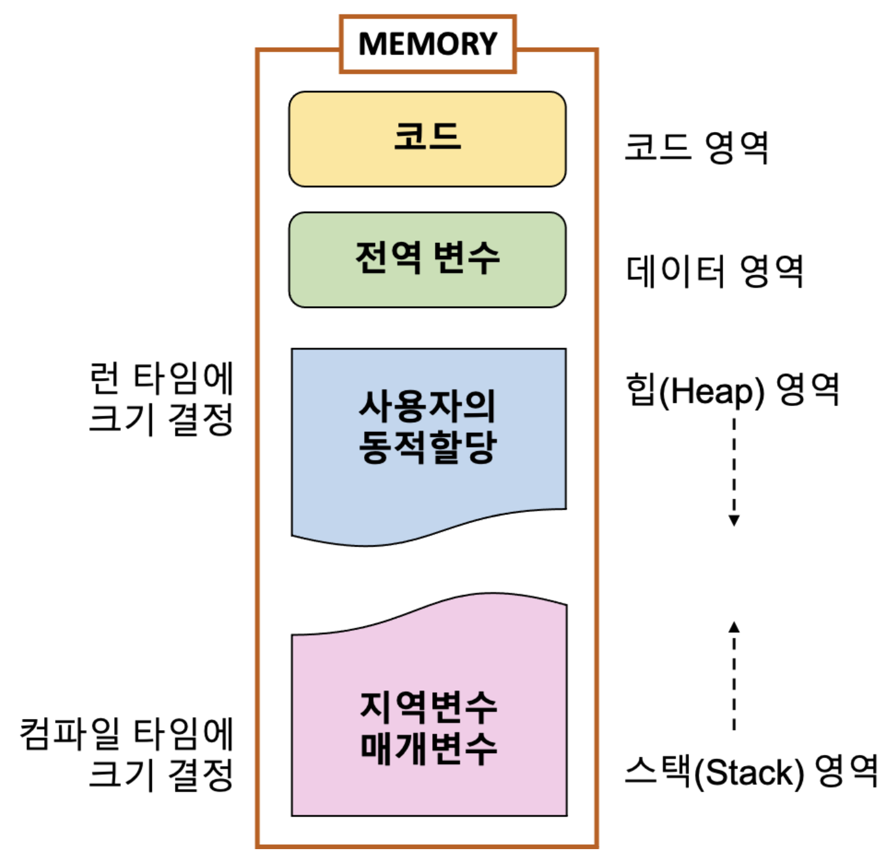

# Memory

## Memory 구조

### Code 영역

- 실행할 프로그램의 코드가 저장되는 영역
- text 영역이라고도 한다
- 프로세스가 시작하고 종료될 때까지 계속 유지

### Data 영역

- 전역 변수, 정적(static) 변수가 저장되는 영역
  - BSS : 초기화 되지 않은 데이터 저장(RAM에 저장)
  - GVAR : 초기화된 데이터 저장(ROM에 저장)
- 숫자나 문자열 리터럴 값도 저장된다
- 프로세스가 시작하고 종료될 때까지 계속 유지

### Heap 영역

- 사용자(개발자)가 직접 관리하는 영역, 동적으로 할당되고 해제된다.
  - 영역 중 유일하게 런타임 시에 크기가 결정된다.
  - 유동적으로 데이터를 저장하고, 꺼내올 수 있다.
- 데이터 액세스가 상대적으로 느린 편
  - 할당/해제 작업으로 인한 속도 저하 발생
  - 힙 경합으로 인한 속도 저하 발생

### Stack 영역

- 프로그램이 자동으로 생성하는 임시 메모리 영역
- 함수 호출 시 생성되는 지역 변수와 매개 변수가 저장되는 영역으로, 함수 호출이 완료되면 저장된 메모리도 해제된다.
- 후입선출(LIFO) 방식으로 동작
- compile될 때 크기가 결정

#### Stack frame

함수가 호출되면 스택에는 함수의 매개변수, 호출이 끝난 뒤 돌아갈 반환 주소값, 함수에서 선언된 지역 변수 등이 저장된다. 이렇게 스택 영역에 차례대로 저장되는 함수의 호출 정보를 스택 프레임(stack frame)이라고 한다.

