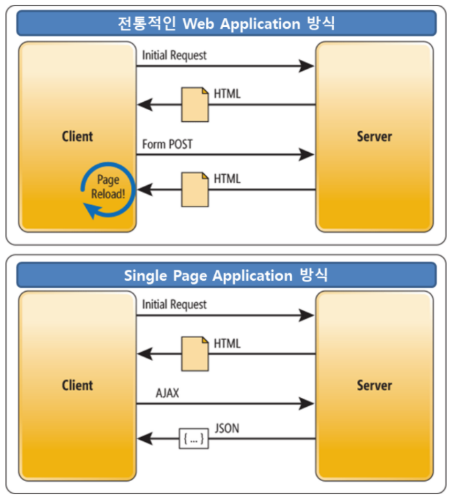

# SPA(Single Page Application)

## What is SPA?

SPA란, 어떤 웹 사이트의 전체 페이지를 하나의 페이지에 담아 동적으로 화면을 바꿔가며 표현하는 것이다. 뭔가를 클릭하거나 스크롤하면, 상호작용하기 위한 최소한의 요소만 변경이 일어난다.

### MPA(Multi Page Application)

전통적인 웹 방식으로, 새로운 페이지를 요청할 때마다 정적 리소스가 다운로드되고 전체 페이지를 다시 렌더링하는 방식이다. 새로고침이 발생되어 사용성이 좋지 않고, 변경이 필요없는 부분도 갱신하므로 비효율적이다.

## 장점

- 우수한 사용성(빠른 반응성, 화면 전환 애니메이션)
- 서버 요청 횟수가 적다.
- 필요한 데이터만 받으므로 트래픽이 감소한다.
- 웹과 앱에 동일한 백엔드 코드를 사용할 수 있어 재사용성이 높다.

## 단점

- 처음에 많은 리소스를 받아야 하므로 초기 구동 속도가 느리다.
- SEO(Search Engine Optimization)에 문제가 있다.

## References

https://junsday.tistory.com/40

https://m.blog.naver.com/dktmrorl/222085340333