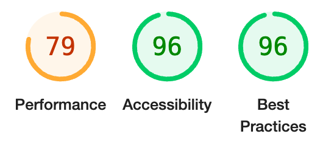
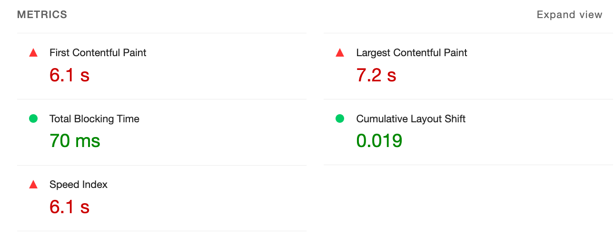
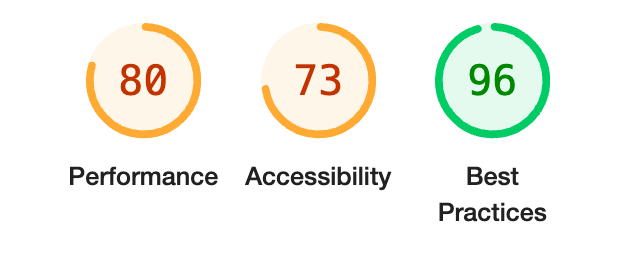
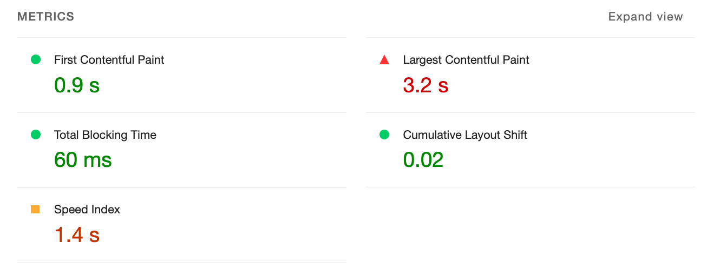
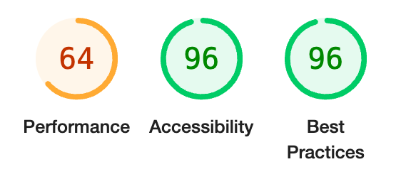
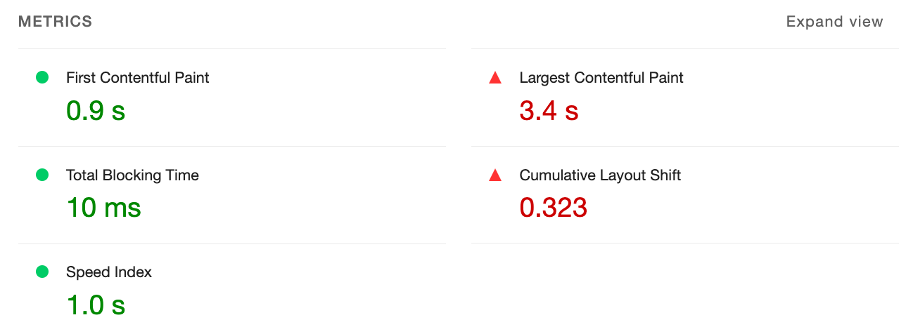
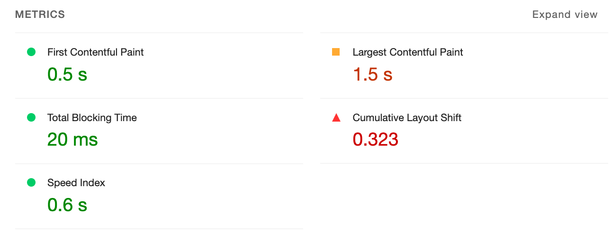

# Gzip compression

## How to

### Using web server

#### Apache

```
<IfModule mod_deflate.c>
  AddOutputFilterByType DEFLATE text/css text/javascript application/javascript
</IfModule>
```

- `<IfModule mod_deflate.c>` : checkes if the `mod_deflate` module is loaded in the Apache server.
- `AddOutputFilterByType DEFLATE ...` : tells the Apache server to apply the `DEFLATE` output filter to the specified MIME types.

### Using pre-compressed build

React 빌드의 경우 한 번 빌드된 정적 파일을 항상 변동없이 그대로 클라이언트에게 전달하므로 web server에서 매번 압축 절차를 거칠 필요가 없음. web server에서 이미 압축된 파일을 전달하도록 하는 것이 효율적이다.

1. React 빌드 시 gzip 압축 파일도 같이 생성

```js
// config-overrides.js

const { override, useBabelRc } = require('customize-cra');
const CompressionPlugin = require('compression-webpack-plugin');

const compressBuildToGzip = () => (config) => {
  config.plugins.push(new CompressionPlugin());

  return config;
};

module.exports = override(compressBuildToGzip());
```

2. web server에서 압축 파일 전달하도록 설정

```
<IfModule mod_rewrite.c>
  RewriteEngine On

  RewriteCond %{HTTP:Accept-encoding} gzip
  RewriteRule ^(.*)\.(css|js)$ $1\.$2\.gz [QSA]
</IfModule>
<IfModule mod_headers.c>
  <FilesMatch "\.css\.gz$">
    Header set Content-Encoding gzip
    Header set Content-Type "text/css"
  </FilesMatch>
  <FilesMatch "\.js\.gz$">
    Header set Content-Encoding gzip
    Header set Content-Type "text/javascript"
  </FilesMatch>
</IfModule>
```


## 효과

- React(on PHP)
  - 적용 전
    - js 5.9mb, css 587kb
    - 
    - 
  - 적용 후
    - js 1.3mb, css 74kb
    - 
    - 

- React
  - 적용 전
    - js 2.3mb, css 587kb
    - 
    - 
  - 적용 후
    - js 643kb, css 74kb
    - 
    - 
